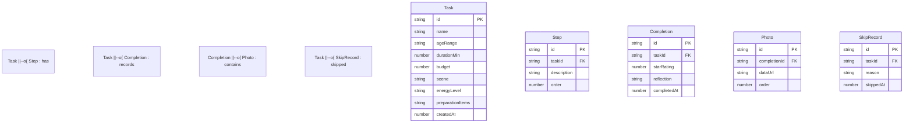

## 1. 架构设计

```mermaid
flowchart TD
    "前端 React SPA" --> "LocalStorage 持久化"
    "前端 React SPA" --> "内存状态管理"
    subgraph "前端应用"
        "路由层 React Router"
        "页面组件"
        "通用组件"
        "状态管理 Zustand"
        "工具函数"
    end
    "LocalStorage" --> "任务数据"
    "LocalStorage" --> "完成记录"
    "LocalStorage" --> "换掉记录"
    "LocalStorage" --> "照片 Base64"
```

纯前端 SPA 架构，所有数据存储在 LocalStorage，无需后端服务。

## 2. 技术说明

- **前端**：React@18 + TypeScript + TailwindCSS@3 + Vite
- **初始化工具**：Vite (react-ts 模板)
- **路由**：React Router DOM@6
- **状态管理**：Zustand（轻量、简洁）
- **动画**：Framer Motion
- **后端**：无
- **数据库**：LocalStorage（浏览器本地持久化）
- **图标**：Lucide React

## 3. 路由定义

| 路由 | 用途 |
|------|------|
| `/` | 抽签首页 - 抽签盒子+快捷筛选 |
| `/pool` | 任务池 - 任务列表+添加/编辑任务 |
| `/task/:id` | 任务详情 - 步骤+照片+评分感想 |
| `/stats` | 统计页 - 月度数据+活动回顾 |

## 4. 数据模型

### 4.1 数据模型定义



### 4.2 数据类型定义

```typescript
type Scene = "indoor" | "outdoor" | "both";
type EnergyLevel = "low" | "medium" | "high";
type SkipReason = "too_tired" | "no_materials" | "dont_want_out" | "other";

interface Task {
  id: string;
  name: string;
  ageRange: string;
  durationMin: number;
  budget: number;
  scene: Scene;
  energyLevel: EnergyLevel;
  preparationItems: string[];
  steps: Step[];
  createdAt: number;
}

interface Step {
  id: string;
  description: string;
  order: number;
}

interface Completion {
  id: string;
  taskId: string;
  starRating: number;
  reflection: string;
  photos: Photo[];
  checkedSteps: string[];
  completedAt: number;
}

interface Photo {
  id: string;
  dataUrl: string;
  order: number;
}

interface SkipRecord {
  id: string;
  taskId: string;
  reason: SkipReason;
  customReason?: string;
  skippedAt: number;
}

interface FilterState {
  weather?: "sunny" | "rainy";
  maxDuration?: number;
  maxBudget?: number;
  energyLevel?: EnergyLevel;
  scene?: Scene;
}
```

### 4.3 预置任务数据

应用初始化时预置 5 个示例任务：
1. 公园捡树叶 - 4岁+ / 60分钟 / 免费 / 室外 / 轻松
2. 做三明治 - 3岁+ / 30分钟 / 30元 / 室内 / 轻松
3. 搭纸箱城堡 - 5岁+ / 90分钟 / 20元 / 室内 / 适中
4. 拍家庭短片 - 6岁+ / 120分钟 / 免费 / 室内+室外 / 适中
5. 去图书馆 - 3岁+ / 60分钟 / 免费 / 室内 / 轻松

## 5. 状态管理设计

使用 Zustand 创建全局 store，包含以下 slice：

- **taskStore**：tasks 列表、CRUD 操作
- **completionStore**：完成记录、评分感想、照片
- **filterStore**：当前筛选条件
- **lotteryStore**：抽签状态（当前抽中的任务、换签记录）

所有 store 数据变更后自动同步到 LocalStorage。
