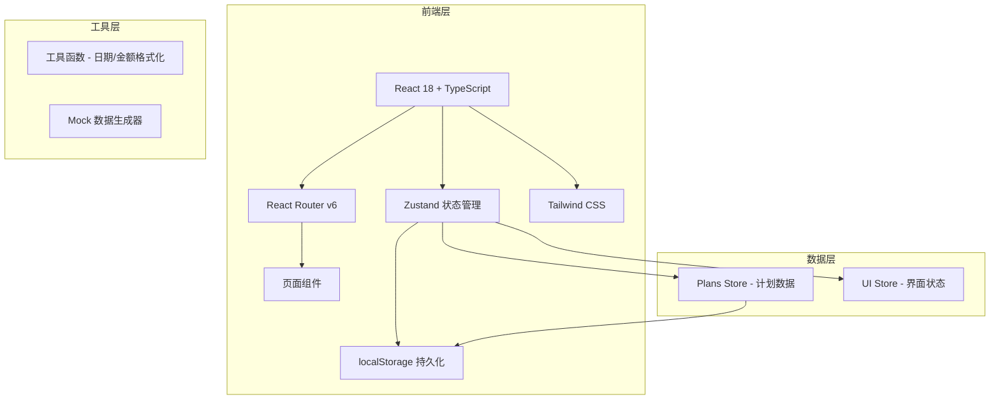
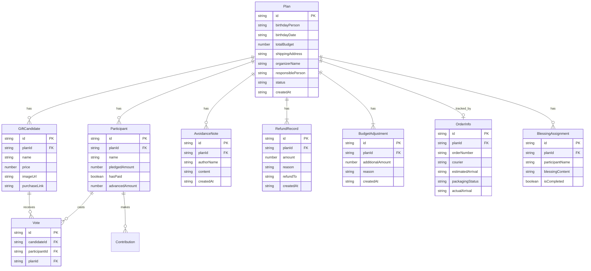

## 1. 架构设计



纯前端架构，使用 Zustand + localStorage 实现状态管理和数据持久化，无需后端服务。

## 2. 技术说明

- **前端**: React@18 + TypeScript + Tailwind CSS@3 + Vite
- **初始化工具**: vite-init (react-ts 模板)
- **路由**: react-router-dom@6
- **状态管理**: zustand (含 persist 中间件持久化到 localStorage)
- **图标**: lucide-react
- **后端**: 无（纯前端，数据存 localStorage）
- **数据库**: 无（zustand persist → localStorage）

## 3. 路由定义

| 路由 | 用途 |
|------|------|
| `/` | 首页 - 生日计划列表 |
| `/plan/new` | 创建新的生日计划 |
| `/plan/:id` | 计划详情 - 投票/分摊/避雷/预算追踪 |
| `/plan/:id/order` | 订单追踪 - 订单号/到货/包装/祝福语 |
| `/plan/:id/refund` | 退款/加预算流程 |
| `/stats` | 统计页 - 年度送礼/花费/热门礼物 |

## 4. 数据模型

### 4.1 数据模型定义



### 4.2 TypeScript 类型定义

```typescript
interface Plan {
  id: string
  birthdayPerson: string
  birthdayDate: string
  totalBudget: number
  shippingAddress: string
  organizerName: string
  responsiblePerson: string
  status: 'voting' | 'funding' | 'purchased' | 'delivered' | 'completed'
  createdAt: string
  giftCandidates: GiftCandidate[]
  participants: Participant[]
  avoidanceNotes: AvoidanceNote[]
  orderInfo: OrderInfo | null
  blessingAssignments: BlessingAssignment[]
  refundRecords: RefundRecord[]
  budgetAdjustments: BudgetAdjustment[]
}

interface GiftCandidate {
  id: string
  planId: string
  name: string
  price: number
  imageUrl: string
  purchaseLink: string
}

interface Participant {
  id: string
  planId: string
  name: string
  pledgedAmount: number
  hasPaid: boolean
  advancedAmount: number
}

interface Vote {
  id: string
  candidateId: string
  participantId: string
  planId: string
}

interface AvoidanceNote {
  id: string
  planId: string
  authorName: string
  content: string
  createdAt: string
}

interface OrderInfo {
  id: string
  planId: string
  orderNumber: string
  courier: string
  estimatedArrival: string
  packagingStatus: 'none' | 'packing' | 'packed'
  actualArrival: string
}

interface BlessingAssignment {
  id: string
  planId: string
  participantName: string
  blessingContent: string
  isCompleted: boolean
}

interface RefundRecord {
  id: string
  planId: string
  amount: number
  reason: string
  refundTo: string
  createdAt: string
}

interface BudgetAdjustment {
  id: string
  planId: string
  additionalAmount: number
  reason: string
  createdAt: string
}
```
