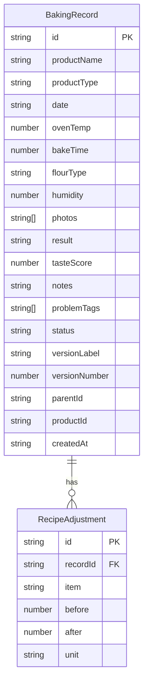

## 1. 架构设计

```mermaid
graph TB
    "前端 React + Vite" --> "Zustand 状态管理"
    "Zustand 状态管理" --> "LocalStorage 持久化"
    "前端 React + Vite" --> "React Router 页面路由"
```

纯前端应用，所有数据存储在浏览器 LocalStorage，无需后端服务。

## 2. 技术说明

- 前端：React@18 + TypeScript + TailwindCSS@3 + Vite
- 初始化工具：vite-init
- 状态管理：Zustand（含 persist 中间件自动同步 LocalStorage）
- 图表：recharts
- 路由：react-router-dom@6
- 图标：lucide-react
- 后端：无
- 数据库：LocalStorage（浏览器本地存储）

## 3. 路由定义

| 路由 | 用途 |
|------|------|
| / | 首页，展示分组记录列表 |
| /record/new | 新建烘焙记录 |
| /record/:id | 查看/编辑烘焙记录详情 |
| /record/:id/analysis | 失败分析页 |
| /version/:productId | 版本管理页（某作品的所有版本） |
| /compare/:productId | 版本对比页 |
| /stats | 统计页 |

## 4. API定义

无后端API。所有数据操作通过 Zustand store 完成。

## 5. 服务端架构图

不适用

## 6. 数据模型

### 6.1 数据模型定义



### 6.2 数据定义

**BakingRecord**:
- id: 唯一标识 (uuid)
- productName: 作品名称 (如"戚风蛋糕")
- productType: 作品类型 (cake/cookie/bread/other)
- date: 烘焙日期
- ovenTemp: 烤箱温度 (℃)
- bakeTime: 烘焙时间 (分钟)
- flourType: 面粉类型 (高筋/中筋/低筋/全麦/其他)
- humidity: 环境湿度 (%)
- photos: 照片Base64数组
- result: 结果 (success/failure/partial)
- tasteScore: 口感评分 (1-5)
- notes: 文字备注
- problemTags: 失败问题标签数组
- status: 状态 (pending_review/improved/failed)
- versionLabel: 版本标签 (如"v1"、"v2")
- versionNumber: 版本号
- parentId: 父版本记录ID（首次为null）
- productId: 作品分组ID（同一作品的不同版本共享）
- createdAt: 创建时间

**RecipeAdjustment**:
- id: 唯一标识
- recordId: 关联的烘焙记录ID
- item: 调整项 (sugar/oil/water/fermentTime/ovenTemp/other)
- before: 调整前数值
- after: 调整后数值
- unit: 单位 (g/ml/min/℃)
