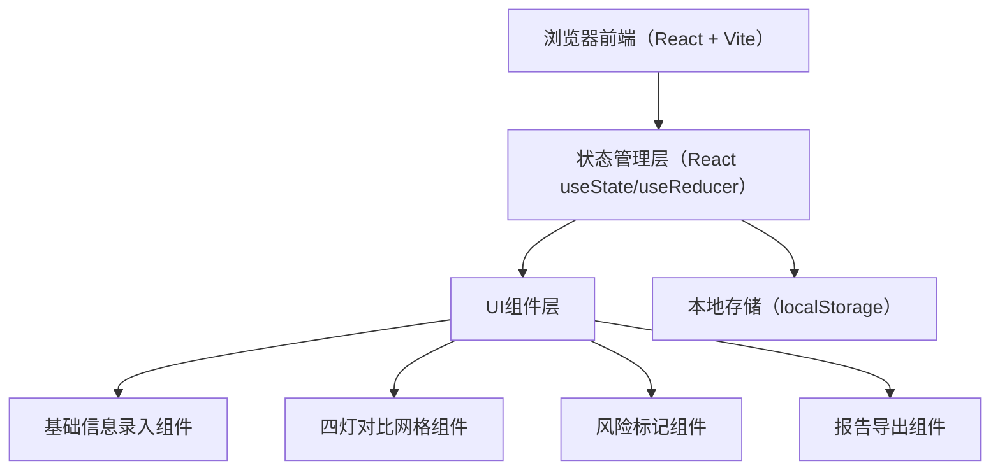
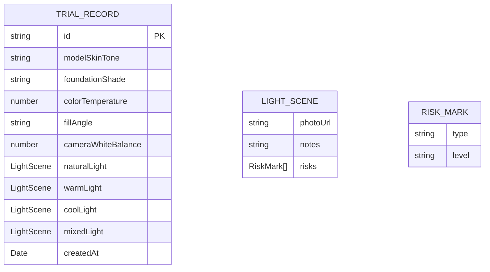

## 1. 架构设计



## 2. 技术说明

- 前端：React@18 + TypeScript + TailwindCSS@3 + Vite
- 初始化工具：vite 脚手架（react-ts 模板）
- 后端：无，纯前端单页应用，数据存储于浏览器 localStorage
- 图标：lucide-react
- 额外依赖：html2canvas（用于报告导出截图）

## 3. 路由定义

| 路由 | 用途 |
|------|------|
| / | 试妆灯色对比主页面，所有功能在单页内完成 |

## 4. 数据模型

### 4.1 数据模型定义



### 4.2 TypeScript 类型定义

```typescript
type RiskType = 'dullness' | 'redness' | 'shine' | 'colorShift';
type RiskLevel = 'mild' | 'moderate' | 'severe';

interface RiskMark {
  type: RiskType;
  level: RiskLevel;
}

interface LightScene {
  photoUrl: string;
  notes: string;
  risks: RiskMark[];
}

interface TrialRecord {
  id: string;
  modelSkinTone: string;
  foundationShade: string;
  colorTemperature: number;
  fillAngle: string;
  cameraWhiteBalance: number;
  naturalLight: LightScene;
  warmLight: LightScene;
  coolLight: LightScene;
  mixedLight: LightScene;
  createdAt: string;
}
```
