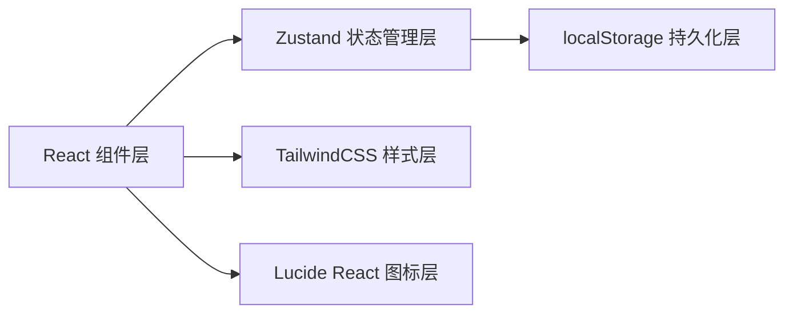
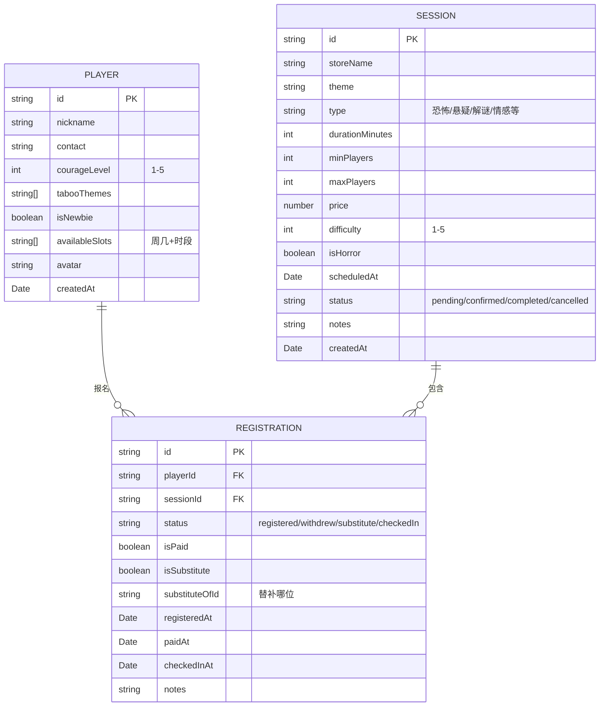

## 1. 架构设计
纯前端React应用，使用Zustand进行状态管理，数据持久化到localStorage，无后端依赖。

## 2. 技术描述
- 前端：React@18 + TypeScript + Vite
- 样式：TailwindCSS@3
- 状态管理：Zustand
- 路由：react-router-dom
- 图标：lucide-react
- 后端：无，纯前端mock数据
- 数据持久化：localStorage

## 3. 路由定义
| 路由 | 用途 |
|------|------|
| / | 数据看板首页 |
| /players | 玩家档案管理 |
| /sessions | 场次管理 |
| /sessions/:id | 场次详情（报名、签到、付款） |

## 4. 数据模型

## 5. 状态管理设计

Store 分层：
- usePlayerStore: 玩家档案 CRUD
- useSessionStore: 场次 CRUD + 报名操作
- useUIGlobalStore: 全局UI状态（弹窗、Toast等）

核心业务逻辑：
- checkCapacity(sessionId): 返回 { enough, gap, overflow }
- checkHorrorConflict(sessionId, playerIds): 返回冲突玩家列表
- suggestNpcReduction(conflictRatio): 建议NPC减量程度
- getAvailableSlotsForNextWeek(playerIds): 返回下周重叠时段热力图数据
