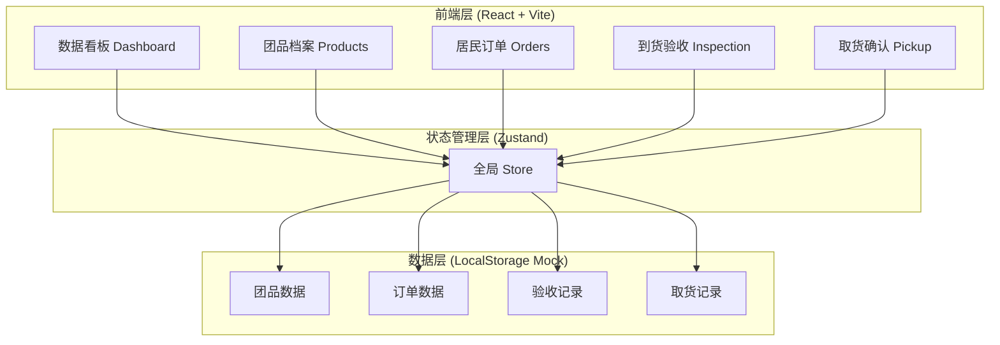
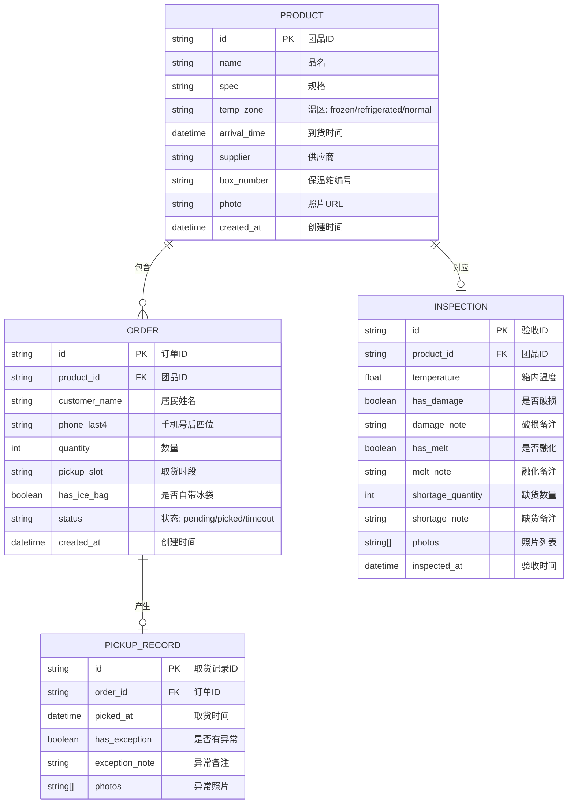

## 1. 架构设计



## 2. 技术描述
- 前端：React@18 + TypeScript + Vite
- 样式：TailwindCSS@3
- 状态管理：Zustand
- 路由：React Router DOM
- 图标：lucide-react
- 数据存储：LocalStorage（模拟数据，无需后端）
- 初始化工具：vite-init，使用 react-ts 模板

## 3. 路由定义
| 路由 | 用途 |
|-------|---------|
| /dashboard | 数据看板 - 统计概览、异常列表、时段压力图 |
| /products | 团品档案 - 团品列表、新增/编辑团品 |
| /orders | 居民订单 - 订单列表、新增/编辑订单 |
| /inspection | 到货验收 - 验收列表、验收表单 |
| /pickup | 取货确认 - 扫码查询、取货确认 |

## 4. 数据模型

### 4.1 数据模型定义（ER图）



### 4.2 TypeScript 类型定义

```typescript
export type TempZone = 'frozen' | 'refrigerated' | 'normal';
export type OrderStatus = 'pending' | 'picked' | 'timeout';
export type PickupSlot = 'morning' | 'noon' | 'afternoon' | 'evening';

export interface Product {
  id: string;
  name: string;
  spec: string;
  tempZone: TempZone;
  arrivalTime: string;
  supplier: string;
  boxNumber: string;
  photo?: string;
  createdAt: string;
}

export interface Order {
  id: string;
  productId: string;
  customerName: string;
  phoneLast4: string;
  quantity: number;
  pickupSlot: PickupSlot;
  hasIceBag: boolean;
  status: OrderStatus;
  createdAt: string;
}

export interface Inspection {
  id: string;
  productId: string;
  temperature: number;
  hasDamage: boolean;
  damageNote?: string;
  hasMelt: boolean;
  meltNote?: string;
  shortageQuantity: number;
  shortageNote?: string;
  photos: string[];
  inspectedAt: string;
}

export interface PickupRecord {
  id: string;
  orderId: string;
  pickedAt: string;
  hasException: boolean;
  exceptionNote?: string;
  photos: string[];
}
```

## 5. 项目文件结构

```
src/
├── components/          # 通用组件
│   ├── Layout/          # 布局组件（侧边栏、导航）
│   ├── Card/            # 统计卡片
│   ├── Modal/           # 弹窗组件
│   ├── StatusBadge/     # 状态标签
│   └── TempIndicator/   # 温度指示器
├── pages/               # 页面组件
│   ├── Dashboard.tsx    # 数据看板
│   ├── Products.tsx     # 团品档案
│   ├── Orders.tsx       # 居民订单
│   ├── Inspection.tsx   # 到货验收
│   └── Pickup.tsx       # 取货确认
├── store/               # Zustand 状态管理
│   └── index.ts
├── types/               # TypeScript 类型定义
│   └── index.ts
├── utils/               # 工具函数
│   ├── mockData.ts      # 模拟数据
│   └── helpers.ts       # 辅助函数
├── App.tsx              # 应用入口
├── main.tsx             # 渲染入口
└── index.css            # 全局样式
```
