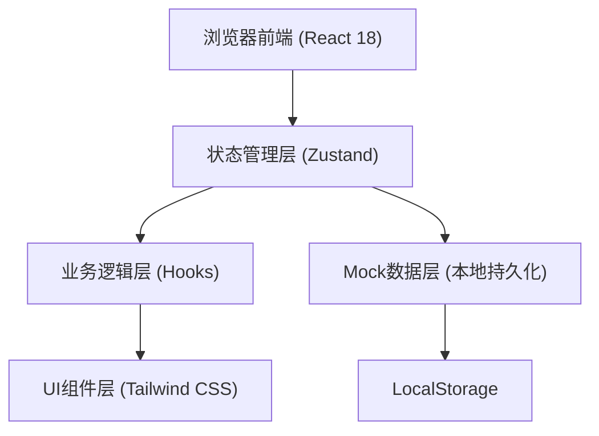
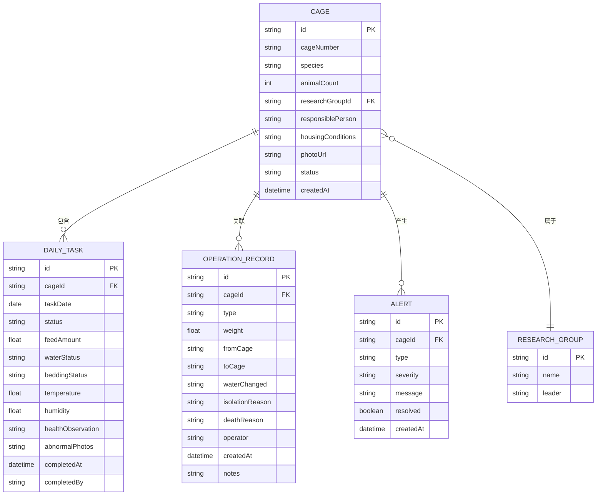

## 1. 架构设计



## 2. 技术说明

- 前端：React@18 + TypeScript + Vite + Tailwind CSS@3
- 路由：React Router DOM@6
- 状态管理：Zustand@4
- 图表库：Recharts（轻量级React图表库）
- 图标库：Lucide React
- 数据持久化：LocalStorage（模拟后端）
- 初始化工具：vite-init

## 3. 路由定义

| 路由 | 页面组件 | 用途 |
|------|---------|------|
| / | Dashboard | 首页总览：快速告警、今日任务概览、快捷入口 |
| /cages | CageList | 笼盒/鱼缸档案列表页 |
| /cages/:id | CageDetail | 笼盒/鱼缸档案详情页 |
| /tasks | DailyTasks | 每日任务看板页 |
| /records | OperationRecords | 操作记录中心页（称重/换笼/换水/隔离/死亡） |
| /statistics | Statistics | 统计分析页 |

## 4. 数据模型

### 4.1 ER图



### 4.2 TypeScript 类型定义

```typescript
// 课题组
interface ResearchGroup {
  id: string;
  name: string;
  leader: string;
}

// 物种枚举
type Species = 'mouse' | 'zebrafish' | 'rat' | 'rabbit';

// 笼盒/鱼缸状态
type CageStatus = 'normal' | 'warning' | 'isolated' | 'empty';

// 笼盒/鱼缸档案
interface Cage {
  id: string;
  cageNumber: string;
  species: Species;
  animalCount: number;
  researchGroupId: string;
  responsiblePerson: string;
  housingConditions: string;
  photoUrl: string;
  status: CageStatus;
  createdAt: string;
}

// 任务状态
type TaskStatus = 'pending' | 'in_progress' | 'completed' | 'overdue';

// 每日饲喂任务
interface DailyTask {
  id: string;
  cageId: string;
  taskDate: string;
  status: TaskStatus;
  feedAmount: number | null;
  waterStatus: string | null;
  beddingStatus: string | null;
  temperature: number | null;
  humidity: number | null;
  healthObservation: string | null;
  abnormalPhotos: string[];
  completedAt: string | null;
  completedBy: string | null;
}

// 操作记录类型
type OperationType = 'weighing' | 'cage_change' | 'water_change' | 'isolation' | 'death';

// 操作记录
interface OperationRecord {
  id: string;
  cageId: string;
  type: OperationType;
  weight?: number;
  fromCage?: string;
  toCage?: string;
  waterChanged?: boolean;
  isolationReason?: string;
  deathReason?: string;
  operator: string;
  createdAt: string;
  notes?: string;
}

// 告警类型
type AlertType = 'overdue_feeding' | 'temperature_abnormal' | 'abnormal_behavior' | 'humidity_abnormal';
type AlertSeverity = 'high' | 'medium' | 'low';

// 告警
interface Alert {
  id: string;
  cageId: string;
  type: AlertType;
  severity: AlertSeverity;
  message: string;
  resolved: boolean;
  createdAt: string;
}
```

## 5. 目录结构

```
src/
├── components/          # 公共组件
│   ├── Layout/          # 布局组件
│   │   ├── Sidebar.tsx
│   │   ├── Header.tsx
│   │   └── index.tsx
│   ├── CageCard.tsx     # 笼盒卡片
│   ├── TaskCard.tsx     # 任务卡片
│   ├── AlertBadge.tsx   # 告警徽章
│   ├── StatusTag.tsx    # 状态标签
│   ├── Modal.tsx        # 通用模态框
│   └── EmptyState.tsx   # 空状态
├── pages/               # 页面组件
│   ├── Dashboard.tsx
│   ├── CageList.tsx
│   ├── CageDetail.tsx
│   ├── DailyTasks.tsx
│   ├── OperationRecords.tsx
│   └── Statistics.tsx
├── store/               # Zustand状态管理
│   └── index.ts
├── hooks/               # 自定义Hooks
│   ├── useAlerts.ts
│   └── useStatistics.ts
├── types/               # 类型定义
│   └── index.ts
├── utils/               # 工具函数
│   ├── date.ts
│   ├── mock.ts          # Mock数据生成
│   └── storage.ts       # LocalStorage封装
├── data/                # 静态/模拟数据
│   └── mockData.ts
├── App.tsx
├── main.tsx
└── index.css
```
