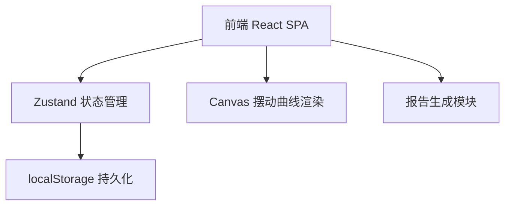
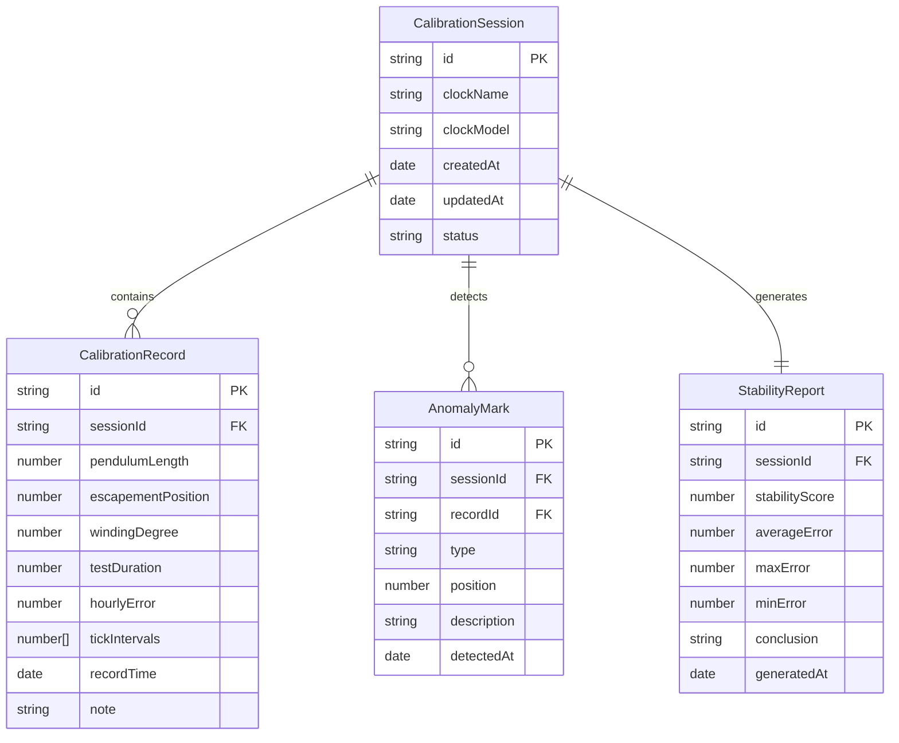

## 1. 架构设计

纯前端应用，无需后端服务。所有数据通过 Zustand 状态管理 + localStorage 持久化存储。

## 2. 技术说明

- **前端**：React@18 + TypeScript + Tailwind CSS@3 + Vite
- **初始化工具**：vite-init (react-ts 模板)
- **状态管理**：Zustand
- **路由**：react-router-dom
- **图表渲染**：Canvas API (原生绘制摆动曲线) + recharts (对比图表和报告图表)
- **后端**：无
- **数据库**：无，使用 localStorage 模拟持久化

## 3. 路由定义

| 路由 | 用途 |
|------|------|
| / | 调校记录主页面，包含参数录入、曲线可视化、异常标记、微调对比和报告生成 |

## 4. API 定义

不适用（纯前端应用）

## 5. 服务端架构图

不适用（纯前端应用）

## 6. 数据模型

### 6.1 数据模型定义

### 6.2 数据定义语言

使用 TypeScript 接口定义：

- `CalibrationSession`：调校会话，一次完整的维修调校过程
- `CalibrationRecord`：调校记录，每次录入的参数快照
- `AnomalyMark`：异常标记，四种异常类型的检测记录
- `StabilityReport`：走时稳定报告，最终交付文档数据

异常类型枚举：`OFF_BEAT`(偏摆) | `STOPPED`(停摆) | `WEAK_RETURN`(回摆无力) | `GEAR_JAM`(齿轮卡滞)

数据存储：所有数据序列化为 JSON 存入 localStorage，key 格式为 `clock-cal-{sessionId}`
