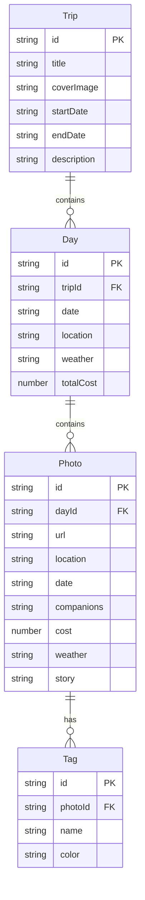

## 1. 架构设计

```mermaid
flowchart TB
    subgraph "前端层"
        "React 18 + TypeScript"
        "React Router DOM"
        "Zustand 状态管理"
        "Tailwind CSS"
    end
    subgraph "数据层"
        "localStorage 本地存储"
        "Zustand persist 中间件"
    end
    subgraph "工具库"
        "html2canvas（海报导出）"
        "date-fns（日期处理）"
        "lucide-react（图标）"
    end
    "前端层" --> "数据层"
    "前端层" --> "工具库"
```

## 2. 技术说明

- 前端：React@18 + TypeScript + Tailwind CSS@3 + Vite
- 初始化工具：vite-init
- 后端：无（纯前端应用，数据存储在 localStorage）
- 数据库：无（使用 Zustand persist 中间件持久化到 localStorage）

## 3. 路由定义

| 路由 | 用途 |
|------|------|
| `/` | 地图路线首页，展示旅行路线和节点 |
| `/timeline` | 时间线视图，按天展开照片和花费 |
| `/upload` | 照片上传和编辑页 |
| `/story` | 故事生成页，选择风格生成游记 |
| `/export` | 导出页，生成路线海报和花费小结 |

## 4. API 定义

无后端 API，所有数据通过 Zustand store 在前端管理。

## 5. 服务端架构图

不适用（纯前端应用）

## 6. 数据模型

### 6.1 数据模型定义



### 6.2 数据定义语言

使用 TypeScript 接口定义：

```typescript
interface Trip {
  id: string
  title: string
  coverImage: string
  startDate: string
  endDate: string
  description: string
}

interface Day {
  id: string
  tripId: string
  date: string
  location: string
  weather: string
  totalCost: number
}

interface Photo {
  id: string
  dayId: string
  url: string
  location: string
  date: string
  companions: string
  cost: number
  weather: string
  story: string
}

interface Tag {
  id: string
  photoId: string
  name: string
  color: string
}

type TagName = '美食' | '风景' | '交通' | '踩坑' | '惊喜'

type StoryStyle = '轻松' | '纪念' | '攻略'
```
