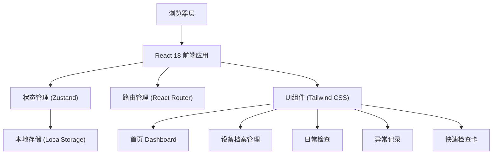
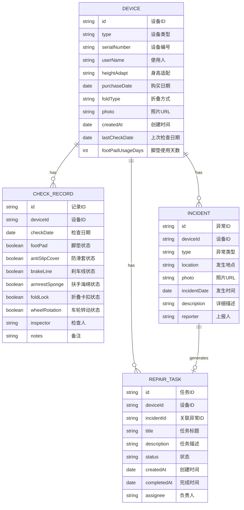

## 1. 架构设计



## 2. 技术描述

- **前端**：React@18 + TypeScript + Vite@5
- **样式**：Tailwind CSS@3
- **状态管理**：Zustand
- **路由**：React Router DOM@6
- **图标**：Lucide React
- **图表**：Recharts（用于趋势图）
- **二维码**：qrcode.react
- **数据存储**：LocalStorage（前端模拟持久化）
- **初始化工具**：vite-init
- **模板**：react-ts（纯前端项目）

## 3. 路由定义

| 路由 | 页面名称 | 用途 |
|-------|----------|------|
| / | 首页 | 显示待检查、待维修、脚垫更换提醒、异常趋势 |
| /devices | 设备档案列表 | 展示所有助行器设备列表 |
| /devices/new | 新增设备 | 创建设备档案 |
| /devices/:id | 设备详情 | 查看和编辑设备档案 |
| /checklist | 日常检查 | 进行日常检查勾选 |
| /checklist/history | 检查历史 | 查看历史检查记录 |
| /incidents | 异常记录列表 | 查看所有异常记录 |
| /incidents/new | 新增异常记录 | 上报异常并生成维修任务 |
| /quick-card | 快速检查卡 | 生成和展示快速检查卡 |
| /repairs | 维修任务 | 查看和管理维修任务 |

## 4. 数据模型

### 4.1 数据模型定义



### 4.2 数据类型定义

```typescript
// 设备类型
interface Device {
  id: string;
  type: string;
  serialNumber: string;
  userName: string;
  heightAdapt: string;
  purchaseDate: string;
  foldType: string;
  photo: string;
  createdAt: string;
  lastCheckDate: string;
  footPadUsageDays: number;
}

// 检查记录类型
interface CheckRecord {
  id: string;
  deviceId: string;
  checkDate: string;
  footPad: boolean;
  antiSlipCover: boolean;
  brakeLine: boolean;
  armrestSponge: boolean;
  foldLock: boolean;
  wheelRotation: boolean;
  inspector: string;
  notes: string;
}

// 异常类型
type IncidentType = 'fall' | 'brake_failure' | 'noise' | 'uneven';

interface Incident {
  id: string;
  deviceId: string;
  type: IncidentType;
  location: string;
  photo: string;
  incidentDate: string;
  description: string;
  reporter: string;
}

// 维修任务类型
type RepairStatus = 'pending' | 'in_progress' | 'completed';

interface RepairTask {
  id: string;
  deviceId: string;
  incidentId: string;
  title: string;
  description: string;
  status: RepairStatus;
  createdAt: string;
  completedAt: string;
  assignee: string;
}

// 检查项类型
interface CheckItem {
  key: string;
  label: string;
  icon: string;
  description: string;
}
```

### 4.3 模拟数据

系统初始化时将包含以下模拟数据：
- 3个助行器设备档案
- 5条历史检查记录
- 3条异常记录
- 2个维修任务

## 5. 状态管理设计

使用 Zustand 创建全局 store：

```typescript
interface AppStore {
  devices: Device[];
  checkRecords: CheckRecord[];
  incidents: Incident[];
  repairTasks: RepairTask[];
  
  // 设备操作
  addDevice: (device: Omit<Device, 'id' | 'createdAt'>) => void;
  updateDevice: (id: string, device: Partial<Device>) => void;
  deleteDevice: (id: string) => void;
  
  // 检查操作
  addCheckRecord: (record: Omit<CheckRecord, 'id'>) => void;
  
  // 异常操作
  addIncident: (incident: Omit<Incident, 'id'>) => void;
  
  // 维修任务操作
  updateRepairStatus: (id: string, status: RepairStatus) => void;
  
  // 统计数据
  getPendingChecks: () => number;
  getPendingRepairs: () => number;
  getFootPadWarnings: () => Device[];
  getIncidentTrend: () => { date: string; count: number }[];
}
```

## 6. 目录结构

```
src/
├── components/          # 公共组件
│   ├── Layout.tsx       # 布局组件
│   ├── StatCard.tsx     # 统计卡片
│   ├── DeviceCard.tsx   # 设备卡片
│   ├── CheckBoxItem.tsx # 检查项组件
│   └── TrendChart.tsx   # 趋势图表
├── pages/               # 页面组件
│   ├── Dashboard.tsx    # 首页
│   ├── DeviceList.tsx   # 设备列表
│   ├── DeviceForm.tsx   # 设备表单
│   ├── DeviceDetail.tsx # 设备详情
│   ├── Checklist.tsx    # 日常检查
│   ├── IncidentList.tsx # 异常列表
│   ├── IncidentForm.tsx # 异常表单
│   ├── QuickCard.tsx    # 快速检查卡
│   └── RepairTasks.tsx  # 维修任务
├── store/               # 状态管理
│   └── useAppStore.ts   # Zustand store
├── types/               # 类型定义
│   └── index.ts         # 数据类型
├── utils/               # 工具函数
│   ├── mockData.ts      # 模拟数据
│   └── helpers.ts       # 辅助函数
├── App.tsx              # 应用入口
├── main.tsx             # 渲染入口
└── index.css            # 全局样式
```

## 7. 功能模块划分

### 7.1 首页模块
- 待检查数量统计
- 待维修任务统计
- 脚垫更换提醒列表
- 异常趋势折线图
- 快捷操作入口

### 7.2 设备档案模块
- 设备CRUD操作
- 设备照片上传
- 设备信息展示

### 7.3 日常检查模块
- 6项检查勾选界面
- 检查进度指示
- 检查历史记录
- 自动更新设备检查日期

### 7.4 异常记录模块
- 异常类型选择（图标化）
- 地点记录和照片上传
- 自动生成维修任务
- 异常历史列表

### 7.5 快速检查卡模块
- 选择设备生成检查卡
- 大字体高对比度展示
- 二维码生成
- 打印优化样式

### 7.6 维修任务模块
- 任务列表展示
- 状态变更操作
- 任务详情查看
