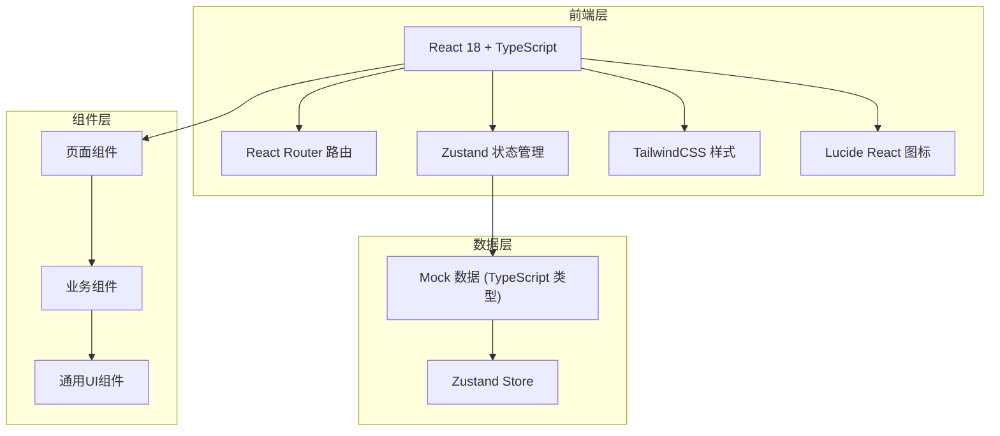
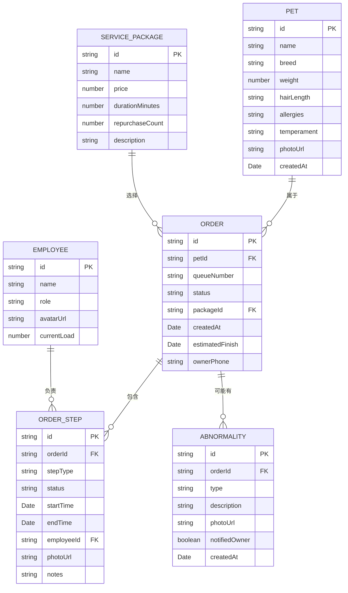

## 1. 架构设计



## 2. 技术选型

- **前端框架**：React 18 + TypeScript
- **构建工具**：Vite 5
- **样式方案**：TailwindCSS 3
- **状态管理**：Zustand
- **路由**：React Router DOM
- **图标库**：lucide-react
- **数据**：前端 Mock 数据，无后端依赖

## 3. 路由定义

| 路由路径 | 页面 | 用途 |
|-----------|-------|-------|
| `/` | 看板主页 Dashboard | 排队列表、超时预警、员工负载、热门套餐 |
| `/order/:id` | 订单详情 OrderDetail | 宠物档案、六步流程追踪、异常标记 |
| `/order/new` | 新建订单 NewOrder | 宠物信息录入、套餐选择 |

## 4. 数据模型

### 4.1 数据模型 ER 图



### 4.2 TypeScript 类型定义

```typescript
// 宠物档案
interface Pet {
  id: string;
  name: string;
  breed: string;
  weight: number;
  hairLength: 'short' | 'medium' | 'long';
  allergies: string[];
  temperament: string;
  photoUrl: string;
  createdAt: Date;
}

// 流程步骤枚举
type StepType = 'reception' | 'bath' | 'dry' | 'trim' | 'ear_paw_care' | 'photo_delivery';
type StepStatus = 'pending' | 'in_progress' | 'completed';

// 订单步骤
interface OrderStep {
  id: string;
  orderId: string;
  stepType: StepType;
  status: StepStatus;
  startTime?: Date;
  endTime?: Date;
  employeeId?: string;
  photoUrl?: string;
  notes?: string;
}

// 异常类型
type AbnormalityType = 'skin_redness' | 'severe_matting' | 'nail_bleeding';

// 异常记录
interface Abnormality {
  id: string;
  orderId: string;
  type: AbnormalityType;
  description: string;
  photoUrl?: string;
  notifiedOwner: boolean;
  createdAt: Date;
}

// 订单状态
type OrderStatus = 'queuing' | 'in_progress' | 'completed' | 'overdue';

// 订单
interface Order {
  id: string;
  petId: string;
  pet: Pet;
  queueNumber: string;
  status: OrderStatus;
  packageId: string;
  package: ServicePackage;
  steps: OrderStep[];
  abnormalities: Abnormality[];
  createdAt: Date;
  estimatedFinish: Date;
  ownerPhone: string;
}

// 员工
interface Employee {
  id: string;
  name: string;
  role: 'groomer' | 'receptionist' | 'manager';
  avatarUrl: string;
  currentLoad: number;
}

// 服务套餐
interface ServicePackage {
  id: string;
  name: string;
  price: number;
  durationMinutes: number;
  repurchaseCount: number;
  description: string;
}
```

## 5. 目录结构

```
trae0601-4/
├── src/
│   ├── pages/
│   │   ├── Dashboard.tsx        # 看板主页
│   │   ├── OrderDetail.tsx      # 订单详情
│   │   └── NewOrder.tsx         # 新建订单
│   ├── components/
│   │   ├── dashboard/
│   │   │   ├── StatCard.tsx          # 统计卡片
│   │   │   ├── QueueList.tsx         # 排队列表
│   │   │   ├── EmployeeLoad.tsx      # 员工负载
│   │   │   └── TopPackages.tsx       # 热门套餐
│   │   ├── order/
│   │   │   ├── PetProfileCard.tsx    # 宠物档案卡
│   │   │   ├── StepTimeline.tsx      # 六步流程时间轴
│   │   │   ├── StepDetail.tsx        # 步骤详情
│   │   │   └── AbnormalityPanel.tsx  # 异常标记面板
│   │   └── common/
│   │       ├── Header.tsx            # 顶部导航
│   │       └── Button.tsx            # 通用按钮
│   ├── store/
│   │   └── usePetStore.ts        # Zustand 状态管理
│   ├── types/
│   │   └── index.ts              # TypeScript 类型定义
│   ├── data/
│   │   └── mockData.ts           # Mock 初始数据
│   ├── utils/
│   │   └── time.ts               # 时间工具函数
│   ├── App.tsx
│   ├── main.tsx
│   └── index.css
├── package.json
├── vite.config.ts
├── tailwind.config.js
└── tsconfig.json
```
