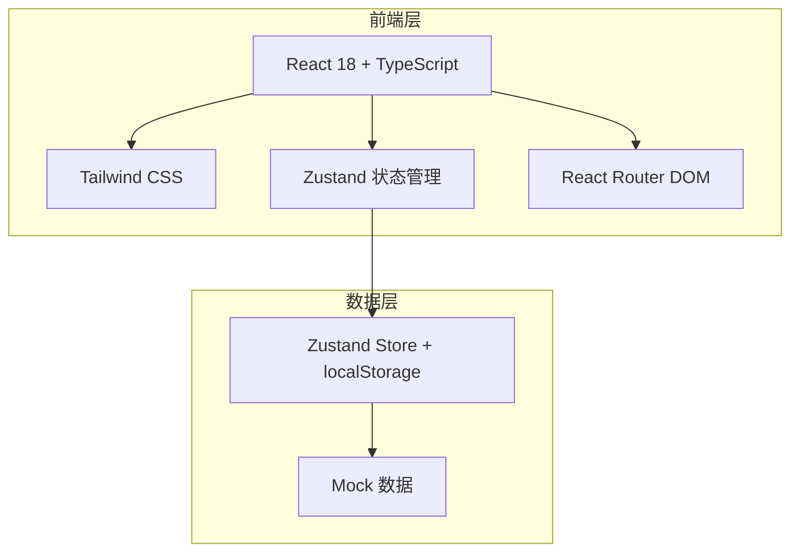
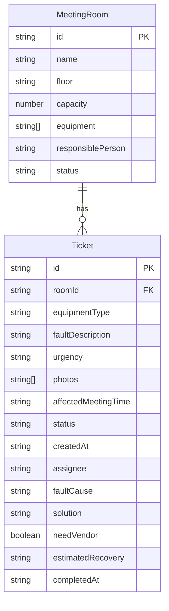

## 1. 架构设计

纯前端项目，使用 Zustand + localStorage 持久化数据，无需后端服务。

## 2. 技术说明

- 前端：React@18 + TypeScript + Tailwind CSS@3 + Vite
- 状态管理：Zustand（含 persist 中间件自动持久化到 localStorage）
- 路由：React Router DOM v6
- 图标：lucide-react
- 初始化工具：vite-init
- 后端：无（纯前端，数据存储在 localStorage）
- 数据库：无（使用 localStorage 模拟持久化）

## 3. 路由定义

| 路由 | 用途 |
|------|------|
| / | 报修看板首页（默认页），四列状态看板 |
| /rooms | 会议室管理页，登记和查看会议室 |
| /report | 提交报修页，新建工单 |
| /ticket/:id | 工单详情/处理页，维修人员接单和处理 |
| /alternatives | 替代建议页，推荐空闲会议室 |
| /stats | 统计概览页，数据分析和排行 |

## 4. 数据模型

### 4.1 数据模型定义

### 4.2 数据定义

**MeetingRoom（会议室）**

| 字段 | 类型 | 说明 |
|------|------|------|
| id | string | UUID |
| name | string | 会议室名称 |
| floor | string | 所在楼层 |
| capacity | number | 容纳人数 |
| equipment | string[] | 设备清单 |
| responsiblePerson | string | 负责人 |
| status | string | 状态：active/maintenance |

**Ticket（报修工单）**

| 字段 | 类型 | 说明 |
|------|------|------|
| id | string | UUID |
| roomId | string | 关联会议室ID |
| equipmentType | string | 设备类型 |
| faultDescription | string | 故障现象描述 |
| urgency | string | 紧急程度：urgent/high/normal |
| photos | string[] | 故障照片URL列表 |
| affectedMeetingTime | string | 受影响会议时间 |
| status | string | 状态：pending/repairing/resolved/procurement |
| createdAt | string | 创建时间 |
| assignee | string | 维修人员 |
| faultCause | string | 故障原因 |
| solution | string | 处理办法 |
| needVendor | boolean | 是否需要外部供应商 |
| estimatedRecovery | string | 预计恢复时间 |
| completedAt | string | 完成时间 |
