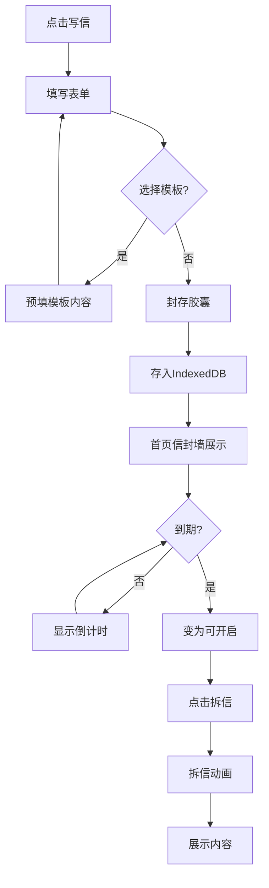

## 1. 产品概述

时间胶囊信箱——写给未来的信。用户可以创建时间胶囊信件，设定未来开启日期，在到期前信件以"密封信封"形态展示（仅显示倒计时），到期后以拆信动画揭示内容。所有数据本地存储，私密安全。

- 核心目的：帮助用户跨越时间与未来的自己对话，创造仪式感和期待感
- 目标用户：喜欢记录生活、注重仪式感的年轻人、学生和职场人

## 2. 核心功能

### 2.1 用户角色

无角色区分，单用户本地应用

### 2.2 功能模块

1. **首页（胶囊展示）**：信封与小盒子排列展示、新建胶囊入口、快速筛选
2. **新建/编辑胶囊**：写给未来自己的信，含标题、正文、开启日期、心情颜色、附图
3. **胶囊详情**：未到期展示倒计时+信封，到期展示拆信动画+完整内容
4. **时间线视图**：纵向时间线展示所有胶囊的状态流转
5. **纪念日模板**：预设模板（生日、毕业、入职等）一键创建胶囊
6. **数据管理**：导出备份JSON、导入恢复、IndexedDB本地存储

### 2.3 页面详情

| 页面名称 | 模块名称 | 功能描述 |
|---------|---------|---------|
| 首页 | 信封墙 | 横向/网格排列的密封信封和可开启信封，每个显示心情颜色条、标题（遮盖式）、倒计时/已开启标记 |
| 首页 | 新建入口 | 浮动"写信"按钮，点击进入新建胶囊页面 |
| 首页 | 筛选栏 | 按状态（全部/路上/已开启）、心情颜色筛选 |
| 新建胶囊 | 表单区 | 标题输入、富文本正文、日期选择器、心情颜色选择器、图片上传（多张） |
| 新建胶囊 | 模板快捷入口 | 底部模板卡片横滑，点击预填内容 |
| 胶囊详情-未到期 | 密封信封 | 大信封动画、倒计时天/时/分/秒、心情颜色氛围光、不可查看正文提示 |
| 胶囊详情-已到期 | 拆信动画 | 信封翻转打开动画、内容渐显、展示标题+正文+图片+写信日期+开启日期 |
| 时间线 | 纵向时间轴 | 按开启日期排列的节点，区分"路上"（虚线）和"已开启"（实线）状态 |
| 时间线 | 节点卡片 | 缩略信封/内容预览、状态标签、快捷操作 |
| 纪念日模板 | 模板列表 | 生日、毕业、入职、新年、恋爱纪念日等卡片，点击创建并预填开头文字 |
| 数据管理 | 导出导入 | 导出全量JSON备份（含图片Base64）、选择JSON文件导入恢复 |

## 3. 核心流程

**创建胶囊流程**：用户点击"写信" → 填写标题/正文/日期/心情/图片 → 点击"封存" → 信件存入IndexedDB → 首页信封墙新增一个密封信封

**开启胶囊流程**：系统实时检测到期胶囊 → 信封状态变为"可开启" → 用户点击信封 → 播放拆信动画 → 展示完整内容

**备份恢复流程**：用户点击导出 → 生成包含所有胶囊+图片的JSON文件下载 → 用户点击导入 → 选择JSON文件 → 解析写入IndexedDB

## 4. 用户界面设计

### 4.1 设计风格

- **主色调**：暖金色(#D4A574)作为主色，配合深棕(#2C1810)背景，营造复古信件氛围
- **辅助色**：奶油白(#FFF8F0)用于卡片和输入框，心情色系（珊瑚红、薰衣草紫、薄荷绿、琥珀黄、天蓝、玫瑰粉）用于信封标记
- **字体**：标题用"Playfair Display"衬线体营造书信质感，正文用"Noto Serif SC"中文衬线体保持阅读舒适
- **布局**：卡片式布局，信封有3D翻转和蜡封效果，整体风格偏向复古手写信件美学
- **按钮风格**：圆角胶囊按钮，带微妙阴影和悬停发光效果
- **图标风格**：lucide-react线性图标，搭配手绘风装饰元素
- **动效**：信封封蜡盖章动画、拆信翻转动画、倒计时脉冲、信封墙入场交错动画

### 4.2 页面设计概览

| 页面名称 | 模块名称 | UI元素 |
|---------|---------|--------|
| 首页 | 信封墙 | 网格卡片、3D信封造型、蜡封图标、心情颜色条、倒计时数字、交错入场动画 |
| 首页 | 筛选栏 | 胶囊按钮组、心情色点选择 |
| 新建胶囊 | 表单区 | 衬线标题、纸质纹理输入框、日期滚轮、色盘选择器、图片上传预览区 |
| 新建胶囊 | 模板入口 | 横向滑动卡片、图标+模板名 |
| 胶囊详情 | 密封信封 | 大信封居中、蜡封、光晕氛围、倒计时翻牌 |
| 胶囊详情 | 拆信展示 | 翻转打开动画、纸质信件展开、手写风排版 |
| 时间线 | 时间轴 | 纵向连线、圆形节点、状态色标记、悬停展开卡片 |
| 纪念日模板 | 模板列表 | 圆角卡片、节日图标、预设文字预览 |
| 数据管理 | 导出导入 | 大按钮+图标、操作反馈toast |

### 4.3 响应式设计

- 桌面优先设计，信封墙在大屏4列、中屏3列、小屏2列
- 时间线在移动端简化为单列
- 拆信动画在移动端适配触控交互

### 4.4 3D场景指引

不适用，采用2D CSS 3D变换实现信封翻转效果
