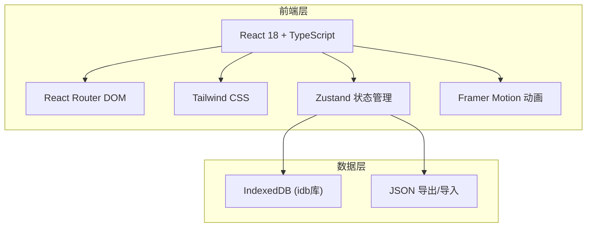
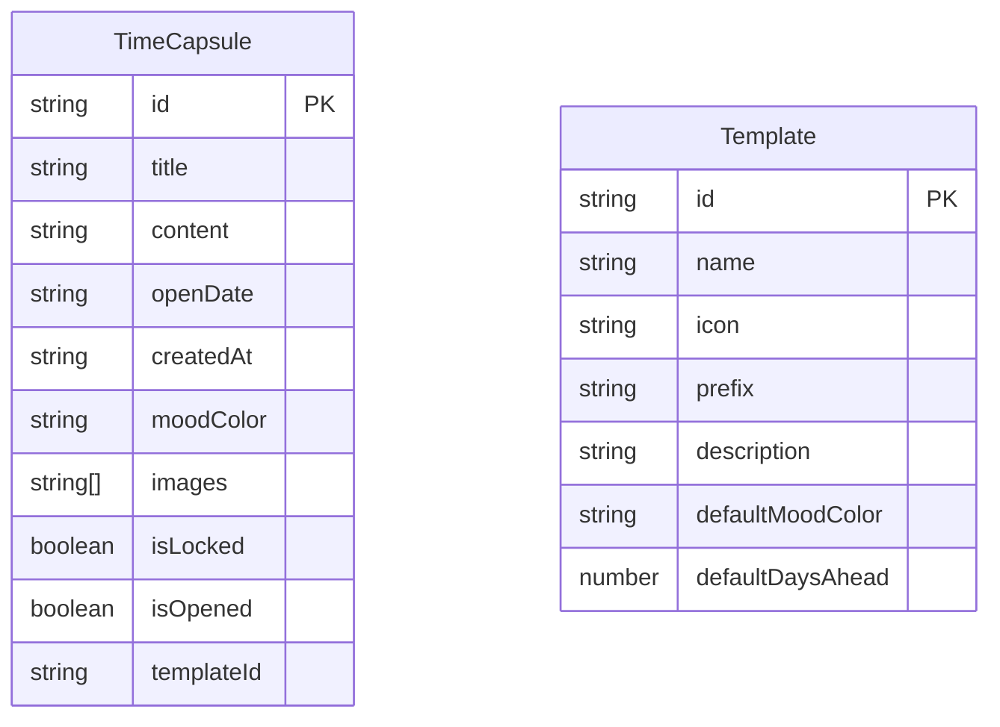

## 1. 架构设计



## 2. 技术说明

- **前端框架**：React@18 + TypeScript + Vite
- **初始化工具**：vite-init (react-ts模板)
- **样式方案**：Tailwind CSS@3 + 自定义CSS变量
- **状态管理**：Zustand
- **路由**：React Router DOM@6
- **动画**：Framer Motion（拆信动画、信封翻转、入场动效）
- **数据库**：IndexedDB（通过idb库封装）
- **图标**：lucide-react
- **后端**：无（纯前端应用）

## 3. 路由定义

| 路由 | 用途 |
|------|------|
| `/` | 首页——信封墙展示所有胶囊 |
| `/create` | 新建胶囊页面 |
| `/create/:templateId` | 从模板新建胶囊 |
| `/capsule/:id` | 胶囊详情页（未到期=密封，已到期=可开启） |
| `/timeline` | 时间线视图 |
| `/backup` | 数据备份与恢复 |

## 4. API定义

无后端API，所有数据操作通过Zustand Store + IndexedDB完成。

### Store接口定义

```typescript
interface TimeCapsule {
  id: string;
  title: string;
  content: string;
  openDate: string;
  createdAt: string;
  moodColor: string;
  images: string[];
  isLocked: boolean;
  isOpened: boolean;
  templateId?: string;
}

interface CapsuleStore {
  capsules: TimeCapsule[];
  filter: 'all' | 'on-the-way' | 'opened';
  moodFilter: string | null;
  loadCapsules: () => Promise<void>;
  addCapsule: (capsule: Omit<TimeCapsule, 'id' | 'createdAt' | 'isLocked' | 'isOpened'>) => Promise<void>;
  openCapsule: (id: string) => Promise<void>;
  deleteCapsule: (id: string) => Promise<void>;
  exportBackup: () => Promise<string>;
  importBackup: (json: string) => Promise<void>;
  setFilter: (filter: 'all' | 'on-the-way' | 'opened') => void;
  setMoodFilter: (color: string | null) => void;
}
```

## 5. 服务端架构图

不适用，纯前端应用

## 6. 数据模型

### 6.1 数据模型定义



### 6.2 IndexedDB Schema

- **数据库名**：`time-capsule-db`
- **版本**：1
- **Object Store**：
  - `capsules`：存储所有时间胶囊，主键 `id`，索引 `openDate`、`isOpened`
  - `templates`：存储纪念日模板（初始化时预填），主键 `id`
- **图片存储**：图片转为Base64字符串存储在 `images` 数组中
