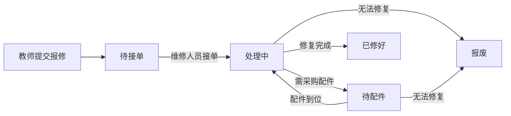

## 1. 产品概述

乐器维修排单系统，为音乐教室的乐器报修与维修管理提供数字化解决方案。解决口头报修易遗漏、维修进度不可追溯、故障统计缺失等问题。面向学校音乐教师、后勤维修人员及管理人员使用。

## 2. 核心功能

### 2.1 用户角色
| 角色 | 说明 | 核心权限 |
|------|------|----------|
| 报修人（教师） | 音乐教室任课老师 | 新增报修单、查看本人报修、乐器档案查询 |
| 维修人员 | 负责乐器维修的后勤人员 | 接单、处理维修、更新状态、填写处理说明 |
| 管理员 | 学校后勤/教务管理人员 | 全部权限：乐器档案CRUD、报修单全量管理、统计分析 |

### 2.2 功能模块
1. **乐器档案管理**：乐器列表、新增/编辑/删除乐器、乐器详情、照片上传
2. **报修单管理**：报修单列表（紧急优先排序）、新建报修、报修详情、状态流转
3. **维修工作台**：待接单列表、处理中列表、状态变更操作、处理日志记录
4. **统计分析**：教室报修排行、平均维修时长、反复维修乐器TOP榜、状态分布

### 2.3 页面详情
| 页面名称 | 模块名称 | 功能描述 |
|-----------|-------------|---------------------|
| 仪表盘 | 概览卡片 | 待接单/处理中/已修好/报废数量统计、今日新增报修 |
| 仪表盘 | 快捷操作 | 新建报修入口、乐器档案入口 |
| 乐器档案 | 列表区 | 表格展示乐器编号/类型/品牌/教室/责任人，支持筛选搜索 |
| 乐器档案 | 表单弹窗 | 新增/编辑乐器：编号、类型、品牌、存放教室、责任老师、照片上传 |
| 报修单 | 列表区 | 卡片/表格混合展示，按紧急程度+创建时间排序，标签显示状态 |
| 报修单 | 新建表单 | 选择乐器、故障现象、影响程度（1-5级）、是否影响上课、报修人、故障照片 |
| 报修详情 | 状态时间线 | 可视化展示从待接单到最终状态的完整流转过程 |
| 报修详情 | 处理操作 | 根据当前状态显示可操作按钮，每次操作必须填写处理说明 |
| 维修工作台 | 分栏视图 | 待接单/处理中/待配件 三列看板，支持拖拽或按钮切换状态 |
| 统计分析 | 教室报修排行 | 柱状图展示各教室报修数量排名 |
| 统计分析 | 维修时长 | 折线/柱状图展示月度平均维修时长（天） |
| 统计分析 | 反复维修榜 | 列表展示报修次数最多的乐器TOP10 |
| 统计分析 | 状态分布 | 饼图展示报修单状态占比 |

## 3. 核心流程

### 3.1 报修流程
教师发现乐器故障 → 进入报修页面选择对应乐器 → 填写故障信息并上传照片 → 系统自动将报修单标记为"待接单"并根据"是否影响上课"+"影响程度"计算紧急优先级 → 维修人员在工作台看到高优先级报修置顶。

### 3.2 维修流程
维修人员接单（待接单→处理中，填写接单说明）→ 维修过程中如需配件（处理中→待配件，填写配件信息）→ 维修完成（处理中/待配件→已修好，填写维修说明）→ 或判定无法修复（→报废，填写报废说明）。每次状态变更均记录处理人与时间戳。

### 3.3 流程框图

## 4. 用户界面设计

### 4.1 设计风格
- **主色调**：深胡桃木色 #5D4037（木质乐器质感），搭配温暖琥珀色 #FF8F00 作为紧急高亮
- **辅助色**：森林绿 #2E7D32（已修好）、石灰蓝 #455A64（处理中）、砖红 #C62828（报废）
- **背景**：米白色 #FFF8F1 底 + 细腻木纹纹理叠加
- **按钮风格**：圆角 10px，微立体阴影，hover 有轻微上浮动效
- **字体**：标题用 "Noto Serif SC"（衬线体，古典雅致），正文用 "Noto Sans SC"
- **布局**：左侧固定导航栏 + 右侧内容区，卡片式模块分区
- **图标风格**：线性图标 + 轻微圆角，音乐主题装饰元素

### 4.2 页面设计概览
| 页面名称 | 模块名称 | UI 元素 |
|-----------|-------------|-------------|
| 仪表盘 | 概览卡片 | 4色统计卡片，数字放大+趋势箭头，底部迷你进度条 |
| 报修单列表 | 紧急标签 | 红底白字闪烁动效标记"影响上课"的报修单 |
| 报修详情 | 状态时间线 | 左侧竖线+圆点节点，已完成状态绿色填充，当前状态脉冲动画 |
| 维修工作台 | 看板列 | 每列顶部大标题+数量徽章，卡片带阴影+渐变边框 |
| 统计分析 | 图表区 | 统一圆角容器，标题用衬线体，数据标签悬停浮层 |

### 4.3 响应式
- 桌面端（≥1280px）：左侧导航 240px + 内容区多列布局
- 平板（768-1279px）：导航折叠为图标模式，看板改为2列
- 移动端（<768px）：顶部汉堡菜单，列表单列堆叠，表单全宽
