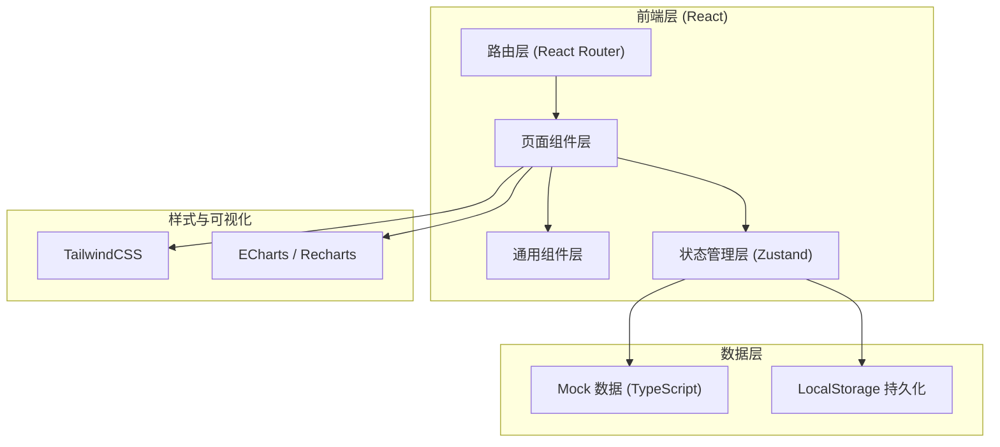
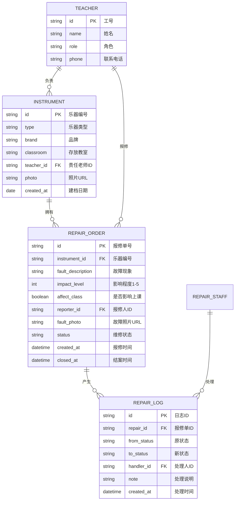

## 1. 架构设计



## 2. 技术说明

- **前端框架**：React 18 + TypeScript 5
- **构建工具**：Vite 5
- **样式方案**：TailwindCSS 3.4 + CSS 变量（主题系统）
- **状态管理**：Zustand 4（轻量级、持久化中间件）
- **路由**：React Router 6
- **图表库**：Recharts 2（React 原生图表库）
- **图标**：Lucide React（线性图标库）
- **后端**：无后端，使用 Mock 数据 + LocalStorage 持久化
- **数据库**：浏览器 LocalStorage（JSON 序列化存储）

## 3. 路由定义

| 路由路径 | 页面名称 | 用途 |
|----------|----------|------|
| `/` | 仪表盘 Dashboard | 概览统计、快捷入口 |
| `/instruments` | 乐器档案列表 | 乐器CRUD、搜索筛选 |
| `/instruments/new` | 新增乐器 | 乐器表单页 |
| `/repairs` | 报修单列表 | 报修单总览、紧急优先排序 |
| `/repairs/new` | 新建报修 | 报修表单页 |
| `/repairs/:id` | 报修详情 | 状态时间线、处理操作 |
| `/workbench` | 维修工作台 | 看板视图、快速流转状态 |
| `/statistics` | 统计分析 | 多维度数据图表 |

## 4. 数据模型

### 4.1 数据模型定义（ER图）



### 4.2 维修状态枚举

| 状态值 | 显示名称 | 颜色标识 |
|--------|----------|----------|
| `pending` | 待接单 | 橙黄色 #FF8F00 |
| `processing` | 处理中 | 蓝色 #1976D2 |
| `waiting_parts` | 待配件 | 紫色 #7B1FA2 |
| `completed` | 已修好 | 绿色 #2E7D32 |
| `scrapped` | 报废 | 红色 #C62828 |

### 4.3 优先级排序规则

报修单列表排序优先级（从高到低）：
1. `affect_class = true`（影响上课）置顶
2. `impact_level` 降序（5 → 1）
3. `status` 按处理中 → 待接单 → 待配件 → 已修好 → 报废
4. `created_at` 降序（最新报修在前）

## 5. 项目目录结构

```
src/
├── assets/              # 静态资源（图片、图标等）
├── components/          # 通用组件
│   ├── ui/             # 基础UI组件（Button、Modal、Card等）
│   ├── layout/         # 布局组件（Sidebar、Header）
│   └── shared/         # 业务共享组件（StatusTag、Timeline等）
├── pages/              # 页面组件
│   ├── Dashboard.tsx
│   ├── instruments/
│   ├── repairs/
│   ├── Workbench.tsx
│   └── Statistics.tsx
├── store/              # Zustand store
│   ├── instrumentStore.ts
│   ├── repairStore.ts
│   └── userStore.ts
├── types/              # TypeScript 类型定义
│   └── index.ts
├── mock/               # Mock 数据
│   ├── instruments.ts
│   ├── repairs.ts
│   └── users.ts
├── utils/              # 工具函数
│   ├── priority.ts
│   ├── date.ts
│   └── storage.ts
├── router/             # 路由配置
│   └── index.tsx
├── App.tsx
├── main.tsx
└── index.css
```
