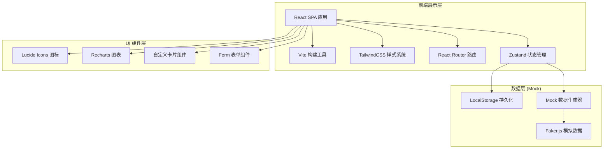

## 1. 架构设计



## 2. 技术描述

- **前端框架**: React 18 + TypeScript 5（类型安全）
- **构建工具**: Vite 5（极速热更新，打包优化）
- **样式方案**: TailwindCSS 3.4（原子化 CSS，自定义主题配置）
- **路由管理**: React Router 6（嵌套路由，代码分割）
- **状态管理**: Zustand 4（轻量状态，持久化中间件）
- **UI 组件**: 自研组件库 + TailwindCSS 预设
- **图表库**: Recharts 2（React 生态，支持响应式）
- **图标库**: Lucide React（线性图标，风格统一）
- **后端**: 无后端，使用 Mock 数据 + LocalStorage 持久化
- **数据模拟**: 内置丰富的充电桩、巡检、报修 Mock 数据集

## 3. 目录结构

```
src/
├── assets/              # 静态资源：图片、字体
├── components/          # 可复用组件
│   ├── layout/         # 布局组件：Sidebar、Header、Breadcrumb
│   ├── ui/             # 基础UI：Card、Button、Badge、Table、Modal
│   ├── charts/         # 图表组件：StatusDonut、UsageHeatmap、TrendLine
│   └── features/       # 业务组件：ChargingCard、InspectionForm、RepairTimeline
├── pages/               # 页面组件
│   ├── Dashboard.tsx   # 总览看板
│   ├── ChargingStations/  # 桩位档案模块
│   │   ├── List.tsx
│   │   ├── Detail.tsx
│   │   └── Form.tsx
│   ├── Inspections/    # 巡检管理模块
│   │   ├── Tasks.tsx
│   │   ├── Execute.tsx
│   │   └── Records.tsx
│   ├── Repairs/        # 报修中心模块
│   │   ├── Submit.tsx
│   │   ├── Tickets.tsx
│   │   └── Detail.tsx
│   ├── Maintenance/    # 维修记录模块
│   │   ├── Faults.tsx
│   │   ├── RecordForm.tsx
│   │   └── History.tsx
│   └── Statistics/     # 数据统计模块
│       ├── FaultRate.tsx
│       ├── UsagePeak.tsx
│       ├── PendingRepairs.tsx
│       └── LowEfficiency.tsx
├── store/              # Zustand 状态仓库
│   ├── stationStore.ts    # 充电桩数据
│   ├── inspectionStore.ts # 巡检数据
│   ├── repairStore.ts     # 报修数据
│   └── userStore.ts       # 用户状态
├── mock/               # Mock 数据
│   ├── stations.ts     # 充电桩档案
│   ├── inspections.ts  # 巡检记录
│   ├── repairs.ts      # 报修工单
│   └── maintenance.ts  # 维修记录
├── types/              # TypeScript 类型定义
│   └── index.ts
├── utils/              # 工具函数
│   ├── formatters.ts   # 日期/金额格式化
│   ├── validators.ts   # 表单校验
│   └── helpers.ts      # 通用工具
├── App.tsx
├── main.tsx
└── index.css
```

## 4. 路由定义

| 路由路径 | 页面组件 | 说明 |
|----------|----------|------|
| `/` | Dashboard | 总览看板 - 设备状态、告警、热力图 |
| `/stations` | StationList | 桩位档案列表 |
| `/stations/:id` | StationDetail | 充电桩详情（抽屉展示） |
| `/stations/new` | StationForm | 新增充电桩表单 |
| `/inspections/tasks` | InspectionTasks | 巡检任务列表 |
| `/inspections/execute/:id` | InspectionExecute | 执行巡检页面 |
| `/inspections/records` | InspectionRecords | 巡检历史记录 |
| `/repairs/submit` | RepairSubmit | 居民报修提交 |
| `/repairs/tickets` | RepairTickets | 报修工单列表 |
| `/repairs/tickets/:id` | RepairDetail | 报修工单详情 |
| `/maintenance/faults` | MaintenanceFaults | 故障桩列表（暂停预约） |
| `/maintenance/record` | MaintenanceRecordForm | 维修记录表单 |
| `/maintenance/history` | MaintenanceHistory | 维修历史 |
| `/statistics/fault-rate` | FaultRateStatistics | 故障率分析 |
| `/statistics/usage-peak` | UsagePeakStatistics | 使用高峰分析 |
| `/statistics/pending` | PendingRepairsStatistics | 未处理报修统计 |
| `/statistics/low-efficiency` | LowEfficiencyStatistics | 低效桩分析 |

## 5. 数据模型 (TypeScript 类型定义)

```typescript
// 充电桩状态
type StationStatus = 'online' | 'offline' | 'fault' | 'maintenance';

// 充电桩
interface ChargingStation {
  id: string;
  code: string;           // 桩位编号
  building: string;       // 所属楼栋
  location: string;       // 具体位置描述
  socketCount: number;    // 插座数量
  power: number;          // 功率 kW
  installDate: string;    // 安装日期
  feeRule: string;        // 收费规则描述
  feePerHour: number;     // 每小时费用
  photo: string;          // 照片URL
  status: StationStatus;  // 状态
  createdAt: string;
  lastInspectionAt: string | null;
}

// 巡检检查项
type InspectionItem =
  | 'screen'      // 屏幕
  | 'socket'      // 插座
  | 'leakage'     // 漏保
  | 'cable'       // 线缆
  | 'qrcode'      // 二维码
  | 'fireSpace'   // 消防间距
  | 'clutter';    // 周边堆物

type ItemStatus = 'normal' | 'abnormal' | 'skipped';

// 巡检记录
interface InspectionRecord {
  id: string;
  taskId: string;
  stationId: string;
  inspector: string;
  inspectorId: string;
  inspectDate: string;
  items: Record<InspectionItem, ItemStatus>;
  abnormalPhotos: Partial<Record<InspectionItem, string[]>>;
  remarks: string;
  hasAbnormal: boolean;
}

// 报修类型
type RepairIssueType =
  | 'no_charge'       // 充不进电
  | 'fee_error'       // 扣费异常
  | 'plug_hot'        // 插头发热
  | 'qrcode_invalid'  // 二维码失效
  | 'other';          // 其他

// 报修工单状态
type RepairStatus = 'pending' | 'processing' | 'maintenance' | 'completed' | 'cancelled';

// 报修工单
interface RepairTicket {
  id: string;
  ticketNo: string;
  stationId: string;
  issueType: RepairIssueType;
  description: string;
  photos: string[];
  reporterName: string;
  reporterPhone: string;
  reporterBuilding: string;
  status: RepairStatus;
  createdAt: string;
  assignee: string | null;          // 处理人
  assignedAt: string | null;
  completedAt: string | null;
  resolution: string | null;
  timeline: RepairTimelineItem[];
}

interface RepairTimelineItem {
  time: string;
  action: string;
  operator: string;
  note?: string;
}

// 维修记录
interface MaintenanceRecord {
  id: string;
  stationId: string;
  repairTicketId?: string;
  faultReason: string;
  faultCategory: string;
  partsReplaced: PartItem[];
  totalCost: number;
  technician: string;
  technicianPhone: string;
  startedAt: string;
  completedAt: string;
  notes: string;
  beforePhotos: string[];
  afterPhotos: string[];
  stationStatusAfter: StationStatus;  // 维修后状态
}

interface PartItem {
  name: string;
  quantity: number;
  unitPrice: number;
}

// 巡检任务
interface InspectionTask {
  id: string;
  name: string;
  date: string;
  inspector: string;
  stationIds: string[];
  completedCount: number;
  status: 'pending' | 'in_progress' | 'completed';
}
```

## 6. Mock 数据设计

### 6.1 充电桩数据
- 生成 24 个充电桩，分布于 6 栋楼（1-6号楼），每栋 4 个
- 状态分布：online 18 个、offline 2 个、fault 3 个、maintenance 1 个
- 功率：3.5kW / 7kW 两种，插座数：2 或 4 个
- 安装日期：2023年 - 2025年间随机

### 6.2 巡检数据
- 生成近 30 天的巡检记录，每天约 15-20 条
- 异常率约 8%：插座松动、屏幕不亮、堆物阻塞为常见问题

### 6.3 报修数据
- 生成 40 条报修工单，各状态均匀分布
- 问题类型分布：充不进电 30%、扣费异常 15%、插头发热 20%、二维码失效 25%、其他 10%

### 6.4 维修记录
- 生成 25 条维修记录，关联故障桩和报修工单
- 常见配件：插座模块、显示屏、漏保开关、主控板
