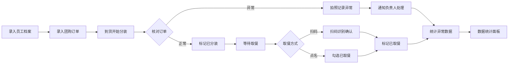

## 1. 产品概述
办公室午餐团购分装管理系统，解决团购到货后取餐混乱的问题。支持员工档案维护、订单录入、按取餐点分装、异常上报、扫码/点名取餐及数据统计，提升午餐分发效率。
- 主要解决：前台午餐堆积、取餐找餐困难、漏餐错餐无记录、异常无法追溯等痛点
- 目标用户：行政人员（管理员）、部门负责人、普通员工

## 2. 核心功能

### 2.1 用户角色
| 角色 | 登录方式 | 核心权限 |
|------|----------|----------|
| 管理员 | 本地身份选择 | 全部功能：员工管理、订单管理、分装、异常处理、统计 |
| 部门负责人 | 本地身份选择 | 查看本部门订单、处理本部门异常通知 |
| 普通员工 | 本地身份选择 | 查看个人订单、扫码取餐 |

### 2.2 功能模块
1. **员工档案页**：员工列表、新增/编辑/删除、按部门筛选、姓名搜索
2. **团购订单页**：订单列表、新增订单、按商家/日期/状态筛选、批量付款标记
3. **到货分装页**：按取餐点分组清单、分装进度、异常上报（拍照+记录）、通知负责人
4. **取餐确认页**：取餐点列表、扫码取餐、点名取餐、未取餐提醒
5. **数据统计页**：常点商家TOP、漏餐率趋势、未取餐统计、部门订单量、退款待处理

### 2.3 页面详情
| 页面名称 | 模块名称 | 功能描述 |
|---------|----------|----------|
| 员工档案页 | 员工列表卡片 | 展示姓名、部门、取餐点、忌口标签、手机号后四位 |
| 员工档案页 | 新增/编辑表单 | 姓名、部门（下拉）、取餐点（下拉）、忌口（多选标签）、手机号后四位 |
| 员工档案页 | 筛选搜索栏 | 部门筛选下拉、取餐点筛选、姓名关键词搜索 |
| 团购订单页 | 订单列表表格 | 日期、商家、菜品、规格、辣度、加饭、饮料、员工、取餐点、付款状态 |
| 团购订单页 | 新增订单表单 | 选择员工、商家、菜品、规格、辣度、加饭、饮料、备注 |
| 团购订单页 | 批量操作栏 | 批量标记已付款、按日期筛选、按商家筛选 |
| 到货分装页 | 取餐点分组卡 | 按取餐点折叠展示订单列表，显示份数统计、已分装/未分装进度条 |
| 到货分装页 | 异常上报弹窗 | 选择异常类型（漏餐/洒漏/错辣度）、备注说明、上传照片、标记处理状态 |
| 到货分装页 | 负责人通知 | 异常上报后自动生成通知列表，可一键通知对应部门负责人 |
| 取餐确认页 | 取餐点切换 | 顶部Tab切换不同取餐点 |
| 取餐确认页 | 扫码区域 | 模拟扫码识别员工订单，扫码成功显示订单详情并标记已取 |
| 取餐确认页 | 点名列表 | 按员工姓名排序列表，勾选标记已取餐，显示取餐状态标签 |
| 数据统计页 | 常点商家TOP | 柱状图展示TOP5商家订单量 |
| 数据统计页 | 漏餐率趋势 | 折线图展示近7天漏餐率变化 |
| 数据统计页 | 未取餐统计 | 数字卡片显示今日/本周未取餐数量及人员列表 |
| 数据统计页 | 部门订单量 | 饼图展示各部门订单占比 |
| 数据统计页 | 退款待处理 | 表格展示异常订单退款处理状态 |

## 3. 核心流程

### 主要流程描述
1. 管理员预先录入员工档案（姓名、部门、取餐点、忌口、手机号后四位）
2. 每日开团时，录入各员工团购订单（商家、菜品、规格、辣度、加饭、饮料、付款状态）
3. 到货后，进入分装页面按取餐点分组，根据清单逐份核对并标记已分装
4. 发现异常（漏餐/洒漏/错辣度）时，拍照记录并上报，系统通知部门负责人
5. 员工取餐时，管理员通过扫码或点名确认，订单标记已取餐
6. 统计页面实时展示各项运营数据，辅助后续优化

### 流程图表

## 4. 用户界面设计

### 4.1 设计风格
- **主色调**：暖橙 #FF7A45（午餐/食物温暖感），次色调：青绿 #22C55E（确认/成功）
- **辅助色**：火红 #EF4444（异常/警示），冷灰 #64748B（中性/文字）
- **按钮风格**：圆角12px，2px阴影，hover上浮微动画
- **字体**：标题使用 LXGW WenKai（温暖中文手写感），正文使用 PingFang SC（清晰易读）
- **布局风格**：左侧导航栏 + 右侧内容区，卡片式信息模块，圆角16px，柔和阴影
- **图标风格**：Lucide 线性图标，暖橙色高亮状态

### 4.2 页面设计概览
| 页面名称 | 模块名称 | UI元素 |
|---------|----------|--------|
| 全局布局 | 左侧导航 | 竖向导航栏，当前页面暖橙高亮，图标+文字 |
| 全局布局 | 顶部栏 | 面包屑、身份切换下拉、今日日期显示 |
| 员工档案 | 筛选区域 | 圆角卡片，水平排列筛选项，搜索框左侧带图标 |
| 员工档案 | 员工卡片 | 网格布局，头像首字、姓名大字、部门标签、忌口多色Tag |
| 团购订单 | 表格区域 | 斑马纹表格，状态色标签列，行hover高亮 |
| 到货分装 | 分组折叠卡 | 取餐点名称+份数角标，进度条渐变色，折叠展开动画 |
| 到货分装 | 异常弹窗 | 居中模态框，异常类型卡片选择，图片上传预览区 |
| 取餐确认 | 扫码区域 | 大尺寸模拟扫描框，扫描线动画，成功绿色反馈 |
| 取餐确认 | 点名列表 | 双列姓名卡片，已取餐灰化+勾选动画 |
| 数据统计 | 图表卡片 | 圆角卡片+渐变标题条，图表区域白底，数字特大号显示 |

### 4.3 响应式
- 桌面端优先设计（1440px基准）
- 平板端（768px）：左侧导航折叠为图标栏，表格改为卡片列表
- 移动端（<640px）：底部Tab导航，单列堆叠布局，大触控目标

### 4.4 微交互动效
- 页面加载：卡片逐个 fadeInUp 入场（延迟0-200ms）
- 按钮点击：scale 0.95 → 1.0 回弹
- 状态切换：标签颜色渐变过渡（300ms）
- 折叠展开：max-height + opacity 平滑过渡
- 扫码：扫描线从上到下循环动画
