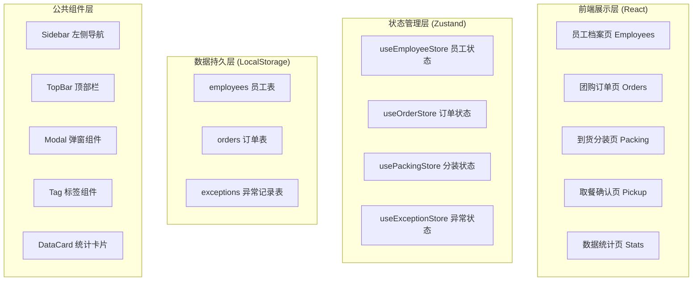
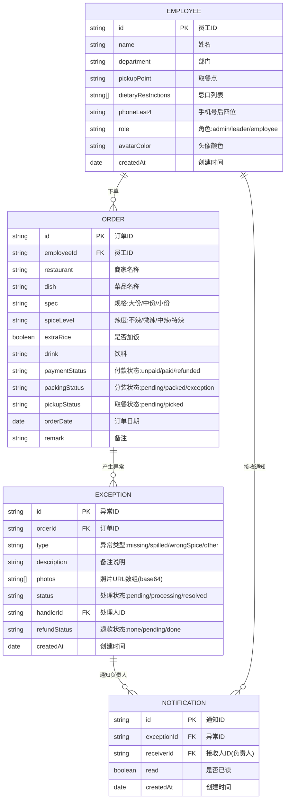

## 1. 架构设计



## 2. 技术说明

- **前端框架**：React@18 + TypeScript@5 + Vite@5
- **路由管理**：react-router-dom@6
- **状态管理**：zustand@4（分模块Store，LocalStorage持久化）
- **样式方案**：TailwindCSS@3 + CSS Variables（主题色）
- **图标库**：lucide-react
- **图表库**：recharts（轻量级React图表）
- **后端方案**：无后端，纯前端 + LocalStorage + Mock数据
- **数据持久化**：zustand-persist中间件写入LocalStorage

## 3. 路由定义

| 路由路径 | 页面名称 | 说明 |
|---------|----------|------|
| / | 重定向到 /orders | 默认进入订单页（业务主场景） |
| /employees | 员工档案页 | 员工CRUD |
| /orders | 团购订单页 | 订单管理、新增、筛选 |
| /packing | 到货分装页 | 按取餐点分组分装、异常上报 |
| /pickup | 取餐确认页 | 扫码/点名取餐 |
| /stats | 数据统计页 | 各类图表和统计数据 |

## 4. 数据模型定义

### 4.1 实体关系图



### 4.2 TypeScript 类型定义

```typescript
// 员工
interface Employee {
  id: string;
  name: string;
  department: string;
  pickupPoint: string;
  dietaryRestrictions: DietaryRestriction[];
  phoneLast4: string;
  role: 'admin' | 'leader' | 'employee';
  avatarColor: string;
  createdAt: string;
}

type DietaryRestriction = '无辣' | '素食' | '海鲜过敏' | '花生过敏' | '香菜' | '葱';
type PickupPoint = '前台A区' | '前台B区' | '1楼茶水间' | '2楼茶水间' | '3楼茶水间';
type Department = '技术部' | '产品部' | '设计部' | '运营部' | '市场部' | '人事部' | '财务部';

// 订单
interface Order {
  id: string;
  employeeId: string;
  restaurant: string;
  dish: string;
  spec: '大份' | '中份' | '小份';
  spiceLevel: '不辣' | '微辣' | '中辣' | '特辣';
  extraRice: boolean;
  drink: string;
  paymentStatus: 'unpaid' | 'paid' | 'refunded';
  packingStatus: 'pending' | 'packed' | 'exception';
  pickupStatus: 'pending' | 'picked';
  orderDate: string;
  remark: string;
}

// 异常
interface OrderException {
  id: string;
  orderId: string;
  type: 'missing' | 'spilled' | 'wrongSpice' | 'other';
  description: string;
  photos: string[];
  status: 'pending' | 'processing' | 'resolved';
  handlerId: string | null;
  refundStatus: 'none' | 'pending' | 'done';
  createdAt: string;
}
```

## 5. Store 模块设计

### useEmployeeStore
- `employees: Employee[]` - 员工列表
- `addEmployee(data: Omit<Employee, 'id' | 'createdAt'>)` - 新增
- `updateEmployee(id: string, data: Partial<Employee>)` - 更新
- `deleteEmployee(id: string)` - 删除
- `getEmployeeById(id: string)` - 按ID查询
- `getByDepartment(department: string)` - 按部门筛选
- `getByPickupPoint(point: string)` - 按取餐点筛选

### useOrderStore
- `orders: Order[]` - 订单列表
- `addOrder(data: Omit<Order, 'id' | 'packingStatus' | 'pickupStatus'>)` - 新增
- `updateOrder(id: string, data: Partial<Order>)` - 更新
- `deleteOrder(id: string)` - 删除
- `getByDate(date: string)` - 按日期查询
- `getByPickupPoint(point: string, date?: string)` - 按取餐点分组
- `getByEmployee(employeeId: string)` - 按员工查询
- `getByPaymentStatus(status: string)` - 按付款状态筛选
- `markPacked(id: string)` - 标记已分装
- `markPicked(id: string)` - 标记已取餐
- `markPaid(ids: string[])` - 批量标记付款

### useExceptionStore
- `exceptions: OrderException[]` - 异常列表
- `addException(data: Omit<OrderException, 'id' | 'createdAt'>)` - 上报异常
- `updateException(id: string, data: Partial<OrderException>)` - 更新处理状态
- `getByOrderId(orderId: string)` - 查询订单异常
- `getByStatus(status: string)` - 按处理状态筛选
- `getPendingRefunds()` - 获取待退款列表

## 6. 项目目录结构

```
src/
├── components/          # 公共组件
│   ├── Layout/         # 布局组件（Sidebar、TopBar）
│   ├── UI/             # 基础UI（Modal、Tag、Button、Input）
│   └── Charts/         # 图表组件
├── pages/              # 页面组件
│   ├── Employees/      # 员工档案
│   ├── Orders/         # 团购订单
│   ├── Packing/        # 到货分装
│   ├── Pickup/         # 取餐确认
│   └── Stats/          # 数据统计
├── store/              # Zustand状态
│   ├── employee.ts
│   ├── order.ts
│   └── exception.ts
├── types/              # TS类型
│   └── index.ts
├── utils/              # 工具函数
│   ├── mockData.ts     # Mock数据生成
│   ├── colors.ts       # 头像颜色生成
│   └── formatters.ts   # 格式化函数
├── App.tsx
├── main.tsx
└── index.css           # 全局样式+Tailwind
```
