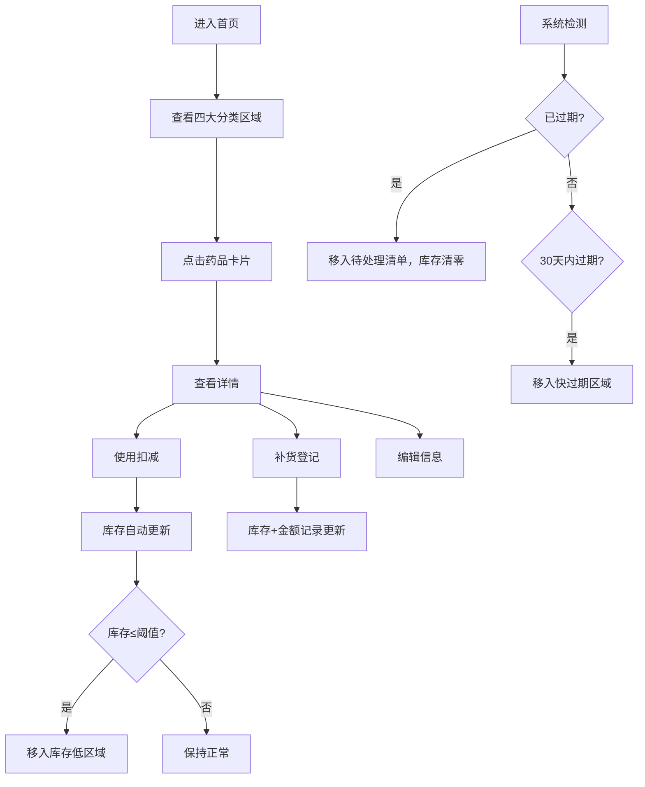

## 1. 产品概述

家庭药箱智能库存管理系统，帮助用户管理家中药品和护理用品，实时监控库存状态、有效期，避免"用时方恨少"的窘境。

- 目标用户：家庭主妇/主夫、需要照顾老人小孩的家庭成员
- 核心价值：杜绝药品过期浪费、避免急用缺货、智能提醒补货

## 2. 核心功能

### 2.1 用户角色

| 角色 | 注册方式 | 核心权限 |
|------|----------|----------|
| 家庭用户 | 无需注册，本地存储 | 全部功能 |

### 2.2 功能模块

1. **首页仪表盘**：快过期、库存低、常用药、儿童慎用四大分类卡片
2. **药品管理**：添加/编辑/删除药品，支持图片上传
3. **库存操作**：快速扣减（使用）、补货登记（价格+渠道）
4. **待处理清单**：过期药品自动进入，支持销毁/丢弃记录
5. **统计分析**：本月消耗品类Top、快过期金额、常缺物品排名

### 2.3 页面详情

| 页面名称 | 模块名称 | 功能描述 |
|----------|----------|----------|
| 首页仪表盘 | 快过期区 | 展示30天内过期物品，按剩余天数排序，醒目警示色 |
| 首页仪表盘 | 库存低区 | 展示库存≤阈值的物品，一键补货按钮 |
| 首页仪表盘 | 常用药区 | 展示标记为常用的药品，快速取用入口 |
| 首页仪表盘 | 儿童慎用区 | 展示儿童禁用/慎用药品，突出警示标识 |
| 药品列表页 | 药品卡片列表 | 展示全部药品，支持搜索、筛选、排序 |
| 药品详情/添加页 | 表单录入 | 名称、品类、适用人群、数量、单位、低库存阈值、有效期、存放位置、开封日期、图片、备注、是否常用、儿童慎用标记 |
| 库存操作弹窗 | 扣减库存 | 快速选择扣减数量，记录使用时间 |
| 库存操作弹窗 | 补货登记 | 输入补货数量、单价、购买渠道、购买日期 |
| 待处理清单页 | 过期列表 | 展示所有已过期药品，标记可用库存为0，支持处理操作 |
| 统计分析页 | 消耗排行 | 本月使用量Top品类柱状图 |
| 统计分析页 | 金额预警 | 快过期物品总金额卡片，明细列表 |
| 统计分析页 | 缺货记录 | 历史缺货次数排行，提醒常备物品 |

## 3. 核心流程

## 4. 用户界面设计

### 4.1 设计风格

- **主色调**：清新薄荷绿 (#10B981) 搭配温暖珊瑚橙 (#F97316)，传递健康与关怀
- **警示色**：到期深红 (#EF4444)、临期琥珀 (#F59E0B)、正常翠绿 (#10B981)
- **按钮风格**：圆角胶囊形按钮，带微阴影和hover上浮效果
- **字体**：标题用圆润的"ZCOOL KuaiLe"展示字体，正文用"Noto Sans SC"无衬线字体
- **布局风格**：卡片式网格布局，柔和阴影，圆角16px，充足留白
- **图标风格**：彩色扁平风emoji图标，每个品类对应专属emoji

### 4.2 页面设计概览

| 页面名称 | 模块名称 | UI元素 |
|----------|----------|--------|
| 首页仪表盘 | 顶部导航 | 渐变色标题栏、搜索框、统计页入口按钮 |
| 首页仪表盘 | 四大分类区 | 彩色分区标题、横向滚动卡片网格、计数徽章 |
| 首页仪表盘 | 浮动按钮 | 右下角圆形"+"添加按钮，带脉冲动画 |
| 药品卡片 | 卡片样式 | 左侧缩略图、中间信息（名称+数量+位置）、右侧状态标签和操作按钮 |
| 药品卡片 | 状态标签 | 颜色区分：绿=正常、黄=低库存、橙=快过期、红=已过期 |
| 药品表单页 | 表单布局 | 分组卡片式表单，图标+标签+输入框，图片上传区带预览 |
| 统计分析页 | 图表区 | 彩色柱状图、金额大数字卡片、排行列表带奖牌图标 |
| 待处理清单页 | 列表区 | 红色警示背景条、过期天数高亮、处理按钮组 |

### 4.3 响应式

- Desktop-first设计，桌面端3-4列卡片网格
- 平板端2列，移动端单列
- 所有触摸目标≥44px，移动端优化手势操作
- 底部导航栏在移动端显示，桌面端顶部导航

### 4.4 动效设计

- 页面加载：卡片从下至上渐入，带stagger延迟
- 库存扣减：数字滚动动画 + 轻微缩放反馈
- 状态变化：卡片颜色渐变过渡
- 按钮交互：hover上浮2px + 阴影加深，click有按压缩放
- 警示区域：脉冲呼吸动画吸引注意
