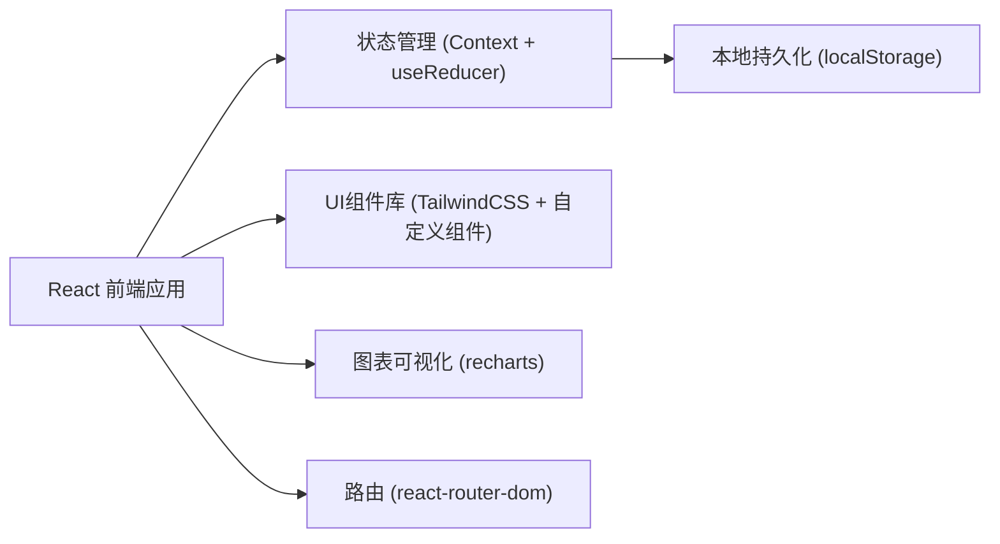
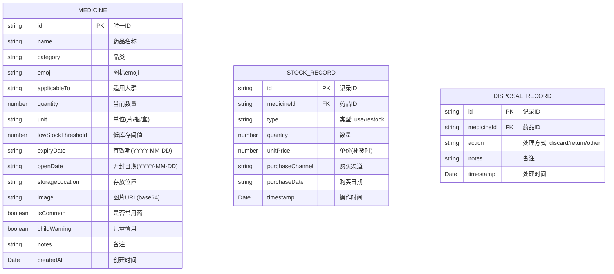

## 1. 架构设计



## 2. 技术说明

- 前端：React@18 + TypeScript + Vite
- 样式：TailwindCSS@3 + 自定义CSS动画
- 图表：recharts
- 路由：react-router-dom@6
- 图标：Lucide React
- 数据存储：localStorage（前端本地持久化，无需后端）
- 初始化工具：npm create vite@latest

## 3. 路由定义

| 路由 | 用途 |
|------|------|
| / | 首页仪表盘 - 四大分类展示 |
| /medicines | 药品列表 - 全部药品管理 |
| /medicines/new | 新增药品表单 |
| /medicines/:id | 药品详情 + 编辑 |
| /pending | 待处理清单 - 过期药品 |
| /statistics | 统计分析页 |

## 4. 数据模型

### 4.1 数据模型定义



### 4.2 TypeScript 类型定义

```typescript
type Category = '退烧药' | '感冒药' | '消炎药' | '肠胃药' | '外用药' | '创可贴/敷料' | '碘伏/消毒' | '保健品' | '其他';
type ApplicableTo = '全部人群' | '成人' | '儿童' | '老年人' | '孕妇禁用' | '特定人群';

interface Medicine {
  id: string;
  name: string;
  category: Category;
  emoji: string;
  applicableTo: ApplicableTo;
  quantity: number;
  unit: string;
  lowStockThreshold: number;
  expiryDate: string;
  openDate?: string;
  storageLocation: string;
  image?: string;
  isCommon: boolean;
  childWarning: boolean;
  notes?: string;
  createdAt: string;
}

interface StockRecord {
  id: string;
  medicineId: string;
  type: 'use' | 'restock';
  quantity: number;
  unitPrice?: number;
  purchaseChannel?: string;
  purchaseDate?: string;
  timestamp: string;
}

interface DisposalRecord {
  id: string;
  medicineId: string;
  action: 'discard' | 'return' | 'other';
  notes?: string;
  timestamp: string;
}
```

## 5. 核心业务逻辑

### 5.1 状态计算规则

```
isExpired = today > expiryDate
isExpiringSoon = !isExpired && daysUntilExpiry <= 30
isLowStock = quantity <= lowStockThreshold
isAvailable = !isExpired && quantity > 0
```

### 5.2 过期处理机制

- 每次加载应用时扫描全部药品
- 已过期药品：自动从可用库存排除，移入待处理清单
- 已过期药品不显示在首页"常用药""库存低"等区域
- 待处理清单中的药品需要手动标记"已丢弃/已处理"

### 5.3 统计计算

- 本月消耗：取当月 StockRecord 中 type='use' 的记录按 category 聚合
- 快过期金额：StockRecord 中近期补货的 unitPrice × 快过期药品的 quantity
- 常缺物品：统计 lowStock 触发次数或历史库存为0的药品排序
