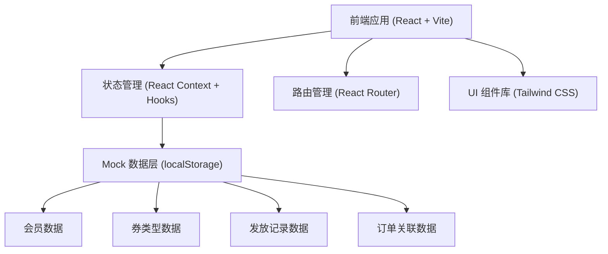
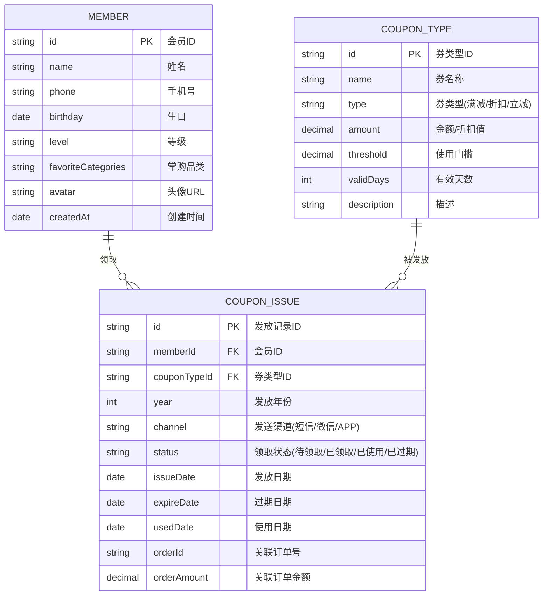

# 会员生日券管理系统 技术架构文档

## 1. 架构设计



## 2. 技术描述

- **前端框架**：React@18 + TypeScript
- **构建工具**：Vite@5
- **样式方案**：TailwindCSS@3
- **路由管理**：React Router DOM@6
- **状态管理**：React Context + useReducer
- **数据存储**：localStorage 持久化 + Mock 初始数据
- **图标库**：Lucide React
- **日期处理**：date-fns

## 3. 路由定义

| 路由路径 | 页面名称 | 说明 |
|---------|---------|-----|
| / | 数据概览 | 统计卡片、本月生日会员、漏发预警 |
| /members | 会员管理 | 会员列表、搜索筛选、新增/编辑 |
| /coupons | 生日券管理 | 本月生日列表、发券操作、发放记录 |
| /coupons/expired | 过期未用券 | 已过期未使用的券列表 |
| /coupon-types | 券类型配置 | 券模板管理 |

## 4. 数据模型

### 4.1 数据模型 ER 图



### 4.2 核心业务规则

1. **防重复发券**：同一会员 + 同一年 + 同一券类型，只能发放一次
2. **过期判定**：发放日期 + 有效天数 < 当前日期 且 状态为待领取/已领取 → 已过期
3. **使用率计算**：已使用券数 / 已发放券总数 * 100%
4. **漏发判定**：本月生日会员中，未在本年发放过该券类型的会员

## 5. 核心模块划分

```
src/
├── components/        # 通用组件
│   ├── Layout/        # 布局组件
│   ├── Card/          # 数据卡片
│   ├── Table/         # 表格组件
│   ├── Modal/         # 弹窗组件
│   └── StatusTag/     # 状态标签
├── pages/             # 页面组件
│   ├── Dashboard/     # 数据概览
│   ├── Members/       # 会员管理
│   ├── Coupons/       # 生日券管理
│   └── CouponTypes/   # 券类型配置
├── context/           # 全局状态
│   ├── MemberContext.tsx
│   ├── CouponContext.tsx
│   └── CouponTypeContext.tsx
├── types/             # TypeScript 类型定义
│   └── index.ts
├── data/              # Mock 数据
│   └── mockData.ts
├── utils/             # 工具函数
│   ├── date.ts
│   └── coupon.ts
└── hooks/             # 自定义 Hooks
    └── useLocalStorage.ts
```

## 6. 状态管理设计

使用 React Context + useReducer 管理全局状态，配合 localStorage 实现数据持久化。

- **MemberContext**：会员数据 CRUD
- **CouponContext**：发放记录管理、发券逻辑、统计计算
- **CouponTypeContext**：券类型配置管理

## 7. 关键功能实现要点

1. **本月生日会员筛选**：按月/日匹配生日，忽略年份
2. **防重复发券校验**：发券前检查 memberId + year + couponTypeId 组合是否已存在
3. **过期状态实时计算**：列表渲染时根据当前日期动态判定券状态
4. **统计数据聚合**：按月维度聚合发券数、使用数、订单金额
5. **漏发名单生成**：本月生日会员 - 已在本年发券的会员

## 8. 初始 Mock 数据

- 20+ 个会员，覆盖不同等级和生日月份
- 3-4 种券类型（50 元立减券、100 元满减券、8 折折扣券等）
- 若干历史发放记录，包含不同领取状态
- 部分已过期未使用的券记录
