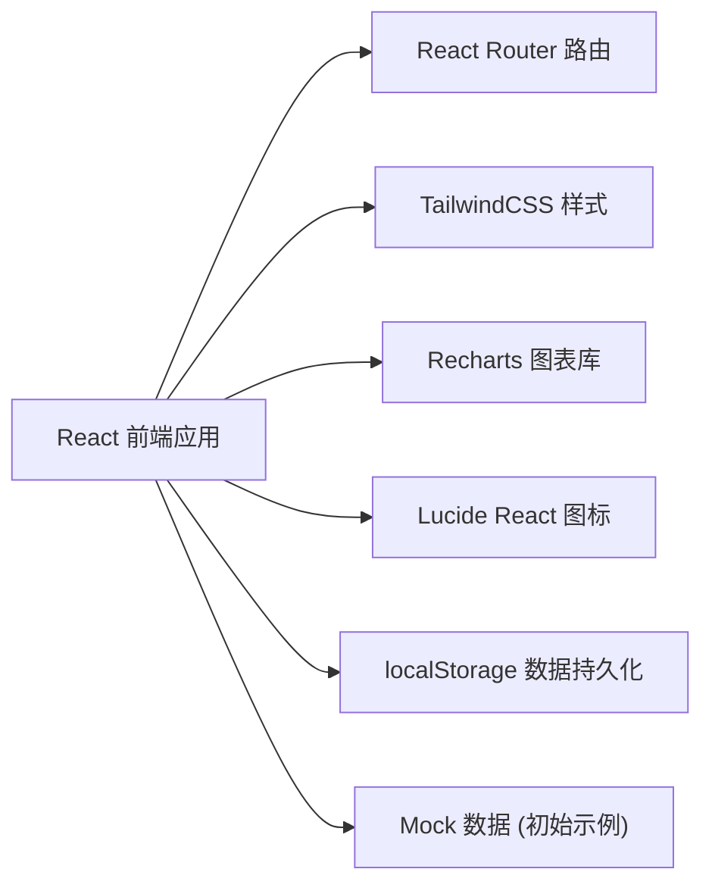
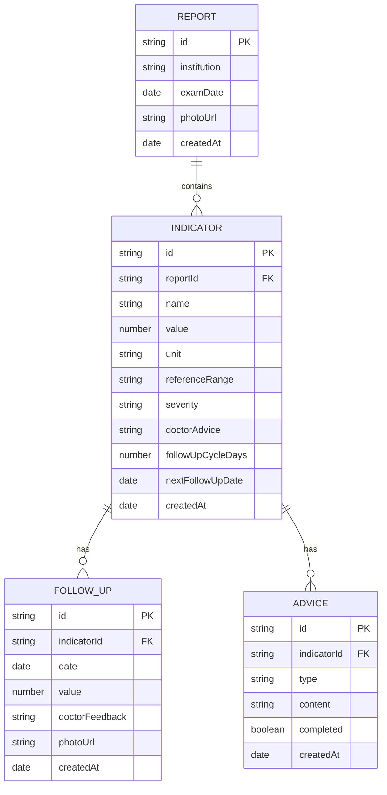

## 1. 架构设计



## 2. 技术说明
- 前端框架：React@18 + TypeScript
- 构建工具：Vite@5
- 样式方案：TailwindCSS@3
- 路由管理：React Router@6
- 图表组件：Recharts（轻量级折线图）
- 图标库：Lucide React
- 数据存储：localStorage（浏览器本地存储，无需后端）
- 初始化工具：npm create vite@latest

## 3. 路由定义
| 路由路径 | 页面用途 |
|---------|---------|
| / | 总览仪表盘 - 统计概览、待复查任务、预警信息 |
| /reports | 体检报告列表 - 所有报告卡片展示 |
| /reports/new | 新建报告 - 录入体检信息表单 |
| /reports/:id | 报告详情 - 报告基本信息及异常指标列表 |
| /indicators/:id | 指标详情 - 趋势图、复查记录、健康建议 |

## 4. 数据模型

### 4.1 数据模型ER图



### 4.2 TypeScript 类型定义

```typescript
type Severity = 'mild' | 'attention' | 'urgent';
type AdviceType = 'medication' | 'exercise' | 'diet';

interface Report {
  id: string;
  institution: string;
  examDate: string;
  photoUrl?: string;
  createdAt: string;
}

interface Indicator {
  id: string;
  reportId: string;
  name: string;
  value: number;
  unit: string;
  referenceRange: string;
  severity: Severity;
  doctorAdvice: string;
  followUpCycleDays: number;
  nextFollowUpDate: string;
  createdAt: string;
}

interface FollowUp {
  id: string;
  indicatorId: string;
  date: string;
  value: number;
  doctorFeedback: string;
  photoUrl?: string;
  createdAt: string;
}

interface Advice {
  id: string;
  indicatorId: string;
  type: AdviceType;
  content: string;
  completed: boolean;
  createdAt: string;
}
```

## 5. 目录结构

```
src/
├── components/          # 可复用组件
│   ├── Dashboard/       # 仪表盘相关组件
│   ├── Report/          # 报告相关组件
│   ├── Indicator/       # 指标相关组件
│   ├── FollowUp/        # 复查记录组件
│   ├── Advice/          # 建议相关组件
│   └── UI/              # 基础UI组件（卡片、按钮等）
├── pages/               # 页面组件
│   ├── Dashboard.tsx
│   ├── ReportList.tsx
│   ├── ReportNew.tsx
│   ├── ReportDetail.tsx
│   └── IndicatorDetail.tsx
├── hooks/               # 自定义Hooks
│   └── useLocalStorage.ts
├── store/               # 状态管理
│   └── index.ts
├── types/               # TypeScript类型定义
│   └── index.ts
├── utils/               # 工具函数
│   ├── date.ts
│   └── mockData.ts
├── App.tsx
├── main.tsx
└── index.css
```
