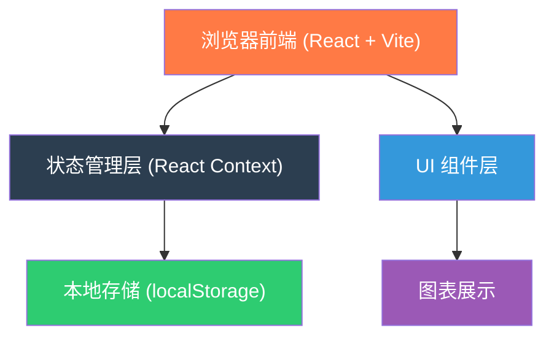
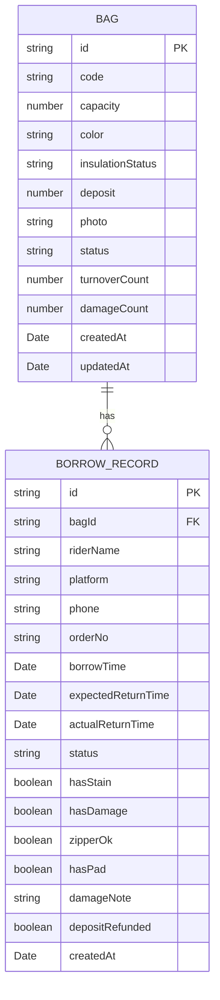

# 保温袋周转管理系统 技术架构文档

## 1. 架构设计



## 2. 技术选型说明

| 技术栈 | 选型 | 说明 |
|--------|------|------|
| 前端框架 | React 18 | 组件化开发，生态丰富 |
| 构建工具 | Vite 5 | 开发体验好，构建速度快 |
| 样式方案 | TailwindCSS 3 | 原子化 CSS，开发效率高 |
| 图表库 | Recharts | React 生态，开箱即用的统计图表 |
| 图标库 | Lucide React | 轻量美观的图标集 |
| 状态管理 | React Context + useReducer | 应用规模小，无需引入 Redux |
| 数据存储 | localStorage | 纯前端应用，数据本地持久化 |
| 路由 | React Router v6 | 单页应用路由管理 |
| 语言 | TypeScript | 类型安全，提升可维护性 |

## 3. 路由定义

| 路由路径 | 页面名称 | 说明 |
|----------|----------|------|
| / | 总览页 | 数据概览、快捷操作、最近动态 |
| /bags | 袋子档案 | 保温袋列表、新增/编辑/删除 |
| /borrow | 借出记录 | 借出列表、新增借出 |
| /return | 归还管理 | 待归还列表、归还登记 |
| /overdue | 催还区 | 超时未还列表 |
| /statistics | 数据统计 | 周转次数、损坏率、押金统计 |

## 4. 数据模型

### 4.1 ER 图



### 4.2 数据类型定义

```typescript
// 保温袋状态
type BagStatus = 'available' | 'borrowed' | 'damaged' | 'lost';

// 借出记录状态
type BorrowStatus = 'active' | 'returned' | 'overdue' | 'lost';

// 保温层状态
type InsulationStatus = 'excellent' | 'good' | 'fair' | 'poor';

// 外卖平台
type Platform = 'meituan' | 'eleme' | 'douyin' | 'other';

interface Bag {
  id: string;
  code: string;              // 袋子编号
  capacity: number;          // 容量（升）
  color: string;             // 颜色
  insulationStatus: InsulationStatus; // 保温层状态
  deposit: number;           // 押金金额
  photo: string;             // 照片 base64
  status: BagStatus;         // 当前状态
  turnoverCount: number;     // 周转次数
  damageCount: number;       // 损坏次数
  createdAt: string;
  updatedAt: string;
}

interface BorrowRecord {
  id: string;
  bagId: string;
  riderName: string;         // 骑手姓名
  platform: Platform;        // 平台
  phone: string;             // 手机号
  orderNo: string;           // 订单号
  borrowTime: string;        // 借出时间
  expectedReturnTime: string; // 预计归还时间
  actualReturnTime?: string; // 实际归还时间
  status: BorrowStatus;      // 状态
  hasStain?: boolean;        // 是否有污渍
  hasDamage?: boolean;       // 是否破损
  zipperOk?: boolean;        // 拉链是否正常
  hasPad?: boolean;          // 是否有垫板
  damageNote?: string;       // 损坏备注
  depositRefunded?: boolean; // 押金是否已退
  createdAt: string;
}
```

## 5. 项目目录结构

```
src/
├── components/          # 通用组件
│   ├── Layout/         # 布局组件（侧边栏、顶栏）
│   ├── Card/           # 卡片组件
│   ├── Modal/          # 弹窗组件
│   ├── StatusTag/      # 状态标签
│   └── Empty/          # 空状态
├── pages/              # 页面组件
│   ├── Dashboard/      # 总览页
│   ├── Bags/           # 袋子档案
│   ├── Borrow/         # 借出记录
│   ├── Return/         # 归还管理
│   ├── Overdue/        # 催还区
│   └── Statistics/     # 数据统计
├── context/            # 状态管理
│   └── AppContext.tsx
├── types/              # TypeScript 类型
│   └── index.ts
├── utils/              # 工具函数
│   ├── storage.ts      # localStorage 封装
│   ├── date.ts         # 日期处理
│   └── mock.ts         # Mock 数据
├── App.tsx
├── main.tsx
└── index.css
```

## 6. 核心功能实现思路

### 6.1 状态管理
- 使用 React Context 统一管理袋子和借出记录数据
- 初始化时从 localStorage 读取数据
- 数据变更时自动同步到 localStorage

### 6.2 超时判断逻辑
- 每次渲染时计算当前时间与预计归还时间的差值
- 超过预计归还时间且状态为 active 的记录标记为 overdue
- 催还区展示所有 overdue 状态的记录

### 6.3 统计计算
- 周转次数：每个袋子的借出次数
- 损坏率：损坏次数 / 总周转次数
- 押金未退：状态为 active 或 overdue 且押金未退的记录

### 6.4 图片处理
- 使用 FileReader API 读取本地图片
- 转换为 base64 存储在 localStorage
- 限制图片大小，超出则压缩

## 7. Mock 数据

预置 10 个保温袋、15 条借出记录（包含进行中、已归还、超时三种状态），用于演示和测试。
