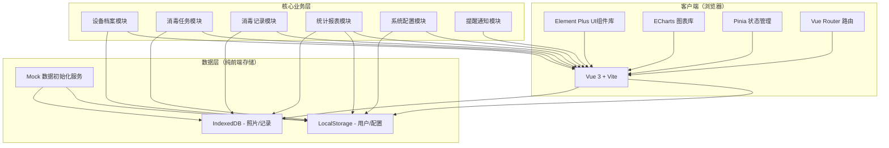
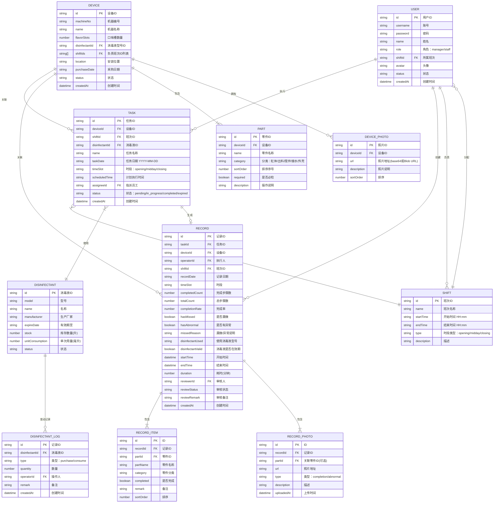

## 1. 架构设计



## 2. 技术描述

- **前端框架**：Vue 3.4 + TypeScript 5.0 + Vite 5.0
- **UI 组件库**：Element Plus 2.4
- **图表可视化**：ECharts 5.4
- **状态管理**：Pinia 2.1
- **路由管理**：Vue Router 4.2
- **数据存储**：LocalStorage（结构化数据） + IndexedDB（照片/大文件）
- **日期处理**：dayjs 1.11
- **图标库**：@element-plus/icons-vue
- **工具库**：uuid（ID生成）、lodash-es（数据处理）

## 3. 路由定义

| 路由路径 | 页面名称 | 权限 | 说明 |
|---------|---------|------|------|
| `/login` | 登录页 | 公开 | 角色选择、账号密码登录 |
| `/dashboard` | 工作台 | 店长/员工 | 数据概览、待办提醒、快捷入口 |
| `/devices` | 设备档案 | 店长/员工 | 机器列表、档案详情、零件配置 |
| `/devices/create` | 新增设备 | 店长 | 设备表单、照片上传 |
| `/devices/:id/edit` | 编辑设备 | 店长 | 修改设备信息 |
| `/tasks` | 消毒任务 | 店长/员工 | 任务列表、按时间分组展示 |
| `/tasks/:id/execute` | 执行消毒 | 员工 | 逐项勾选、照片上传、消毒液校验 |
| `/records` | 消毒记录 | 店长/员工 | 历史记录查询、筛选、异常标记 |
| `/records/:id` | 记录详情 | 店长/员工 | 步骤详情、照片预览、漏做说明 |
| `/statistics` | 统计报表 | 店长 | 完成率、漏做排行、异常照片、消毒液消耗 |
| `/settings/shifts` | 班次配置 | 店长 | 班次时间段、负责人管理 |
| `/settings/disinfectant` | 消毒液管理 | 店长 | 型号、有效期、库存管理 |
| `/settings/notification` | 提醒配置 | 店长 | 提醒规则、预警天数设置 |
| `/settings/users` | 员工管理 | 店长 | 账号、角色、班次分配 |

## 4. 数据模型

### 4.1 实体关系图（ER图）



### 4.2 初始Mock数据

```typescript
// 默认账号
const defaultUsers = [
  { id: 'u001', username: 'manager', password: '123456', name: '张店长', role: 'manager' },
  { id: 'u002', username: 'staff01', password: '123456', name: '李员工', role: 'staff' },
  { id: 'u003', username: 'staff02', password: '123456', name: '王员工', role: 'staff' }
];

// 班次配置
const defaultShifts = [
  { id: 's001', name: '开店前', startTime: '07:30', endTime: '08:30', type: 'opening' },
  { id: 's002', name: '午间', startTime: '12:30', endTime: '13:30', type: 'midday' },
  { id: 's003', name: '打烊', startTime: '22:00', endTime: '23:00', type: 'closing' }
];

// 默认消毒液
const defaultDisinfectants = [
  { id: 'd001', model: 'D-84-500', name: '84消毒液', manufacturer: '利康', expireDate: '2026-12-31', stock: 50, unitConsumption: 50 },
  { id: 'd002', model: 'D-QX-100', name: '强力消毒剂', manufacturer: '安洁', expireDate: '2026-08-15', stock: 20, unitConsumption: 30 }
];

// 默认设备
const defaultDevices = [
  {
    id: 'dev001', machineNo: 'ICM-2025-A001', name: '软质冰淇淋机1号', flavorSlots: 3,
    disinfectantId: 'd001', shiftIds: ['s001', 's002', 's003'],
    parts: [
      { id: 'p001', name: '左料缸', category: '缸体', sortOrder: 1, required: true },
      { id: 'p002', name: '中料缸', category: '缸体', sortOrder: 2, required: true },
      { id: 'p003', name: '右料缸', category: '缸体', sortOrder: 3, required: true },
      { id: 'p004', name: '出料口总成', category: '出料', sortOrder: 4, required: true },
      { id: 'p005', name: '搅拌轴×3', category: '搅拌', sortOrder: 5, required: true },
      { id: 'p006', name: '接水盘', category: '接水', sortOrder: 6, required: true },
      { id: 'p007', name: '设备外壳', category: '外壳', sortOrder: 7, required: true }
    ]
  },
  {
    id: 'dev002', machineNo: 'ICM-2025-A002', name: '硬质冰淇淋机2号', flavorSlots: 2,
    disinfectantId: 'd001', shiftIds: ['s001', 's003'],
    parts: [
      { id: 'p008', name: '左料缸', category: '缸体', sortOrder: 1, required: true },
      { id: 'p009', name: '右料缸', category: '缸体', sortOrder: 2, required: true },
      { id: 'p010', name: '出料口总成', category: '出料', sortOrder: 3, required: true },
      { id: 'p011', name: '搅拌轴×2', category: '搅拌', sortOrder: 4, required: true },
      { id: 'p012', name: '接水盘', category: '接水', sortOrder: 5, required: true },
      { id: 'p013', name: '设备外壳', category: '外壳', sortOrder: 6, required: true }
    ]
  }
];
```

## 5. 核心业务规则

### 5.1 任务自动生成规则

- 每日凌晨 00:10 根据设备档案的 `shiftIds` 自动生成当日三个时段任务
- 任务状态流转：`pending`(待执行) → `in_progress`(进行中) → `completed`(已完成) / `expired`(已逾期)
- 超过班次结束时间未完成的任务自动标记为 `expired`

### 5.2 消毒液校验规则

- 提交前自动比对当前日期与消毒液 `expireDate`
- `expireDate < 当前日期` → 绝对禁止提交，弹出错误提示
- `expireDate - 当前日期 ≤ 7天` → 允许提交，但给出黄色警告并记录
- 每次完成消毒任务自动扣减消毒液库存（扣减 `unitConsumption` 毫升）

### 5.3 漏做提醒规则

- 员工勾选未全部完成时提交，弹窗要求填写漏做说明
- 系统自动创建一条"漏做"类型的店长提醒
- 提醒内容包含：设备号、时段、遗漏零件清单、员工说明
- 店长工作台顶部显示未读提醒徽章数量

### 5.4 统计口径

- **完成率**：`completedCount / totalCount × 100%`，按月/按设备维度聚合
- **最常漏零件**：统计 `RECORD_ITEM` 中 `completed = false` 的零件按次数降序
- **异常照片**：`RECORD_PHOTO` 中 `type = 'abnormal'` 的照片集合
- **消毒液消耗**：按 `DISINFECTANT_LOG` 中 `type = 'consume'` 按月汇总

