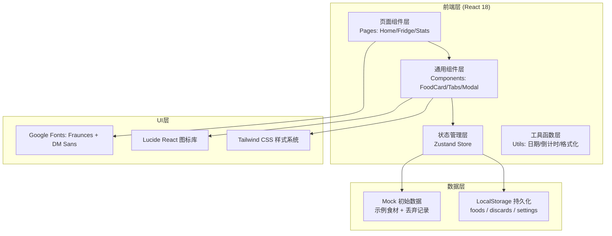
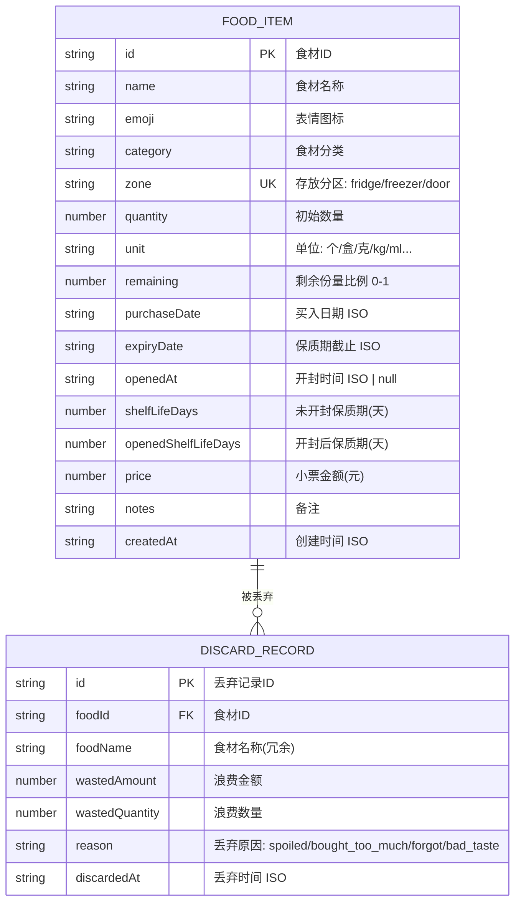

## 1. 架构设计



---

## 2. 技术描述

- **前端框架**: React 18 + TypeScript
- **构建工具**: Vite 6
- **路由**: React Router DOM 6
- **状态管理**: Zustand 4
- **样式方案**: Tailwind CSS 3
- **图标库**: Lucide React
- **数据持久化**: LocalStorage (无需后端)
- **初始化方式**: vite-init react-ts 模板

---

## 3. 路由定义

| 路由路径 | 页面组件 | 功能说明 |
|----------|----------|----------|
| `/` | HomePage | 首页仪表盘：今晚先吃、三天风险、浪费统计 |
| `/fridge` | FridgePage | 冰箱分区视图：冷藏/冷冻/门架 |
| `/stats` | StatsPage | 浪费统计：分类明细、图表 |

---

## 4. 数据模型

### 4.1 数据模型定义 (ER图)



### 4.2 枚举常量定义

```typescript
// 存放分区
type StorageZone = 'fridge' | 'freezer' | 'door';

// 丢弃原因
type DiscardReason = 'spoiled' | 'bought_too_much' | 'forgot' | 'bad_taste';

// 食材状态
type FoodStatus = 'fresh' | 'warning' | 'danger' | 'expired';
```

### 4.3 特殊类别开封后保质期规则

```typescript
// 开封后保质期覆盖规则 (天)
const OPENED_SHELF_LIFE_OVERRIDE: Record<string, number> = {
  '酸奶': 3,
  '牛奶': 3,
  '豆腐': 2,
  '熟食': 2,
  '肉类熟食': 2,
  '沙拉酱': 7,
  '果酱': 14,
  '开封即用': 1,
};
```

---

## 5. 状态管理 (Zustand Store)

### 5.1 Store 接口定义

```typescript
interface FoodStore {
  // state
  foods: FoodItem[];
  discards: DiscardRecord[];
  
  // actions - 食材CRUD
  addFood: (data: Omit<FoodItem, 'id' | 'createdAt'>) => void;
  updateFood: (id: string, data: Partial<FoodItem>) => void;
  deleteFood: (id: string) => void;
  
  // actions - 库存操作
  markOpened: (id: string, openedAt?: string) => void;
  deductPortion: (id: string, portion: number) => void; // portion: 扣减比例 0-1
  
  // actions - 丢弃操作
  discardFood: (id: string, reason: DiscardReason) => void;
  
  // computed / selectors
  getUrgentFoods: () => FoodItem[];      // 24小时内
  getWarningFoods: () => FoodItem[];     // 3天内
  getTotalWaste: () => number;
  getMonthlyWaste: () => number;
  getTopDiscardReason: () => DiscardReason | null;
  getFoodsByZone: (zone: StorageZone) => FoodItem[];
}
```

---

## 6. 核心工具函数

```typescript
// 日期/倒计时工具
export function daysUntil(dateStr: string): number;
export function getFoodStatus(food: FoodItem): FoodStatus;
export function getExpiryProgress(food: FoodItem): number; // 0-100
export function formatDate(dateStr: string): string;

// 金额格式化
export function formatMoney(amount: number): string;

// 倒计时文字
export function getCountdownText(food: FoodItem): string;

// 丢弃原因映射
export const DISCARD_REASON_LABEL: Record<DiscardReason, string>;
export const DISCARD_REASON_EMOJI: Record<DiscardReason, string>;
```

---

## 7. 项目目录结构

```
src/
├── components/
│   ├── layout/
│   │   ├── AppLayout.tsx        # 应用布局(导航)
│   │   └── Sidebar.tsx          # 侧边导航
│   ├── food/
│   │   ├── FoodCard.tsx         # 食材卡片
│   │   ├── FoodGrid.tsx         # 食材网格
│   │   ├── FoodFormModal.tsx    # 录入/编辑弹窗
│   │   ├── FoodDetailModal.tsx  # 详情+操作面板
│   │   ├── DiscardModal.tsx     # 丢弃原因选择
│   │   └── DeductModal.tsx      # 扣减库存弹窗
│   ├── home/
│   │   ├── UrgentList.tsx       # 今晚先吃清单
│   │   ├── WarningList.tsx      # 三天风险预警
│   │   └── StatsCards.tsx       # 统计卡片组
│   ├── fridge/
│   │   └── ZoneTabs.tsx         # 分区Tab切换
│   ├── stats/
│   │   ├── WasteSummary.tsx     # 浪费概览
│   │   ├── ReasonBreakdown.tsx  # 原因分类
│   │   └── DiscardHistory.tsx   # 丢弃历史
│   └── common/
│       ├── Button.tsx
│       ├── Modal.tsx
│       ├── ProgressBar.tsx
│       └── Badge.tsx
├── pages/
│   ├── HomePage.tsx
│   ├── FridgePage.tsx
│   └── StatsPage.tsx
├── store/
│   └── useFoodStore.ts          # Zustand Store
├── utils/
│   ├── date.ts                  # 日期工具
│   ├── food.ts                  # 食材业务逻辑
│   └── constants.ts             # 常量枚举
├── types/
│   └── index.ts                 # 全局类型定义
├── data/
│   └── mockData.ts              # 初始Mock数据
├── App.tsx
├── main.tsx
└── index.css
```

---

## 8. 初始化数据 (Mock)

- 15条示例食材，覆盖三个分区
- 包含不同紧迫程度（已过期/24h内/3天内/正常）
- 5条丢弃历史记录，覆盖4种丢弃原因
- 确保首页能展示足够丰富的数据
