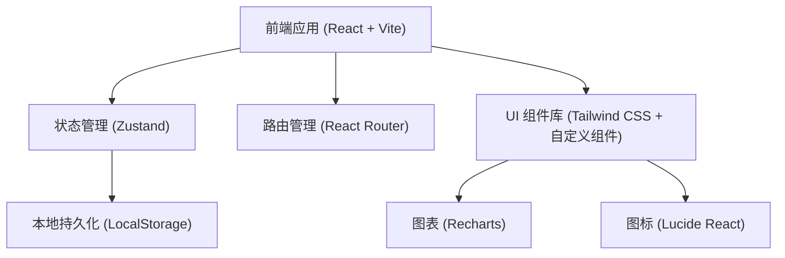
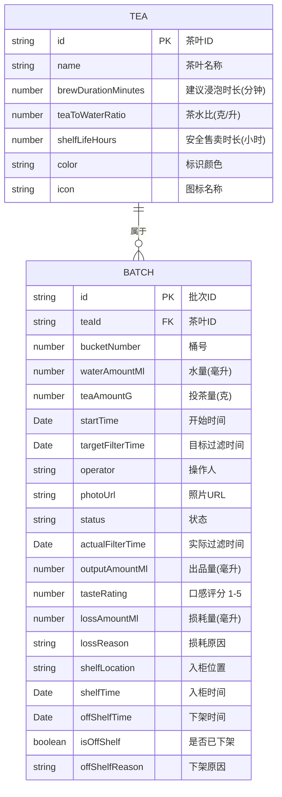

## 1. 架构设计



本项目为纯前端应用，数据存储在浏览器 LocalStorage 中，无需后端服务。使用 Mock 数据初始化演示数据，方便用户快速体验。

## 2. 技术说明

- **前端框架**：React 18 + TypeScript
- **构建工具**：Vite 5
- **样式方案**：Tailwind CSS 3
- **状态管理**：Zustand
- **路由管理**：React Router DOM 6
- **图表库**：Recharts
- **图标库**：Lucide React
- **数据存储**：LocalStorage（前端持久化）
- **初始化工具**：vite-init

## 3. 路由定义

| 路由 | 页面 | 说明 |
|------|------|------|
| `/` | 批次管理页 | 默认首页，展示批次列表和操作 |
| `/statistics` | 统计分析页 | 出品率、超时、报损、开泡建议 |
| `/settings` | 基础配置页 | 茶叶品种、浸泡参数配置 |

## 4. 数据模型

### 4.1 数据模型定义



### 4.2 状态枚举

| 状态值 | 说明 |
|--------|------|
| `brewing` | 浸泡中 |
| `ready` | 待过滤（到达目标时间前10分钟） |
| `overdue` | 已超时（超过目标过滤时间） |
| `filtered` | 已过滤（在售中） |
| `off_shelf` | 已下架 |

## 5. 目录结构

```
src/
├── components/          # 可复用组件
│   ├── BatchCard.tsx    # 批次卡片
│   ├── BatchForm.tsx    # 新建批次表单
│   ├── FilterForm.tsx   # 过滤记录表单
│   ├── StatusBadge.tsx  # 状态标签
│   ├── Countdown.tsx    # 倒计时组件
│   └── StatCard.tsx     # 统计卡片
├── pages/               # 页面组件
│   ├── BatchList.tsx    # 批次管理页
│   ├── Statistics.tsx   # 统计分析页
│   └── Settings.tsx     # 基础配置页
├── store/               # 状态管理
│   └── useBatchStore.ts # 批次数据 store
├── types/               # TypeScript 类型
│   └── index.ts         # 类型定义
├── utils/               # 工具函数
│   ├── time.ts          # 时间处理
│   └── storage.ts       # 本地存储
├── data/                # Mock 数据
│   └── mockData.ts      # 初始演示数据
├── App.tsx              # 应用入口
├── main.tsx             # 渲染入口
└── index.css            # 全局样式
```

## 6. 核心功能实现要点

### 6.1 倒计时与状态更新

- 使用 `setInterval` 每秒更新当前时间
- 根据当前时间与目标过滤时间计算批次状态
- 使用 React 自定义 Hook `useCountdown` 封装倒计时逻辑
- 状态判断：
  - 当前时间 < 目标时间 - 10分钟 → `brewing`
  - 目标时间 - 10分钟 ≤ 当前时间 < 目标时间 → `ready`
  - 当前时间 ≥ 目标时间 → `overdue`
  - 已过滤且未下架 → `filtered`
  - 已下架 → `off_shelf`

### 6.2 提醒功能

- 状态变为 `ready` 时触发浏览器通知（Notification API）
- 状态变为 `overdue` 时播放提示音 + 页面高亮闪烁
- 使用 `useEffect` 监听状态变化触发提醒

### 6.3 自动下架

- 每次渲染时检查已过滤批次的入柜时间 + 安全售卖时长
- 若当前时间超过则自动标记为下架
- 下架原因自动记录为「超过安全售卖时间」

### 6.4 统计分析

- 出品率 = 出品量 / 水量 × 100%
- 按茶叶分组计算平均出品率和标准差（稳定度）
- 统计超时批次数量和平均超时时长
- 报损原因占比分析
- 开泡建议基于历史同时段销量数据推荐
