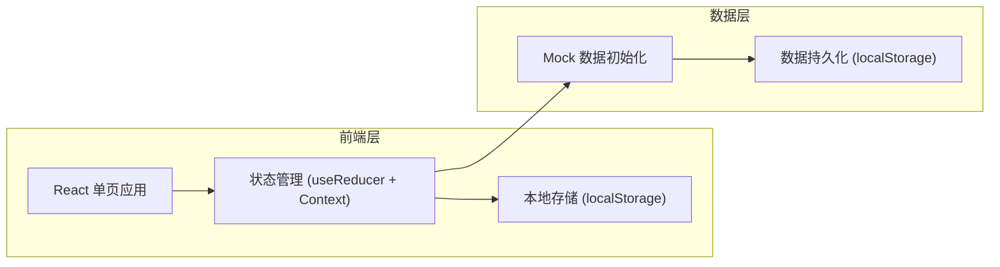
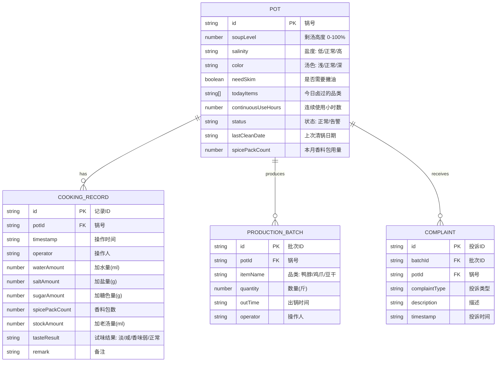

## 1. 架构设计



## 2. 技术描述

- **前端框架**：React 18 + TypeScript
- **构建工具**：Vite 5
- **样式方案**：Tailwind CSS 3
- **图标库**：Lucide React
- **状态管理**：React Context + useReducer
- **数据持久化**：localStorage（首次加载注入 mock 数据）
- **路由**：React Router DOM 6

## 3. 路由定义

| 路由 | 页面 | 功能 |
|------|------|------|
| / | 锅况总览 | 所有卤锅状态卡片、告警提示、快捷操作入口 |
| /pot/:id | 卤锅详情 | 单锅详细状态、续煮记录、出品记录 |
| /cooking-record | 续煮记录 | 投料表单、试味标注、续煮流水列表 |
| /production | 出品记录 | 批次登记、客诉标记、出品列表 |
| /statistics | 统计分析 | 香料消耗排行、清锅提醒、品质趋势 |

## 4. 数据模型

### 4.1 数据模型定义



### 4.2 类型定义

```typescript
// 卤锅状态
interface Pot {
  id: string;
  name: string;
  soupLevel: number; // 0-100 百分比
  salinity: 'low' | 'normal' | 'high';
  color: 'light' | 'normal' | 'dark';
  needSkim: boolean;
  todayItems: string[];
  continuousUseHours: number;
  status: 'normal' | 'warning' | 'danger';
  lastCleanDate: string;
  spicePackCount: number;
  cookingRecords: CookingRecord[];
  productionBatches: ProductionBatch[];
  complaints: Complaint[];
}

// 续煮记录
interface CookingRecord {
  id: string;
  potId: string;
  timestamp: string;
  operator: string;
  waterAmount: number;
  saltAmount: number;
  sugarAmount: number;
  spicePackCount: number;
  stockAmount: number;
  tasteResult: 'light' | 'salty' | 'weak' | 'normal';
  remark?: string;
}

// 出品批次
interface ProductionBatch {
  id: string;
  potId: string;
  itemName: '鸭脖' | '鸡爪' | '豆干';
  quantity: number;
  outTime: string;
  operator: string;
  hasComplaint: boolean;
}

// 客诉记录
interface Complaint {
  id: string;
  batchId: string;
  potId: string;
  complaintType: string;
  description: string;
  timestamp: string;
}

// 统计数据
interface Statistics {
  spiceRanking: { potId: string; potName: string; count: number }[];
  cleanSchedule: { potId: string; potName: string; lastCleanDate: string; recommendedCleanDate: string }[];
  tasteTrend: { date: string; normal: number; light: number; salty: number; weak: number }[];
}
```

### 4.3 告警规则

- **低液位告警**：soupLevel < 30%
- **连续使用过久告警**：continuousUseHours >= 72
- **客诉集中告警**：同一锅 24 小时内客诉 >= 2 条
