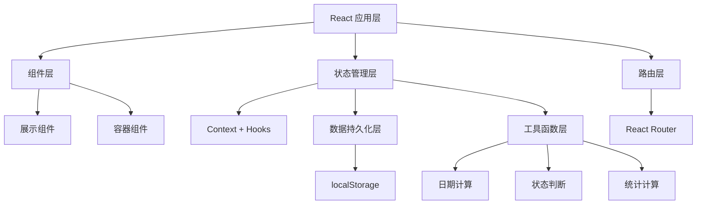
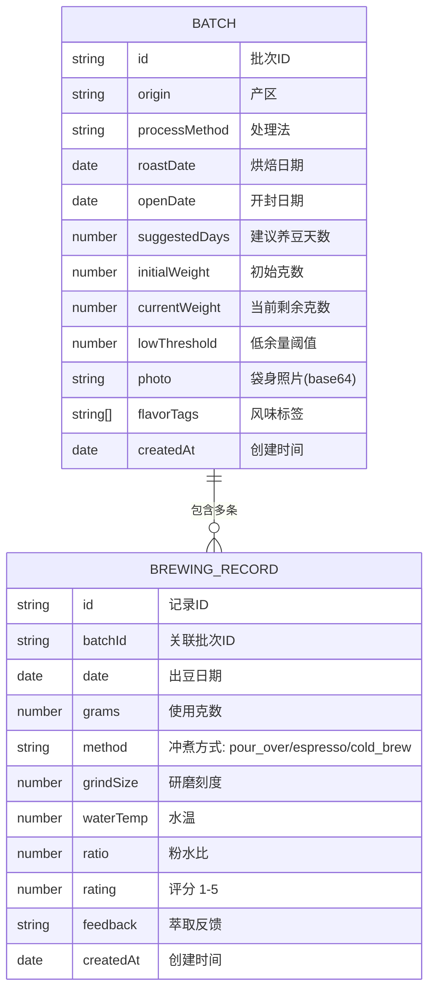

## 1. 架构设计



## 2. 技术栈说明

- **前端框架**：React@18 + TypeScript
- **构建工具**：Vite@5
- **样式方案**：TailwindCSS@3 + CSS Variables
- **路由管理**：React Router DOM@6
- **图表库**：Recharts@2
- **图标库**：Lucide React
- **状态管理**：React Context + useReducer
- **数据持久化**：localStorage
- **图片处理**：FileReader API (本地预览) + Canvas (压缩)

## 3. 目录结构

```
src/
├── components/          # 通用组件
│   ├── BatchCard.tsx    # 批次卡片
│   ├── StatusBadge.tsx  # 状态徽章
│   ├── FlavorTags.tsx   # 风味标签
│   ├── Modal.tsx        # 弹窗组件
│   └── Navbar.tsx       # 导航栏
├── pages/               # 页面组件
│   ├── Dashboard.tsx    # 看板首页
│   ├── BatchDetail.tsx  # 批次详情
│   ├── AddBatch.tsx     # 新增批次
│   └── Statistics.tsx   # 统计页面
├── context/             # 状态管理
│   └── BatchContext.tsx # 批次数据 Context
├── hooks/               # 自定义 Hooks
│   ├── useBatches.ts    # 批次操作 Hook
│   └── useStats.ts      # 统计计算 Hook
├── types/               # TypeScript 类型
│   └── index.ts         # 类型定义
├── utils/               # 工具函数
│   ├── dateUtils.ts     # 日期计算
│   ├── statusUtils.ts   # 状态判断
│   └── statsUtils.ts    # 统计计算
├── data/                # 模拟数据
│   └── mockData.ts      # 初始 Mock 数据
├── App.tsx              # 根组件
├── main.tsx             # 入口文件
└── index.css            # 全局样式
```

## 4. 路由定义

| 路由路径 | 页面名称 | 说明 |
|---------|---------|------|
| / | 看板首页 | 展示所有批次卡片，支持筛选和快速出豆 |
| /batch/:id | 批次详情 | 展示批次详细信息和出豆历史 |
| /add | 新增批次 | 表单页面，添加新的咖啡豆批次 |
| /statistics | 统计页面 | 消耗速度、评价排行、补货建议 |

## 5. 数据模型

### 5.1 数据模型定义



### 5.2 类型定义

```typescript
// 批次状态枚举
type BatchStatus = 
  | 'unopened'      // 未开封
  | 'resting'       // 养豆中
  | 'optimal'       // 最佳风味
  | 'declining'     // 风味下降
  | 'expired'       // 已过期
  | 'low_stock';    // 余量不足

// 冲煮方式
type BrewingMethod = 'pour_over' | 'espresso' | 'cold_brew';

// 咖啡豆批次
interface CoffeeBatch {
  id: string;
  origin: string;          // 产区
  processMethod: string;   // 处理法
  roastDate: string;       // 烘焙日期 (ISO string)
  openDate: string | null; // 开封日期 (ISO string)
  suggestedDays: number;   // 建议养豆天数
  initialWeight: number;   // 初始克数
  currentWeight: number;   // 当前剩余克数
  lowThreshold: number;    // 低余量阈值 (克)
  photo: string | null;    // 袋身照片 (base64)
  flavorTags: string[];    // 风味标签
  createdAt: string;
}

// 出豆/萃取记录
interface BrewingRecord {
  id: string;
  batchId: string;
  date: string;            // 出豆日期
  grams: number;           // 使用克数
  method: BrewingMethod;   // 冲煮方式
  grindSize: number | null; // 研磨刻度
  waterTemp: number | null; // 水温
  ratio: string | null;    // 粉水比
  rating: number | null;   // 评分 1-5
  feedback: string | null; // 萃取反馈文字
  createdAt: string;
}

// 统计数据
interface Statistics {
  totalBatches: number;
  restingCount: number;
  expiringSoon: number;
  totalConsumed: number;
  consumptionRate: { batchId: string; rate: number }[];
  avgRatings: { batchId: string; avgRating: number }[];
  wastedAmount: number;
  restockSuggestions: RestockItem[];
}

interface RestockItem {
  batchId: string;
  origin: string;
  currentWeight: number;
  dailyRate: number;
  estimatedEmptyDate: string;
  suggestedAmount: number;
}
```

## 6. 核心算法

### 6.1 批次状态判断

- **未开封**：`openDate === null`
- **养豆中**：已开封且 `daysSinceOpen < suggestedDays`
- **最佳风味**：`suggestedDays <= daysSinceOpen <= suggestedDays + 14` (默认最佳期2周)
- **风味下降**：`daysSinceOpen > suggestedDays + 14` 且 `daysSinceOpen <= suggestedDays + 30`
- **已过期**：`daysSinceOpen > suggestedDays + 30`
- **余量不足**：`currentWeight <= lowThreshold`

优先级：红色标识(余量不足/已过期) > 黄色标识(养豆中) > 绿色(最佳) > 橙色(风味下降)

### 6.2 消耗速度计算

`日均消耗 = (初始克数 - 当前克数) / 开封后天数`

### 6.3 补货建议

`预计耗尽日期 = 今天 + (当前克数 / 日均消耗)`

如果预计耗尽日期在 7 天内，则建议补货。
