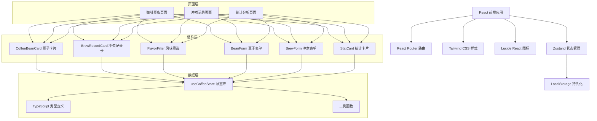
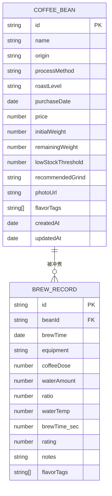

# 咖啡豆笔记 - 技术架构文档

## 1. 架构设计



## 2. 技术描述

- **前端框架**：React 18 + TypeScript
- **构建工具**：Vite 5
- **路由管理**：React Router DOM 6
- **状态管理**：Zustand 4
- **样式方案**：Tailwind CSS 3
- **图标库**：Lucide React
- **数据持久化**：LocalStorage（浏览器本地存储）
- **初始化工具**：vite-init（react-ts 模板）

## 3. 路由定义

| 路由路径 | 页面组件 | 功能说明 |
|----------|----------|----------|
| `/` | CoffeeBeans 咖啡豆库 | 首页，展示所有咖啡豆卡片 |
| `/brews` | BrewRecords 冲煮记录 | 展示冲煮记录时间线 |
| `/stats` | Stats 统计分析 | 展示产区、性价比、参数统计 |

## 4. 数据模型

### 4.1 实体关系图



### 4.2 TypeScript 类型定义

```typescript
// 风味标签类型
type FlavorTag = 'sour' | 'sweet' | 'bitter' | 'nutty' | 'floral' | 'fruity' | 'chocolate' | 'caramel';

// 烘焙度
type RoastLevel = 'light' | 'medium-light' | 'medium' | 'medium-dark' | 'dark';

// 处理法
type ProcessMethod = 'washed' | 'natural' | 'honey' | 'anaerobic' | 'wet-hulled';

// 咖啡豆
interface CoffeeBean {
  id: string;
  name: string;
  origin: string;
  processMethod: ProcessMethod;
  roastLevel: RoastLevel;
  purchaseDate: string;
  price: number;
  initialWeight: number;
  remainingWeight: number;
  lowStockThreshold: number;
  recommendedGrind: string;
  photoUrl: string;
  flavorTags: FlavorTag[];
  createdAt: string;
  updatedAt: string;
}

// 冲煮记录
interface BrewRecord {
  id: string;
  beanId: string;
  brewTime: string;
  equipment: string;
  coffeeDose: number;
  waterAmount: number;
  waterTemp: number;
  brewTimeSec: number;
  rating: number;
  notes: string;
  flavorTags: FlavorTag[];
}

// 库存状态
type StockStatus = 'normal' | 'low' | 'empty';
```

## 5. 状态管理设计

### 5.1 Store 结构

```typescript
interface CoffeeState {
  beans: CoffeeBean[];
  brewRecords: BrewRecord[];
  activeFlavorFilter: FlavorTag[];
  
  // 豆子操作
  addBean: (bean: Omit<CoffeeBean, 'id' | 'createdAt' | 'updatedAt'>) => void;
  updateBean: (id: string, bean: Partial<CoffeeBean>) => void;
  deleteBean: (id: string) => void;
  getBeanById: (id: string) => CoffeeBean | undefined;
  
  // 冲煮记录操作
  addBrewRecord: (record: Omit<BrewRecord, 'id'>) => void;
  deleteBrewRecord: (id: string) => void;
  getRecordsByBeanId: (beanId: string) => BrewRecord[];
  
  // 筛选
  toggleFlavorFilter: (tag: FlavorTag) => void;
  clearFlavorFilter: () => void;
  getFilteredBeans: () => CoffeeBean[];
  
  // 统计
  getStats: () => Statistics;
}
```

## 6. 项目目录结构

```
src/
├── components/
│   ├── layout/
│   │   └── Navbar.tsx
│   ├── coffee/
│   │   ├── CoffeeBeanCard.tsx
│   │   ├── CoffeeBeanForm.tsx
│   │   └── FlavorFilter.tsx
│   ├── brew/
│   │   ├── BrewRecordCard.tsx
│   │   └── BrewForm.tsx
│   ├── stats/
│   │   ├── StatCard.tsx
│   │   ├── OriginChart.tsx
│   │   └── ValueRanking.tsx
│   └── ui/
│       ├── Button.tsx
│       ├── Modal.tsx
│       └── Tag.tsx
├── pages/
│   ├── CoffeeBeans.tsx
│   ├── BrewRecords.tsx
│   └── Stats.tsx
├── store/
│   └── useCoffeeStore.ts
├── types/
│   └── index.ts
├── utils/
│   ├── storage.ts
│   └── helpers.ts
├── data/
│   └── mockData.ts
├── App.tsx
├── main.tsx
└── index.css
```

## 7. 核心功能实现要点

### 7.1 库存自动扣减
- 新增冲煮记录时，根据 `coffeeDose`（粉量）自动扣减对应豆子的 `remainingWeight`
- 扣减后检查是否低于 `lowStockThreshold`，更新库存状态
- 删除冲煮记录时，回加库存

### 7.2 风味筛选
- 支持多选风味标签
- 筛选逻辑：豆子包含任一选中标签即匹配（OR 逻辑）
- 无筛选时展示全部豆子

### 7.3 统计分析
- **最喜欢的产区**：按产区统计冲煮次数或平均评分
- **性价比最高**：计算 `平均评分 / 每克价格` 比值
- **常用冲煮参数**：统计最频繁使用的器具、粉水比、水温区间
