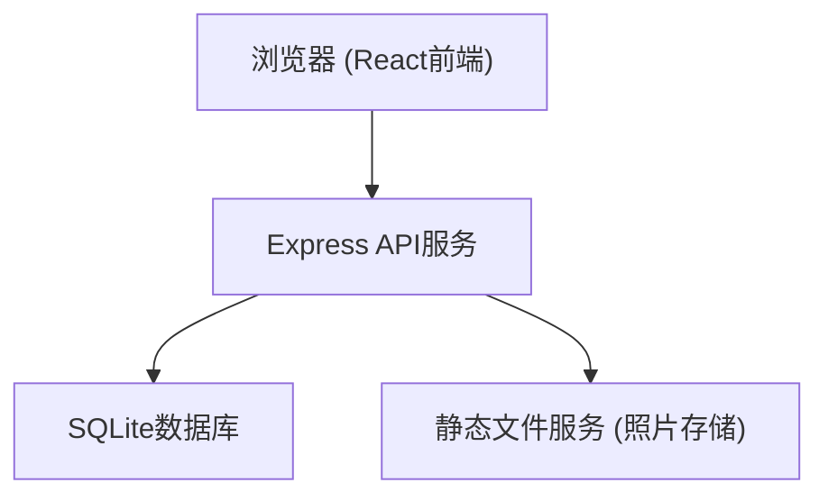
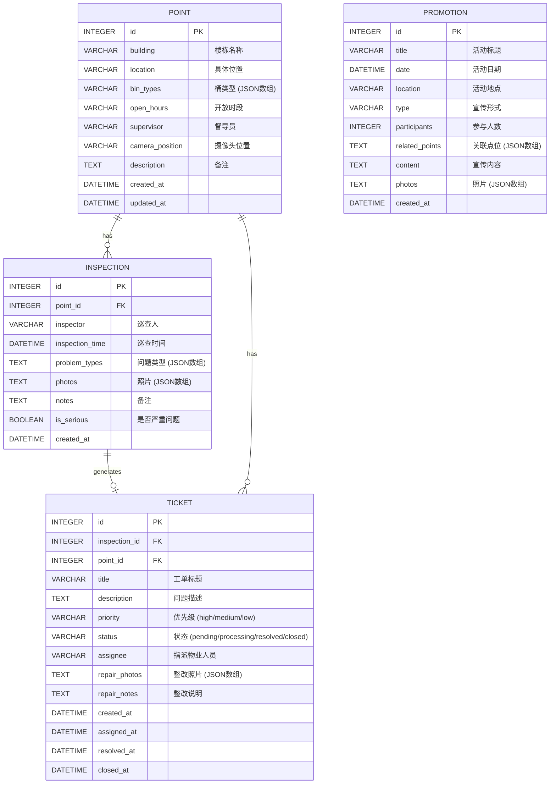

## 1. 架构设计

本系统采用前后端分离架构，前端使用 React + TypeScript 构建，后端使用 Express + TypeScript 提供 API 服务，数据存储使用 SQLite 数据库。



## 2. 技术描述

- **前端**：React@18 + TypeScript + Vite + TailwindCSS@3 + Zustand + React Router + lucide-react + recharts
- **后端**：Express@4 + TypeScript
- **数据库**：SQLite（使用 better-sqlite3）
- **初始化工具**：vite-init
- **状态管理**：Zustand
- **图表库**：recharts
- **图标库**：lucide-react

## 3. 路由定义

### 前端路由

| 路由路径 | 页面名称 | 说明 |
|---------|----------|------|
| /dashboard | 数据看板 | 系统首页，展示核心指标和图表 |
| /points | 点位管理 | 投放点位列表和管理 |
| /points/:id | 点位详情 | 单个点位的详细信息 |
| /inspections | 巡查记录 | 巡查记录列表 |
| /inspections/new | 新建巡查 | 创建新的巡查记录 |
| /inspections/:id | 巡查详情 | 查看单条巡查详情 |
| /tickets | 问题派单 | 工单列表 |
| /tickets/:id | 工单详情 | 查看工单详情和处理 |
| /promotions | 宣传记录 | 宣传活动列表 |
| /statistics | 统计分析 | 多维度统计分析 |

### 后端 API 路由

| 方法 | 路由 | 功能 |
|------|------|------|
| GET | /api/points | 获取点位列表 |
| GET | /api/points/:id | 获取点位详情 |
| POST | /api/points | 新增点位 |
| PUT | /api/points/:id | 更新点位 |
| DELETE | /api/points/:id | 删除点位 |
| GET | /api/inspections | 获取巡查列表 |
| GET | /api/inspections/:id | 获取巡查详情 |
| POST | /api/inspections | 新增巡查记录 |
| GET | /api/tickets | 获取工单列表 |
| GET | /api/tickets/:id | 获取工单详情 |
| POST | /api/tickets | 创建工单 |
| PUT | /api/tickets/:id | 更新工单状态 |
| POST | /api/tickets/:id/resolve | 提交整改 |
| GET | /api/promotions | 获取宣传列表 |
| POST | /api/promotions | 新增宣传记录 |
| GET | /api/statistics/overview | 获取概览统计数据 |
| GET | /api/statistics/trend | 获取问题趋势数据 |
| GET | /api/statistics/recurrence | 获取复发统计 |
| GET | /api/statistics/repair-time | 获取整改时效统计 |
| GET | /api/statistics/error-types | 获取错误类型统计 |
| GET | /api/statistics/focus-buildings | 获取重点宣传楼栋 |

## 4. 数据模型

### 4.1 数据模型定义



### 4.2 数据库初始化SQL

```sql
-- 点位表
CREATE TABLE IF NOT EXISTS points (
    id INTEGER PRIMARY KEY AUTOINCREMENT,
    building TEXT NOT NULL,
    location TEXT,
    bin_types TEXT NOT NULL,
    open_hours TEXT,
    supervisor TEXT,
    camera_position TEXT,
    description TEXT,
    created_at DATETIME DEFAULT CURRENT_TIMESTAMP,
    updated_at DATETIME DEFAULT CURRENT_TIMESTAMP
);

-- 巡查记录表
CREATE TABLE IF NOT EXISTS inspections (
    id INTEGER PRIMARY KEY AUTOINCREMENT,
    point_id INTEGER NOT NULL,
    inspector TEXT NOT NULL,
    inspection_time DATETIME NOT NULL,
    problem_types TEXT NOT NULL,
    photos TEXT,
    notes TEXT,
    is_serious INTEGER DEFAULT 0,
    created_at DATETIME DEFAULT CURRENT_TIMESTAMP,
    FOREIGN KEY (point_id) REFERENCES points(id)
);

-- 工单表
CREATE TABLE IF NOT EXISTS tickets (
    id INTEGER PRIMARY KEY AUTOINCREMENT,
    inspection_id INTEGER,
    point_id INTEGER NOT NULL,
    title TEXT NOT NULL,
    description TEXT,
    priority TEXT NOT NULL DEFAULT 'medium',
    status TEXT NOT NULL DEFAULT 'pending',
    assignee TEXT,
    repair_photos TEXT,
    repair_notes TEXT,
    created_at DATETIME DEFAULT CURRENT_TIMESTAMP,
    assigned_at DATETIME,
    resolved_at DATETIME,
    closed_at DATETIME,
    FOREIGN KEY (inspection_id) REFERENCES inspections(id),
    FOREIGN KEY (point_id) REFERENCES points(id)
);

-- 宣传记录表
CREATE TABLE IF NOT EXISTS promotions (
    id INTEGER PRIMARY KEY AUTOINCREMENT,
    title TEXT NOT NULL,
    date DATETIME NOT NULL,
    location TEXT,
    type TEXT,
    participants INTEGER DEFAULT 0,
    related_points TEXT,
    content TEXT,
    photos TEXT,
    created_at DATETIME DEFAULT CURRENT_TIMESTAMP
);

-- 创建索引
CREATE INDEX IF NOT EXISTS idx_inspections_point_id ON inspections(point_id);
CREATE INDEX IF NOT EXISTS idx_inspections_time ON inspections(inspection_time);
CREATE INDEX IF NOT EXISTS idx_tickets_point_id ON tickets(point_id);
CREATE INDEX IF NOT EXISTS idx_tickets_status ON tickets(status);
CREATE INDEX IF NOT EXISTS idx_promotions_date ON promotions(date);
```

## 5. 项目结构

```
.
├── src/                          # 前端源码
│   ├── components/               # 公共组件
│   │   ├── Layout.tsx           # 布局组件（侧边栏+内容区）
│   │   ├── StatCard.tsx         # 统计卡片
│   │   ├── PhotoUpload.tsx      # 照片上传组件
│   │   ├── StatusBadge.tsx      # 状态标签
│   │   └── ConfirmDialog.tsx    # 确认对话框
│   ├── pages/                    # 页面组件
│   │   ├── Dashboard.tsx        # 数据看板
│   │   ├── points/              # 点位管理
│   │   │   ├── PointList.tsx
│   │   │   └── PointDetail.tsx
│   │   ├── inspections/         # 巡查记录
│   │   │   ├── InspectionList.tsx
│   │   │   ├── NewInspection.tsx
│   │   │   └── InspectionDetail.tsx
│   │   ├── tickets/             # 问题派单
│   │   │   ├── TicketList.tsx
│   │   │   └── TicketDetail.tsx
│   │   ├── promotions/          # 宣传记录
│   │   │   ├── PromotionList.tsx
│   │   │   └── NewPromotion.tsx
│   │   └── statistics/          # 统计分析
│   │       └── Statistics.tsx
│   ├── store/                    # 状态管理
│   │   └── useStore.ts
│   ├── utils/                    # 工具函数
│   │   ├── api.ts               # API请求封装
│   │   ├── date.ts              # 日期处理
│   │   └── constants.ts         # 常量定义
│   ├── types/                    # 类型定义
│   │   └── index.ts
│   ├── App.tsx
│   ├── main.tsx
│   └── index.css
├── api/                          # 后端源码
│   ├── index.ts                 # 入口文件
│   ├── database.ts              # 数据库连接
│   ├── initDB.ts                # 数据库初始化和种子数据
│   ├── routes/                  # 路由
│   │   ├── points.ts
│   │   ├── inspections.ts
│   │   ├── tickets.ts
│   │   ├── promotions.ts
│   │   └── statistics.ts
│   └── middleware/               # 中间件
├── uploads/                      # 上传的照片
├── vite.config.ts
├── tailwind.config.js
├── tsconfig.json
└── package.json
```

## 6. 核心技术点

### 6.1 前端状态管理
使用 Zustand 管理全局状态，包括当前用户、点位列表缓存、筛选条件等。每个页面可管理自己的本地状态。

### 6.2 API 调用
统一封装 fetch 请求，处理错误、loading 状态、超时等。使用 React Query 风格的数据获取模式。

### 6.3 图表可视化
使用 recharts 库实现折线图、饼图、柱状图等数据可视化。

### 6.4 照片处理
前端使用 FileReader 预览照片，后端使用 express.static 提供静态文件服务，照片存储在 uploads 目录。

### 6.5 响应式布局
使用 Tailwind CSS 的响应式类，实现桌面端、平板端、移动端的自适应布局。
