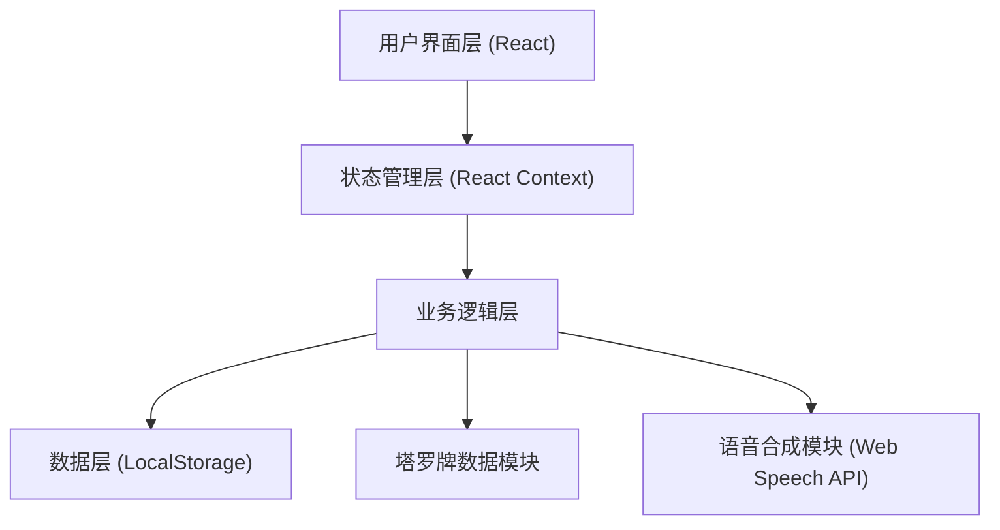

## 1. 架构设计



## 2. 技术描述
- **前端框架**: React@18 + TypeScript
- **构建工具**: Vite@5
- **样式方案**: TailwindCSS@3 + CSS Variables
- **状态管理**: React Context + useReducer
- **路由**: React Router DOM@6
- **动画**: Framer Motion
- **图标**: Lucide React
- **数据存储**: LocalStorage（历史记录持久化）
- **语音播报**: Web Speech API (浏览器原生)
- **无后端**：纯前端应用，所有数据本地存储

## 3. 路由定义
| 路由 | 页面 | 功能描述 |
|------|------|---------|
| / | 首页 | 牌阵选择、主题切换、历史入口 |
| /reading/:spreadId | 占卜页面 | 问题输入、抽牌环节 |
| /reading/:spreadId/interpretation | 解读页面 | 牌面展示、详细解读、语音播报 |
| /history | 历史记录 | 历史占卜列表、详情查看 |

## 4. 数据模型

### 4.1 塔罗牌数据模型
```typescript
interface TarotCard {
  id: number;
  name: string;
  nameEn: string;
  type: 'major' | 'minor';
  suit?: 'wands' | 'cups' | 'swords' | 'pentacles';
  number?: number;
  image: string;
  meaning: {
    upright: string;
    reversed: string;
  };
  keywords: {
    upright: string[];
    reversed: string[];
  };
}
```

### 4.2 牌阵数据模型
```typescript
interface Spread {
  id: string;
  name: string;
  description: string;
  cardCount: number;
  positions: Position[];
  icon: string;
}

interface Position {
  index: number;
  name: string;
  meaning: string;
}
```

### 4.3 占卜记录数据模型
```typescript
interface ReadingRecord {
  id: string;
  timestamp: number;
  spreadId: string;
  spreadName: string;
  question: string;
  cards: DrawnCard[];
  interpretation: string;
}

interface DrawnCard {
  card: TarotCard;
  position: Position;
  isReversed: boolean;
}
```

## 5. 核心模块划分

### 5.1 数据模块
- `data/tarotCards.ts` - 78张塔罗牌完整数据
- `data/spreads.ts` - 四种牌阵配置数据

### 5.2 状态管理
- `context/ThemeContext.tsx` - 主题状态管理
- `context/ReadingContext.tsx` - 占卜流程状态管理

### 5.3 组件模块
- `components/SpreadCard.tsx` - 牌阵选择卡片
- `components/TarotCard.tsx` - 塔罗牌组件（含3D翻转动画）
- `components/CardFan.tsx` - 扇形牌堆组件
- `components/InterpretationCard.tsx` - 解读卡片组件
- `components/ThemeToggle.tsx` - 主题切换组件
- `components/AudioPlayer.tsx` - 语音播报控制组件

### 5.4 页面模块
- `pages/Home.tsx` - 首页
- `pages/Reading.tsx` - 占卜页面
- `pages/Interpretation.tsx` - 解读页面
- `pages/History.tsx` - 历史记录页面

### 5.5 工具模块
- `utils/speech.ts` - 语音合成工具函数
- `utils/storage.ts` - 本地存储工具函数
- `utils/shuffle.ts` - 洗牌算法

## 6. 主题设计变量

### 深色主题 (月夜)
```css
:root {
  --bg-primary: #0a0a1a;
  --bg-secondary: #1a1a2e;
  --bg-card: rgba(22, 33, 62, 0.8);
  --text-primary: #f0e6d3;
  --text-secondary: #a0937d;
  --accent: #e94560;
  --accent-gold: #d4af37;
  --border: rgba(212, 175, 55, 0.3);
  --shadow: 0 8px 32px rgba(0, 0, 0, 0.4);
}
```

### 浅色主题 (日间)
```css
:root {
  --bg-primary: #faf3e0;
  --bg-secondary: #f5edd6;
  --bg-card: rgba(255, 255, 255, 0.9);
  --text-primary: #3d2914;
  --text-secondary: #8b7355;
  --accent: #8b4513;
  --accent-gold: #c9a86c;
  --border: rgba(139, 90, 43, 0.2);
  --shadow: 0 8px 32px rgba(139, 90, 43, 0.15);
}
```
