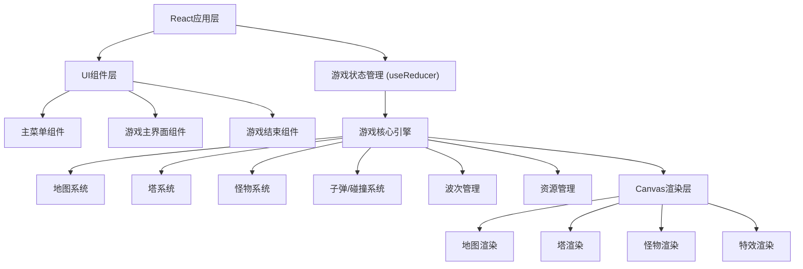

## 1. 架构设计



## 2. 技术描述

- **前端框架**: React@18 + TypeScript
- **构建工具**: Vite@5
- **样式方案**: TailwindCSS@3
- **游戏渲染**: HTML5 Canvas 2D API
- **状态管理**: React useReducer (游戏状态) + useState (UI状态)
- **动画**: requestAnimationFrame 游戏循环
- **无需后端，纯前端实现**

## 3. 路由定义

| Route | 组件 | 用途 |
|-------|------|------|
| / | MainMenu | 主菜单，选择难度 |
| /game | GameScreen | 游戏主界面 |
| /gameover | GameOver | 游戏结束界面 |

使用 React Router 进行路由管理。

## 4. 核心数据结构定义

### 4.1 游戏配置

```typescript
// 难度配置
interface DifficultyConfig {
  name: string;
  startingGold: number;
  startingLives: number;
  monsterHpMultiplier: number;
  monsterSpeedMultiplier: number;
  goldMultiplier: number;
}

// 地图配置
interface MapConfig {
  id: string;
  name: string;
  difficulty: 'easy' | 'normal' | 'hard';
  path: Point[];           // 路径点坐标
  towerSlots: Point[];     // 8个建塔位置
  background: string;      // 背景色/图案
}
```

### 4.2 塔配置

```typescript
type TowerType = 'single' | 'aoe' | 'ice';

interface TowerLevelConfig {
  damage: number;
  range: number;
  fireRate: number;   // 每秒攻击次数
  cost: number;       // 升级费用
  projectileSpeed: number;
  aoeRadius?: number; // AOE塔专属
  slowAmount?: number; // 冰塔专属 0-1
  slowDuration?: number; // 冰塔专属 秒
}

interface TowerConfig {
  type: TowerType;
  name: string;
  description: string;
  baseCost: number;
  color: string;
  levels: TowerLevelConfig[]; // 3个等级
}
```

### 4.3 怪物配置

```typescript
type MonsterType = 'normal' | 'armored' | 'flying' | 'boss';

interface MonsterConfig {
  type: MonsterType;
  name: string;
  hp: number;
  speed: number;  // 像素/秒
  reward: number; // 击杀金币
  armor: number;  // 伤害减免 0-1
  color: string;
  size: number;
  isFlying: boolean;
}
```

### 4.4 波次配置

```typescript
interface WaveMonster {
  type: MonsterType;
  count: number;
  interval: number; // 生成间隔 毫秒
}

interface WaveConfig {
  waveNumber: number;
  monsters: WaveMonster[];
  delay: number; // 波次开始前延迟
}
```

### 4.5 游戏状态

```typescript
interface GameState {
  status: 'menu' | 'playing' | 'paused' | 'won' | 'lost';
  gold: number;
  lives: number;
  currentWave: number;
  totalWaves: number;
  waveInProgress: boolean;
  waveTimer: number;
  speed: 1 | 2 | 3;
  selectedTowerType: TowerType | null;
  towers: Tower[];
  monsters: Monster[];
  projectiles: Projectile[];
  effects: Effect[];
  map: MapConfig;
}
```

### 4.6 运行时实体

```typescript
interface Tower {
  id: string;
  type: TowerType;
  level: number; // 0-2
  x: number;
  y: number;
  slotIndex: number;
  lastFireTime: number;
  target: Monster | null;
}

interface Monster {
  id: string;
  type: MonsterType;
  x: number;
  y: number;
  hp: number;
  maxHp: number;
  speed: number;
  pathIndex: number;  // 当前路径点索引
  progress: number;   // 当前路径段进度 0-1
  slowTimer: number;  // 减速剩余时间
  slowAmount: number; // 当前减速比例
  reward: number;
}

interface Projectile {
  id: string;
  x: number;
  y: number;
  targetId: string;
  damage: number;
  speed: number;
  type: TowerType;
  aoeRadius?: number;
  slowAmount?: number;
  slowDuration?: number;
}

interface Effect {
  id: string;
  type: 'explosion' | 'hit' | 'slow' | 'build';
  x: number;
  y: number;
  duration: number;
  elapsed: number;
  radius?: number;
  color?: string;
}
```

## 5. 核心模块

### 5.1 游戏引擎模块 (gameEngine.ts)

- 游戏主循环 (requestAnimationFrame)
- 时间步长控制 (支持变速)
- 碰撞检测
- 塔AI逻辑
- 怪物路径移动

### 5.2 渲染模块 (renderer.ts)

- Canvas绘制
- 地图/路径渲染
- 塔/怪物/子弹渲染
- 特效粒子系统

### 5.3 配置模块 (configs/)

- maps.ts: 三张地图配置
- towers.ts: 三种塔配置
- monsters.ts: 四种怪物配置
- waves.ts: 波次配置

### 5.4 工具函数 (utils/)

- 数学计算 (距离、插值等)
- ID生成
- 碰撞检测算法
