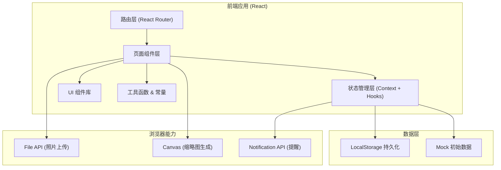
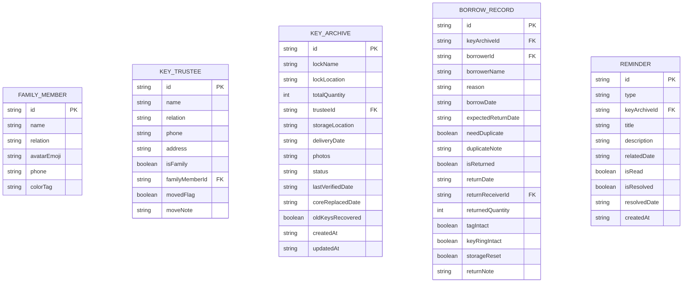

## 1. 架构设计



## 2. 技术描述

- **前端框架**：React@18 + TypeScript
- **构建工具**：Vite@5
- **样式方案**：TailwindCSS@3 + PostCSS
- **路由管理**：React Router DOM@6
- **状态管理**：React Context + useReducer（轻量级，无需 Redux）
- **数据持久化**：LocalStorage（用户钥匙数据、借用记录、设置项）
- **图标方案**：Lucide React（轻量 SVG 图标库）
- **初始化方式**：通过 `npm create vite@latest` 创建 React + TypeScript 模板

**设计决策说明**：
- 纯前端 + LocalStorage 方案，无需后端服务，适合家庭单机使用场景
- Context 管理全局钥匙档案、借用记录、提醒数据，组件间共享状态
- 照片使用 FileReader 转为 Base64 存入 LocalStorage，支持压缩后存储（限制单张 500KB）

## 3. 路由定义

| 路由 | 页面组件 | 用途 |
|------|----------|------|
| `/` | HomePage | 首页 - 救急联系人展示、统计概览、快捷入口 |
| `/keys` | KeyListPage | 钥匙档案列表 |
| `/keys/:id` | KeyDetailPage | 钥匙档案详情 + 借用归还操作 |
| `/keys/new` | KeyFormPage | 新增钥匙档案 |
| `/keys/:id/edit` | KeyFormPage | 编辑钥匙档案 |
| `/reminders` | RemindersPage | 提醒中心 |
| `/settings` | SettingsPage | 成员管理 + 系统设置 |

## 4. 数据模型

### 4.1 数据模型定义



### 4.2 TypeScript 类型定义

```typescript
interface FamilyMember {
  id: string;
  name: string;
  relation: string;
  avatarEmoji: string;
  phone: string;
  colorTag: string;
}

interface KeyTrustee {
  id: string;
  name: string;
  relation: string;
  phone: string;
  address: string;
  isFamily: boolean;
  familyMemberId?: string;
  movedFlag: boolean;
  moveNote?: string;
}

interface KeyArchive {
  id: string;
  lockName: string;
  lockLocation: string;
  totalQuantity: number;
  trusteeId: string;
  storageLocation: string;
  deliveryDate: string;
  photos: string[];
  status: 'available' | 'borrowed' | 'inactive';
  lastVerifiedDate: string;
  coreReplacedDate?: string;
  oldKeysRecovered?: boolean;
  createdAt: string;
  updatedAt: string;
}

interface BorrowRecord {
  id: string;
  keyArchiveId: string;
  borrowerId?: string;
  borrowerName: string;
  reason: string;
  borrowDate: string;
  expectedReturnDate: string;
  needDuplicate: boolean;
  duplicateNote?: string;
  isReturned: boolean;
  returnDate?: string;
  returnReceiverId?: string;
  returnedQuantity?: number;
  tagIntact?: boolean;
  keyRingIntact?: boolean;
  storageReset?: boolean;
  returnNote?: string;
}

type ReminderType = 'long_unverified' | 'trustee_moved' | 'old_keys_unrecovered';

interface Reminder {
  id: string;
  type: ReminderType;
  keyArchiveId: string;
  title: string;
  description: string;
  relatedDate: string;
  isRead: boolean;
  isResolved: boolean;
  resolvedDate?: string;
  createdAt: string;
}

interface AppState {
  familyMembers: FamilyMember[];
  trustees: KeyTrustee[];
  keyArchives: KeyArchive[];
  borrowRecords: BorrowRecord[];
  reminders: Reminder[];
  settings: {
    unverifiedDaysThreshold: number;
    lastScanDate: string;
  };
}
```

### 4.3 Mock 初始数据

预置 3 位家庭成员、5 位托管人（含 2 位家庭成员）、4 组钥匙档案、6 条借用记录、3 条提醒示例数据，确保首次打开即有内容可浏览演示。

## 5. 核心业务逻辑模块

### 5.1 数据持久化 Hook
- `useLocalStorage`：读写 LocalStorage，支持 JSON 序列化
- 初始化时从 LocalStorage 加载，无数据则加载 Mock 数据

### 5.2 提醒生成服务
- `generateReminders()`：扫描钥匙档案生成提醒
- 检查 1：`today - lastVerifiedDate > settings.unverifiedDaysThreshold` → 长期未核对提醒
- 检查 2：`trustee.movedFlag === true` → 托管人搬家提醒
- 检查 3：`coreReplacedDate 存在 && oldKeysRecovered !== true` → 旧钥匙未回收提醒
- 去重机制：同一钥匙同一类型未解决提醒不重复生成

### 5.3 状态派生计算
- 钥匙当前状态：根据未归还借用记录自动计算 status
- 首页救急联系人：按家庭成员聚合，显示其托管的可用钥匙
- 首页统计：总数、借出中、待处理提醒数实时计算

### 5.4 工具函数
- `compressImage(file, maxSizeKB)`：照片压缩为 Base64
- `generateId()`：UUID 生成
- `formatDate(date)`：日期格式化
- `daysBetween(date1, date2)`：日期间隔计算
