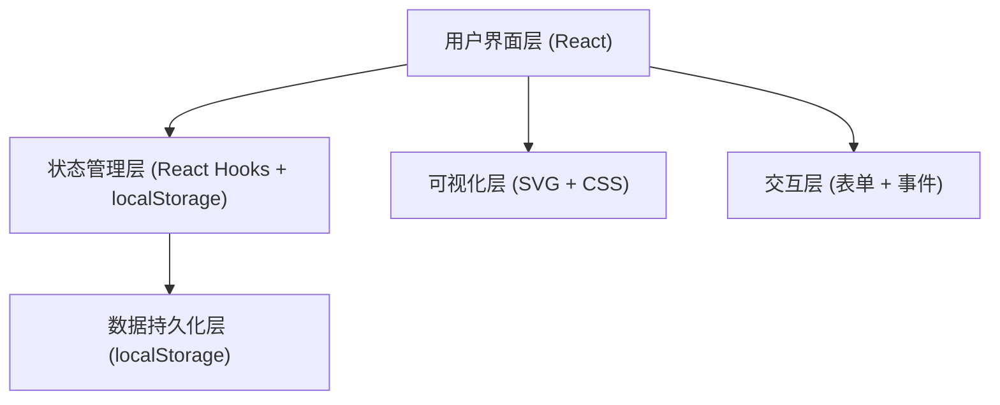

## 1. 架构设计



## 2. 技术描述
- **前端**：React@18 + TypeScript + TailwindCSS@3 + Vite
- **初始化工具**：npm create vite@latest
- **后端**：无（纯前端应用）
- **数据存储**：localStorage 本地持久化，无需后端服务
- **图标库**：lucide-react
- **可视化**：原生 SVG 绘制十字坐标图与偏移量

## 3. 路由定义
| 路由 | 用途 |
|------|------|
| / | 套色对位校准主页（单页应用） |

## 4. 数据模型

### 4.1 TypeScript 类型定义

```typescript
// 印刷问题类型
type PrintIssueType = 'ghosting' | 'gap' | 'smudge' | 'stretch';

// 单个印刷问题
interface PrintIssue {
  type: PrintIssueType;
  label: string;
  marked: boolean;
  remark: string;
}

// 色版信息
interface ColorPlate {
  id: string;
  plateNumber: string;        // 版块编号
  colorName: string;          // 油墨颜色名称
  colorHex: string;           // 油墨颜色色值
  offsetX: number;            // X轴偏移量（毫米）
  offsetY: number;            // Y轴偏移量（毫米）
  testCount: number;          // 试印次数
  pinPositionX: number;       // 定位针X位置
  pinPositionY: number;       // 定位针Y位置
  issues: PrintIssue[];       // 标记的问题
  status: 'pending' | 'testing' | 'passed';  // 校准状态
}

// 校准任务
interface CalibrationTask {
  id: string;
  taskNo: string;             // 任务编号
  paperBatch: string;         // 纸张批次
  paperType: string;          // 纸张类型
  createdAt: string;          // 创建时间
  updatedAt: string;          // 更新时间
  plates: ColorPlate[];       // 色版列表
  finalParams: FinalParams | null;  // 最终参数
  isCompleted: boolean;       // 是否完成
}

// 最终校准参数
interface FinalParams {
  confirmedAt: string;
  operator: string;           // 操作师傅
  overallOffsetX: number;     // 总体X偏移补偿
  overallOffsetY: number;     // 总体Y偏移补偿
  temperature: number;        // 车间温度
  humidity: number;           // 车间湿度
  remark: string;             // 备注
}
```

### 4.2 数据存储键名
- `calibration_tasks`: 全部校准任务列表
- `current_task_id`: 当前正在编辑的任务ID

## 5. 组件结构

```
src/
├── components/
│   ├── TaskInfoCard/        # 任务信息登记卡片
│   ├── PlateList/           # 色版列表与偏移录入
│   ├── OffsetVisualizer/    # 偏移量十字坐标可视化
│   ├── IssueMarker/         # 印刷问题标记面板
│   └── FinalParamsPanel/    # 最终参数保存区
├── types/
│   └── calibration.ts       # 类型定义
├── hooks/
│   └── useCalibration.ts    # 校准状态管理 Hook
├── utils/
│   └── storage.ts           # localStorage 工具
├── App.tsx                  # 主页面
└── index.css                # 全局样式与 Tailwind
```
