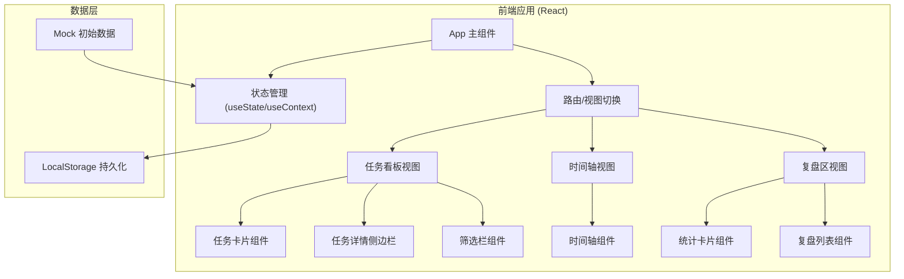
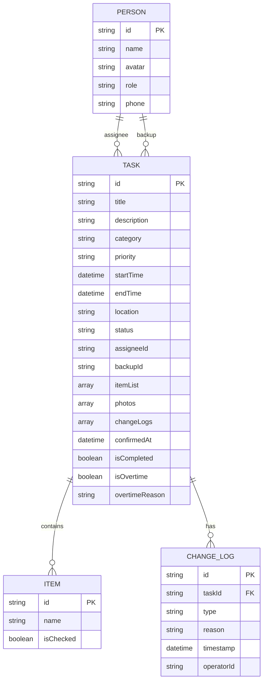

## 1. 架构设计



## 2. 技术描述

- **前端框架**：React@18 + TypeScript
- **构建工具**：Vite@5
- **样式方案**：TailwindCSS@3
- **状态管理**：React useState + useContext（轻量级，无需 Redux）
- **数据持久化**：LocalStorage（前端模拟，无需后端）
- **图标库**：Lucide React（轻量美观）
- **动画**：CSS transitions + Framer Motion（可选，用于复杂动画）

## 3. 目录结构

```
src/
├── components/          # 组件目录
│   ├── layout/         # 布局组件
│   │   ├── Header.tsx
│   │   └── TabNav.tsx
│   ├── tasks/          # 任务相关组件
│   │   ├── TaskCard.tsx
│   │   ├── TaskDetail.tsx
│   │   ├── TaskFilter.tsx
│   │   └── TaskForm.tsx
│   ├── timeline/       # 时间轴组件
│   │   └── TimelineView.tsx
│   ├── review/         # 复盘区组件
│   │   ├── ReviewStats.tsx
│   │   └── ReviewList.tsx
│   └── common/         # 通用组件
│       ├── Button.tsx
│       ├── Badge.tsx
│       └── Avatar.tsx
├── types/              # TypeScript 类型定义
│   └── index.ts
├── data/               # Mock 数据
│   └── mockData.ts
├── context/            # React Context
│   └── TaskContext.tsx
├── hooks/              # 自定义 Hooks
│   └── useLocalStorage.ts
├── utils/              # 工具函数
│   ├── timeUtils.ts
│   └── taskUtils.ts
├── App.tsx
├── main.tsx
└── index.css
```

## 4. 数据模型

### 4.1 数据模型定义



### 4.2 类型定义

```typescript
// 任务优先级
type Priority = 'high' | 'medium' | 'low';

// 任务状态
type TaskStatus = 'pending' | 'claimed' | 'confirmed' | 'in_progress' | 'completed';

// 任务分类
type TaskCategory = 'pickup' | 'ceremony' | 'banquet' | 'logistics' | 'photo' | 'other';

// 人员
interface Person {
  id: string;
  name: string;
  avatar?: string;
  role: string;
  phone?: string;
}

// 物品清单项
interface Item {
  id: string;
  name: string;
  isChecked: boolean;
}

// 变更记录
interface ChangeLog {
  id: string;
  type: 'time' | 'person' | 'location' | 'item' | 'other';
  reason: string;
  timestamp: string;
  operatorId: string;
  oldValue?: string;
  newValue?: string;
}

// 任务
interface Task {
  id: string;
  title: string;
  description?: string;
  category: TaskCategory;
  priority: Priority;
  startTime: string;
  endTime?: string;
  location: string;
  status: TaskStatus;
  assigneeId?: string;
  backupId?: string;
  itemList: Item[];
  photos: string[];
  changeLogs: ChangeLog[];
  confirmedAt?: string;
  isCompleted: boolean;
  completedAt?: string;
  isOvertime: boolean;
  overtimeReason?: string;
}

// 复盘记录
interface ReviewRecord {
  id: string;
  type: 'missed' | 'overtime' | 'suggestion';
  taskId?: string;
  content: string;
  createdAt: string;
}

// 人员统计
interface PersonStats {
  personId: string;
  totalTasks: number;
  completedTasks: number;
  onTimeTasks: number;
  rating: number;
}
```

## 5. 核心功能实现方案

### 5.1 任务管理

- 使用 `TaskContext` 全局管理任务数据
- 支持增删改查操作
- 状态变更记录变更历史
- LocalStorage 持久化存储

### 5.2 时间轴视图

- 按小时分段渲染垂直时间线
- 根据任务开始时间定位到对应时间段
- 当前时间指示器每秒更新
- 任务卡片按时间顺序排列

### 5.3 提醒功能

- 使用 `setInterval` 定时检查高优先级任务
- 距离开始时间 30 分钟且未确认时触发提醒
- 浏览器通知 + 页面红点提醒

### 5.4 复盘统计

- 自动统计任务完成率、超时率
- 按人员维度统计完成情况
- 支持手动添加遗漏事项和经验总结

## 6. 初始化数据

预置 10+ 条典型婚礼任务作为 Mock 数据，涵盖：
- 接亲相关（堵门游戏、迎亲车队、接亲路线）
- 仪式相关（戒指、证婚词、交换戒指环节）
- 婚宴相关（酒店音响、座位安排、红包管理）
- 后勤相关（化妆、摄影、酒水、喜糖）

包含多个人物角色：新郎、新娘、伴郎 A/B、伴娘 A/B、婚礼策划、主持人、摄影师等。
