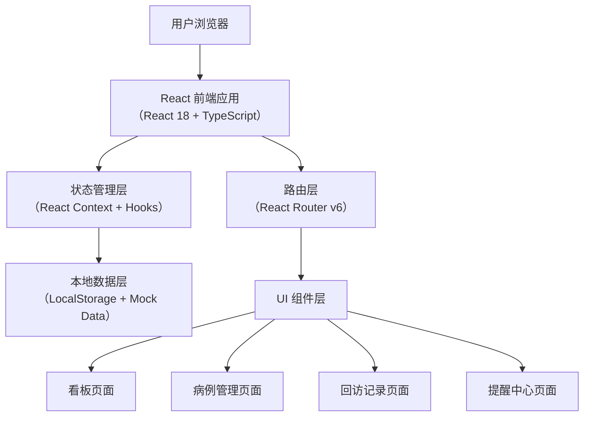
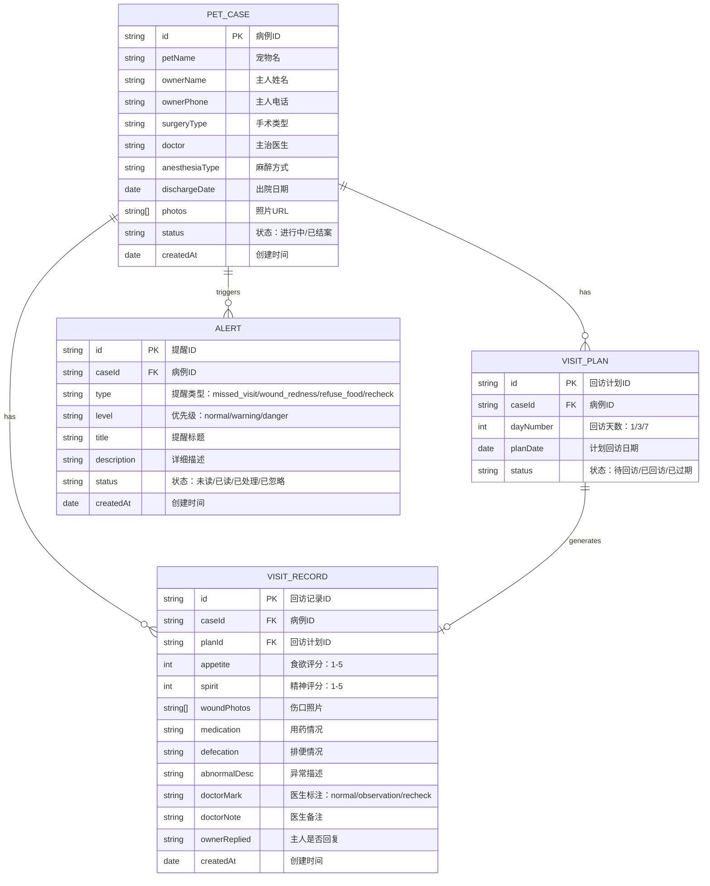

## 1. 架构设计



## 2. 技术选型说明

- **前端框架**：React 18 + TypeScript - 类型安全、组件化开发、生态成熟
- **构建工具**：Vite 5 - 启动快、HMR 体验优秀
- **样式方案**：Tailwind CSS 3 - 原子化 CSS，快速构建 UI
- **图标库**：Lucide React - 简洁线性图标，轻量易定制
- **路由**：React Router v6 - 声明式路由，支持嵌套路由
- **状态管理**：React Context + useReducer - 中轻量状态管理，避免过度设计
- **数据存储**：LocalStorage + Mock 数据 - 无后端场景下的持久化方案
- **日期处理**：date-fns - 轻量日期处理库，比 moment.js 更小

## 3. 路由定义

| 路由 | 页面 | 功能说明 |
|------|------|----------|
| / | 看板首页 | 今日回访、异常病例、未回复主人、复诊安排 |
| /cases | 病例列表 | 病例搜索、筛选、分页展示 |
| /cases/new | 新建病例 | 录入病例信息表单 |
| /cases/:id | 病例详情 | 病例完整信息、回访时间轴、照片画廊 |
| /cases/:id/visits/new | 新建回访 | 录入回访信息表单 |
| /alerts | 提醒中心 | 系统提醒列表、处理操作 |

## 4. 数据模型

### 4.1 ER 图



### 4.2 TypeScript 类型定义

```typescript
// 病例
interface PetCase {
  id: string;
  petName: string;
  ownerName: string;
  ownerPhone: string;
  surgeryType: SurgeryType;
  doctor: string;
  anesthesiaType: AnesthesiaType;
  dischargeDate: string;
  photos: string[];
  status: 'active' | 'closed';
  createdAt: string;
}

type SurgeryType = 'sterilization' | 'tooth_extraction' | 'debridement' | 'other';
type AnesthesiaType = 'general' | 'local' | 'sedation';

// 回访计划
interface VisitPlan {
  id: string;
  caseId: string;
  dayNumber: 1 | 3 | 7;
  planDate: string;
  status: 'pending' | 'completed' | 'missed';
}

// 回访记录
interface VisitRecord {
  id: string;
  caseId: string;
  planId: string;
  appetite: 1 | 2 | 3 | 4 | 5;
  spirit: 1 | 2 | 3 | 4 | 5;
  woundPhotos: string[];
  medication: string;
  defecation: string;
  abnormalDesc: string;
  doctorMark?: 'normal' | 'observation' | 'recheck';
  doctorNote?: string;
  ownerReplied: boolean;
  createdAt: string;
}

// 提醒
interface Alert {
  id: string;
  caseId: string;
  type: 'missed_visit' | 'wound_redness' | 'refuse_food' | 'recheck_schedule';
  level: 'normal' | 'warning' | 'danger';
  title: string;
  description: string;
  status: 'unread' | 'read' | 'handled' | 'ignored';
  createdAt: string;
}
```

## 5. 项目目录结构

```
src/
├── components/           # 通用组件
│   ├── Layout/          # 布局组件（侧边栏、顶部导航）
│   ├── Card/            # 卡片容器组件
│   ├── StatusTag/       # 状态标签组件
│   ├── StarRating/      # 星级评分组件
│   ├── PhotoGallery/    # 照片画廊组件
│   ├── Timeline/        # 时间轴组件
│   └── Modal/           # 弹窗组件
├── pages/               # 页面组件
│   ├── Dashboard/       # 看板首页
│   ├── Cases/           # 病例管理（列表、新建、详情）
│   ├── Visits/          # 回访记录
│   └── Alerts/          # 提醒中心
├── context/             # React Context 状态管理
│   ├── CaseContext.tsx  # 病例数据状态
│   └── AlertContext.tsx # 提醒数据状态
├── types/               # TypeScript 类型定义
│   └── index.ts
├── utils/               # 工具函数
│   ├── date.ts          # 日期处理
│   ├── id.ts            # ID 生成
│   └── storage.ts       # LocalStorage 封装
├── data/                # Mock 数据
│   └── mockData.ts
├── hooks/               # 自定义 Hooks
│   ├── useCases.ts      # 病例相关操作
│   └── useAlerts.ts     # 提醒相关操作
├── App.tsx              # 根组件
├── main.tsx             # 入口文件
└── index.css            # 全局样式 + Tailwind
```

## 6. 核心业务逻辑

### 6.1 回访计划自动生成

新建病例时，根据出院日期自动计算第1天、第3天、第7天的回访计划：
- 第1天回访：出院日期 + 1天
- 第3天回访：出院日期 + 3天
- 第7天回访：出院日期 + 7天

### 6.2 提醒检测逻辑

系统定时（每次进入应用时）检测以下条件并生成提醒：

1. **漏回访提醒**：回访计划日期已过且状态为"待回访" → 优先级 Warning
2. **伤口红肿提醒**：回访记录中异常描述包含"红肿"关键词或医生标注异常 → 优先级 Danger
3. **拒食超过24小时提醒**：回访记录中食欲评分为1且持续超过1天 → 优先级 Danger
4. **复诊安排提醒**：医生标注为"尽快复诊" → 优先级 Warning

### 6.3 看板统计逻辑

- 今日回访：回访计划日期 = 今天 且 状态 = 待回访
- 异常病例：最新回访记录 doctorMark = observation 或 recheck
- 未回复主人：最新回访记录 ownerReplied = false
- 复诊安排：有 recheck 标注且尚未安排复诊完成的病例
