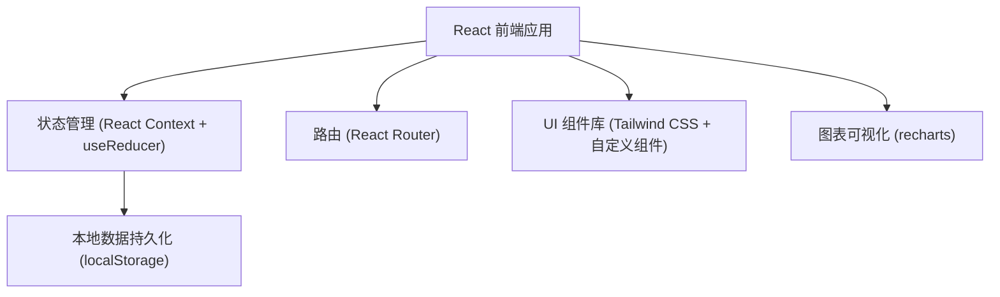
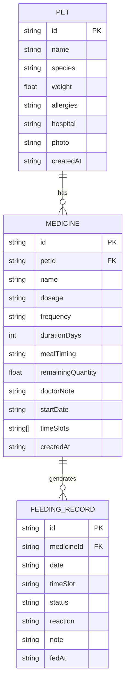

# 宠物喂药日历 - 技术架构文档

## 1. 架构设计



纯前端应用架构，数据存储在浏览器 localStorage 中，无需后端服务。

## 2. 技术描述

- **前端框架**：React@18 + TypeScript
- **构建工具**：Vite@5
- **样式方案**：Tailwind CSS@3
- **路由管理**：React Router DOM@6
- **状态管理**：React Context + useReducer
- **数据持久化**：localStorage
- **图表库**：recharts
- **图标**：lucide-react

## 3. 路由定义

| 路由 | 页面 | 用途 |
|------|------|------|
| / | 首页仪表盘 | 今日待喂/已喂/漏喂/快停药概览，快捷打卡 |
| /pets | 宠物管理 | 宠物列表、添加/编辑宠物档案 |
| /medicines | 药品管理 | 药品列表、添加/编辑药品记录 |
| /statistics | 统计分析 | 疗程完成率、漏喂统计、用药排行 |

## 4. 数据模型

### 4.1 数据模型定义



### 4.2 类型定义

```typescript
// 宠物
interface Pet {
  id: string;
  name: string;
  species: string;      // 品种
  weight: number;       // 体重 (kg)
  allergies: string;    // 过敏史
  hospital: string;     // 常去医院
  photo: string;        // 照片 URL
  createdAt: string;
}

// 药品
interface Medicine {
  id: string;
  petId: string;
  name: string;                  // 药名
  dosage: string;                // 剂量
  frequency: string;             // 频次 (每天几次)
  durationDays: number;          // 疗程天数
  mealTiming: 'before' | 'after' | 'any';  // 饭前饭后
  remainingQuantity: number;     // 剩余数量
  doctorNote: string;            // 医生备注
  startDate: string;             // 开始日期
  timeSlots: string[];           // 喂药时间点 ['08:00', '20:00']
  createdAt: string;
}

// 喂药记录
type FeedingStatus = 'pending' | 'fed' | 'missed' | 'skipped';
type ReactionType = 'normal' | 'vomiting' | 'low-spirit' | 'good-appetite' | 'other';

interface FeedingRecord {
  id: string;
  medicineId: string;
  date: string;          // YYYY-MM-DD
  timeSlot: string;      // HH:mm
  status: FeedingStatus;
  reaction: ReactionType;
  note: string;
  fedAt: string | null;  // 实际喂药时间 ISO
}
```

## 5. 核心状态管理

使用 React Context + useReducer 管理全局状态：

```typescript
interface AppState {
  pets: Pet[];
  medicines: Medicine[];
  feedingRecords: FeedingRecord[];
}

type Action =
  | { type: 'ADD_PET'; payload: Pet }
  | { type: 'UPDATE_PET'; payload: Pet }
  | { type: 'DELETE_PET'; payload: string }
  | { type: 'ADD_MEDICINE'; payload: Medicine }
  | { type: 'UPDATE_MEDICINE'; payload: Medicine }
  | { type: 'DELETE_MEDICINE'; payload: string }
  | { type: 'MARK_FED'; payload: { recordId: string; reaction: ReactionType; note: string } }
  | { type: 'MARK_MISSED'; payload: { recordId: string } }
  | { type: 'GENERATE_DAILY_RECORDS'; payload: string };
```

## 6. 目录结构

```
src/
├── components/          # 通用组件
│   ├── Layout/         # 布局组件
│   ├── PetCard/        # 宠物卡片
│   ├── MedicineCard/   # 药品卡片
│   ├── FeedingItem/    # 喂药项
│   ├── Modal/          # 弹窗组件
│   └── StatsCard/      # 统计卡片
├── pages/              # 页面组件
│   ├── Home/           # 首页
│   ├── Pets/           # 宠物管理
│   ├── Medicines/      # 药品管理
│   └── Statistics/     # 统计页
├── context/            # 状态管理
│   └── AppContext.tsx
├── types/              # 类型定义
│   └── index.ts
├── utils/              # 工具函数
│   ├── date.ts
│   ├── storage.ts
│   └── mockData.ts
├── App.tsx
├── main.tsx
└── index.css
```

## 7. 核心业务逻辑

### 7.1 生成每日喂药任务
- 根据药品的 `frequency` 和 `timeSlots` 生成每日待喂任务
- 比较当前日期与药品 `startDate` 和 `durationDays` 判断是否在疗程内
- 检查已有 `feedingRecords` 避免重复生成

### 7.2 漏喂判断逻辑
- 超过 `timeSlot` 设定时间 2 小时且状态为 `pending` 的任务标记为漏喂
- 漏喂任务显示补喂建议，但**禁止修改剂量**
- 补喂建议：如果距离下次喂药超过4小时，可以补喂；否则跳过

### 7.3 疗程进度计算
- 已完成喂药次数 / 总应喂次数 × 100%
- 总应喂次数 = frequency × durationDays

### 7.4 快停药提醒
- 剩余数量 ≤ 3 天用量的药品标记为「快停药」
- 剩余数量 = remainingQuantity / (每次剂量 × 每日次数)
