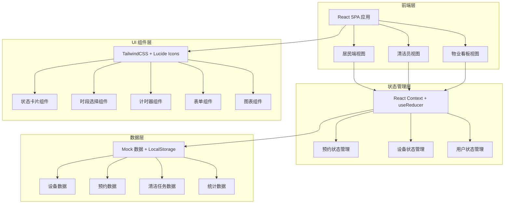
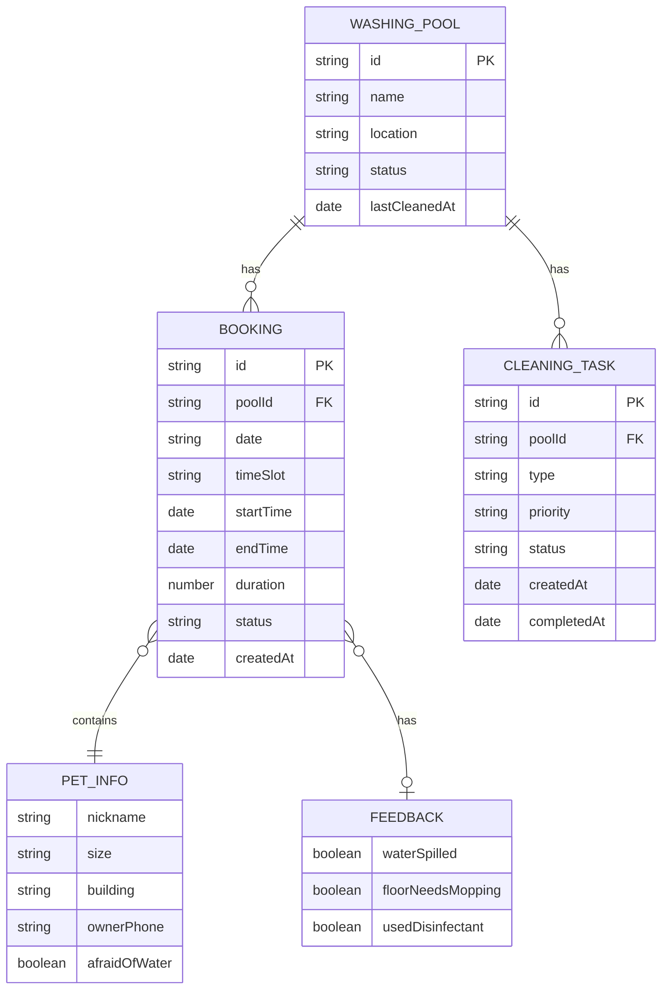

## 1. 架构设计



## 2. 技术描述

- **前端框架**：React@18 + TypeScript
- **构建工具**：Vite@5
- **样式方案**：TailwindCSS@3
- **状态管理**：React Context + useReducer
- **图标库**：Lucide React
- **图表库**：Recharts
- **路由**：React Router DOM@6
- **后端**：无后端，使用 Mock 数据 + LocalStorage 持久化
- **数据持久化**：浏览器 LocalStorage

## 3. 路由定义

| 路由 | 页面/组件 | 说明 |
|------|----------|------|
| `/` | 角色选择页 | 选择居民/清洁员/物业身份进入 |
| `/resident` | 居民首页 | 洗脚池状态总览、时段选择、我的预约 |
| `/resident/booking` | 预约页面 | 选择时段、洗脚池，填写宠物信息 |
| `/resident/using/:bookingId` | 使用中页面 | 计时、结束反馈 |
| `/cleaner` | 清洁员待办页 | 任务列表、设备管理 |
| `/admin` | 物业数据看板 | 数据统计、图表展示 |

## 4. 数据模型

### 4.1 TypeScript 类型定义

```typescript
// 设备状态枚举
type DeviceStatus = 'IDLE' | 'OCCUPIED' | 'CLEANING_PENDING' | 'PAUSED' | 'MAINTENANCE';

// 宠物体型
type PetSize = 'SMALL' | 'MEDIUM' | 'LARGE';

// 预约状态
type BookingStatus = 'PENDING' | 'IN_USE' | 'COMPLETED' | 'NO_SHOW' | 'CANCELLED';

// 清洁任务类型
type TaskType = 'MAT_REPLACEMENT' | 'DRAIN_CLEANING' | 'DISINFECTANT_REFILL';

// 清洁任务状态
type TaskStatus = 'PENDING' | 'IN_PROGRESS' | 'COMPLETED';

// 洗脚池设备
interface WashingPool {
  id: string;
  name: string;
  location: string;
  status: DeviceStatus;
  lastCleanedAt?: Date;
}

// 宠物信息
interface PetInfo {
  nickname: string;
  size: PetSize;
  building: string;
  ownerPhone: string;
  afraidOfWater: boolean;
}

// 预约记录
interface Booking {
  id: string;
  poolId: string;
  poolName: string;
  date: string;
  timeSlot: string;
  startTime?: Date;
  endTime?: Date;
  duration?: number;
  petInfo: PetInfo;
  status: BookingStatus;
  feedback?: {
    waterSpilled: boolean;
    floorNeedsMopping: boolean;
    usedDisinfectant: boolean;
  };
  createdAt: Date;
}

// 清洁任务
interface CleaningTask {
  id: string;
  poolId: string;
  poolName: string;
  type: TaskType;
  priority: 'HIGH' | 'MEDIUM' | 'LOW';
  status: TaskStatus;
  createdAt: Date;
  completedAt?: Date;
  note?: string;
}

// 统计数据
interface Statistics {
  peakHours: { hour: number; count: number }[];
  noShows: { total: number; rate: number; users: { phone: string; count: number }[] };
  overtimeUsage: { total: number; avgDuration: number; overtimes: { poolId: string; count: number }[] };
  buildingUsage: { building: string; count: number }[];
}
```

### 4.2 数据模型关系图



## 5. 项目目录结构

```
src/
├── components/          # 公共组件
│   ├── layout/         # 布局组件
│   ├── ui/             # 基础 UI 组件（卡片、按钮等）
│   ├── PoolCard.tsx    # 洗脚池状态卡片
│   ├── TimeSlotPicker.tsx # 时段选择器
│   ├── Timer.tsx       # 计时器组件
│   ├── PetForm.tsx     # 宠物信息表单
│   └── StatsChart.tsx  # 统计图表
├── pages/              # 页面组件
│   ├── RoleSelect.tsx  # 角色选择页
│   ├── resident/       # 居民端页面
│   ├── cleaner/        # 清洁员端页面
│   └── admin/          # 物业端页面
├── context/            # Context 状态管理
│   ├── BookingContext.tsx
│   ├── PoolContext.tsx
│   └── UserContext.tsx
├── types/              # TypeScript 类型定义
│   └── index.ts
├── data/               # Mock 数据
│   └── mockData.ts
├── hooks/              # 自定义 Hooks
│   ├── useTimer.ts
│   └── useLocalStorage.ts
├── utils/              # 工具函数
│   ├── formatters.ts
│   └── generators.ts
├── App.tsx
├── main.tsx
└── index.css
```
