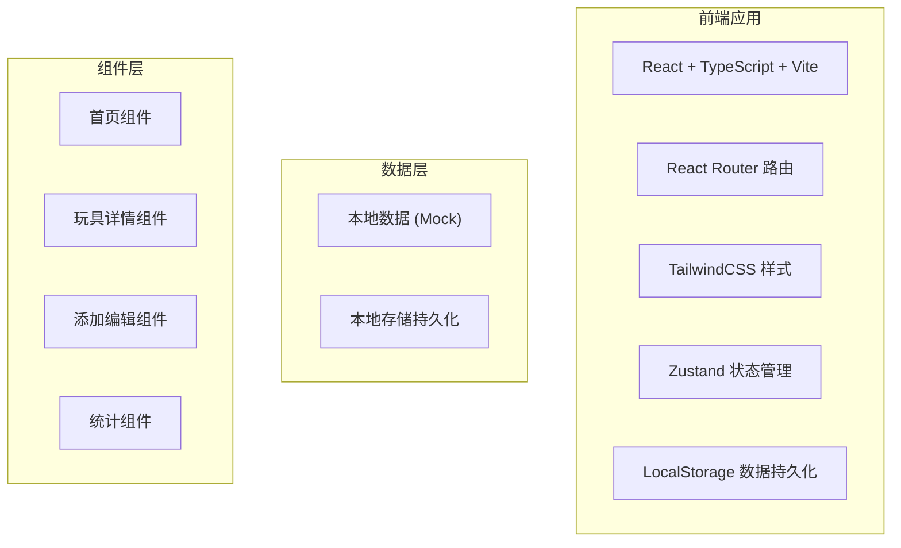
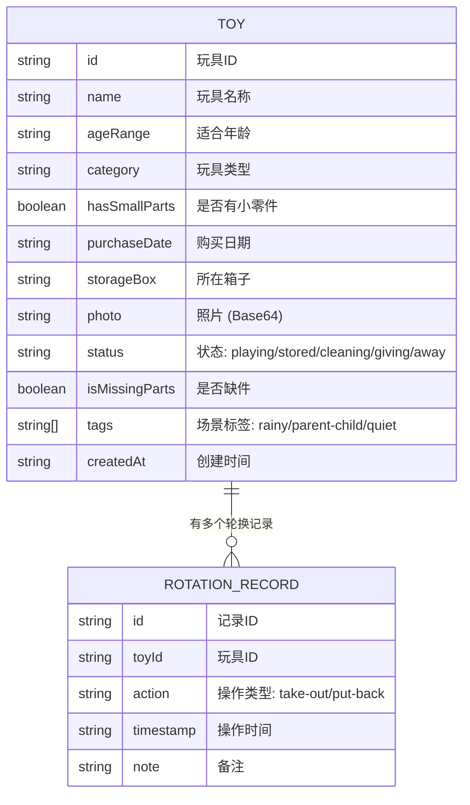

## 1. 架构设计



## 2. 技术说明

- 前端框架：React 18 + TypeScript
- 构建工具：Vite
- 样式方案：TailwindCSS 3
- 状态管理：Zustand
- 路由管理：React Router v6
- 图标库：Lucide React
- 数据存储：LocalStorage 本地持久化
- 图片存储：Base64 本地存储

## 3. 路由定义

| 路由 | 页面 | 功能 |
|------|------|------|
| / | 首页 | 玩具分组展示、场景筛选、安全提醒 |
| /toy/:id | 玩具详情页 | 玩具信息、轮换历史、操作按钮 |
| /add | 添加玩具页 | 新玩具登记表单 |
| /edit/:id | 编辑玩具页 | 玩具信息修改 |
| /stats | 统计页 | 使用数据统计展示 |

## 4. 数据模型

### 4.1 数据模型定义



### 4.2 类型定义

```typescript
type ToyStatus = 'playing' | 'stored' | 'cleaning' | 'giving' | 'away';
type ToyTag = 'rainy' | 'parent-child' | 'quiet';
type RotationAction = 'take-out' | 'put-back';

interface Toy {
  id: string;
  name: string;
  ageRange: string;
  category: string;
  hasSmallParts: boolean;
  purchaseDate: string;
  storageBox: string;
  photo: string;
  status: ToyStatus;
  isMissingParts: boolean;
  tags: ToyTag[];
  createdAt: string;
}

interface RotationRecord {
  id: string;
  toyId: string;
  action: RotationAction;
  timestamp: string;
  note?: string;
}
```

## 5. 状态管理设计

使用 Zustand 管理全局状态：

- toyStore: 玩具数据管理
  - toys: Toy[]
  - addToy(toy: Toy)
  - updateToy(id: string, data: Partial<Toy>)
  - deleteToy(id: string)
  - getToyById(id: string)
  - getToysByStatus(status: ToyStatus)
  - getToysByTag(tag: ToyTag)

- rotationStore: 轮换记录管理
  - records: RotationRecord[]
  - addRecord(record: RotationRecord)
  - getRecordsByToyId(toyId: string)
  - getPlayCount(toyId: string)
  - getLastPlayTime(toyId: string)
```
