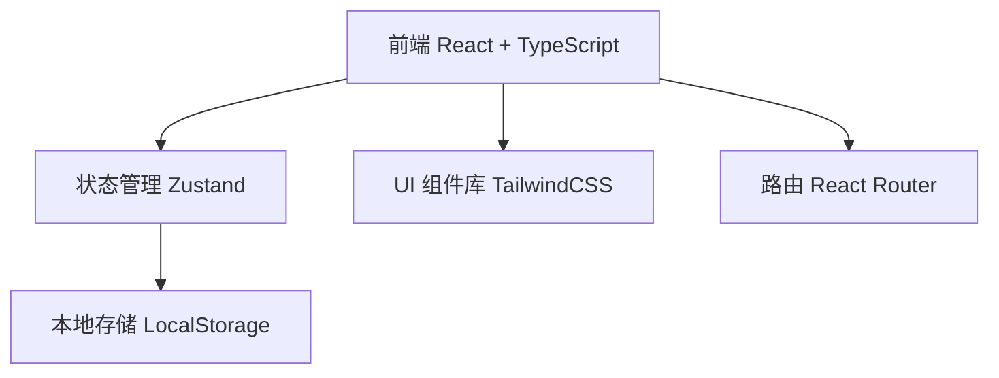
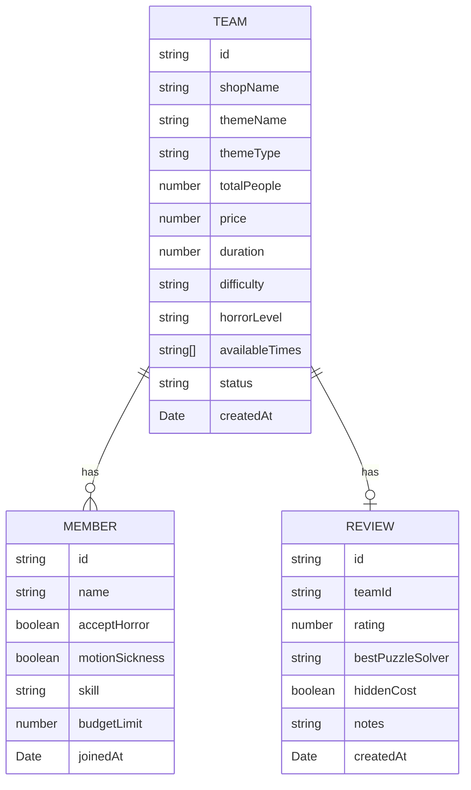

## 1. 架构设计


## 2. 技术描述
- 前端：React@18 + TypeScript + Vite
- 样式：TailwindCSS@3
- 状态管理：Zustand
- 路由：React Router DOM@6
- 图表：纯 CSS 实现柱状图
- 数据存储：LocalStorage（模拟后端，纯前端应用）
- 初始化工具：Vite

## 3. 路由定义
| 路由 | 用途 |
|------|------|
| / | 首页，展示分组组队列表 |
| /create | 创建新组队 |
| /team/:id | 组队详情与报名 |
| /team/:id/review | 体验记录 |
| /stats | 统计页面 |

## 4. 数据模型

### 4.1 数据模型定义


### 4.2 TypeScript 类型定义
```typescript
type ThemeType = 'horror' | 'mystery' | 'mechanism';
type Difficulty = 'easy' | 'medium' | 'hard' | 'expert';
type HorrorLevel = 'none' | 'mild' | 'medium' | 'high' | 'extreme';
type Skill = 'puzzle' | 'search' | 'both';
type TeamStatus = 'recruiting' | 'locked' | 'completed';

interface Member {
  id: string;
  name: string;
  acceptHorror: boolean;
  motionSickness: boolean;
  skill: Skill;
  budgetLimit: number;
  joinedAt: string;
}

interface Review {
  id: string;
  teamId: string;
  rating: number;
  bestPuzzleSolver: string;
  hiddenCost: boolean;
  hiddenCostAmount?: number;
  notes: string;
  createdAt: string;
}

interface Team {
  id: string;
  shopName: string;
  themeName: string;
  themeType: ThemeType;
  totalPeople: number;
  price: number;
  duration: number;
  difficulty: Difficulty;
  horrorLevel: HorrorLevel;
  availableTimes: string[];
  status: TeamStatus;
  members: Member[];
  review?: Review;
  createdAt: string;
}
```
