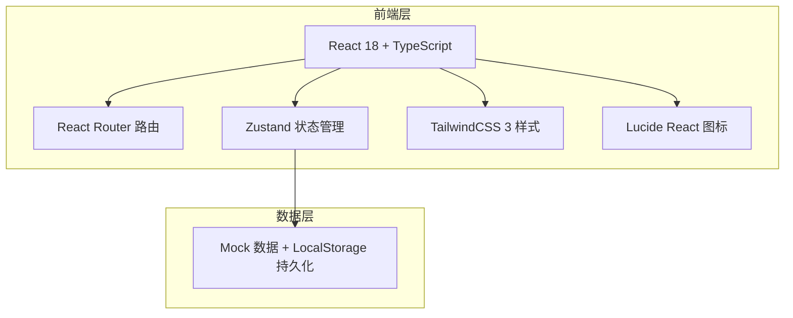
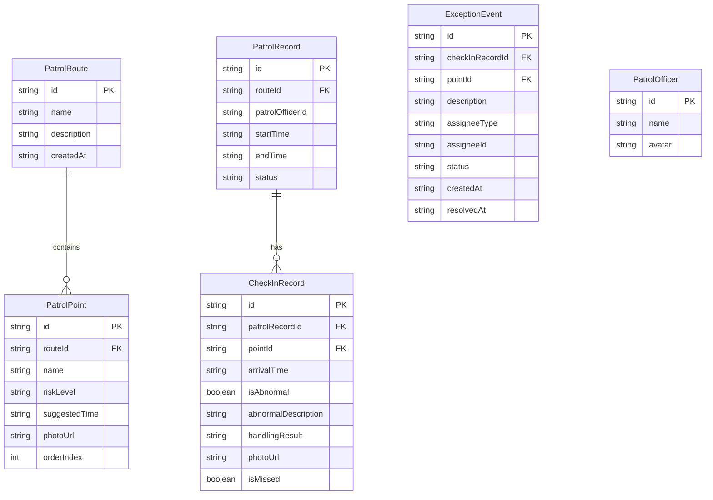

## 1. 架构设计



## 2. 技术说明

- 前端：React 18 + TypeScript + Vite
- 路由：react-router-dom
- 状态管理：zustand
- 样式：tailwindcss@3
- 图标：lucide-react
- 后端：无后端，使用 Mock 数据 + LocalStorage 持久化
- 图表：使用纯 CSS + SVG 实现简单图表，避免引入额外图表库

## 3. 路由定义

| 路由 | 用途 |
|------|------|
| / | 首页仪表盘，快速概览 |
| /config | 巡逻配置页，管理路线和点位 |
| /patrol | 巡逻打卡页，执行巡逻任务 |
| /exceptions | 异常事件页，查看和分派异常 |
| /missed | 漏打卡页，独立展示漏打卡点位 |
| /statistics | 统计分析页，数据报表 |

## 4. 数据模型

### 4.1 数据模型定义



### 4.2 类型定义

```typescript
// 风险等级
type RiskLevel = 'low' | 'medium' | 'high' | 'critical';

// 异常状态
type ExceptionStatus = 'pending' | 'assigned' | 'processing' | 'resolved';

// 分派类型
type AssigneeType = 'maintenance' | 'security';

// 巡逻路线
interface PatrolRoute {
  id: string;
  name: string;
  description: string;
  points: PatrolPoint[];
  createdAt: string;
}

// 巡逻点位
interface PatrolPoint {
  id: string;
  routeId: string;
  name: string;
  riskLevel: RiskLevel;
  suggestedTime: string; // HH:mm 格式
  photoUrl: string;
  orderIndex: number;
}

// 巡逻记录（一次巡逻任务）
interface PatrolRecord {
  id: string;
  routeId: string;
  patrolOfficerId: string;
  startTime: string;
  endTime?: string;
  status: 'in_progress' | 'completed';
}

// 打卡记录（单个点位）
interface CheckInRecord {
  id: string;
  patrolRecordId: string;
  pointId: string;
  arrivalTime?: string;
  isAbnormal: boolean;
  abnormalDescription?: string;
  handlingResult?: string;
  photoUrl?: string;
  isMissed: boolean;
}

// 异常事件
interface ExceptionEvent {
  id: string;
  checkInRecordId: string;
  pointId: string;
  pointName: string;
  routeName: string;
  description: string;
  assigneeType?: AssigneeType;
  assigneeId?: string;
  status: ExceptionStatus;
  createdAt: string;
  resolvedAt?: string;
  handlingResult?: string;
}

// 巡逻员
interface PatrolOfficer {
  id: string;
  name: string;
  avatar?: string;
}
```

## 5. 项目目录结构

```
src/
├── components/          # 可复用组件
│   ├── layout/          # 布局组件（侧边栏、顶部导航）
│   ├── cards/           # 卡片组件
│   ├── forms/           # 表单组件
│   ├── modals/          # 模态框组件
│   └── charts/          # 图表组件
├── pages/               # 页面组件
│   ├── Dashboard.tsx
│   ├── PatrolConfig.tsx
│   ├── PatrolCheckIn.tsx
│   ├── ExceptionList.tsx
│   ├── MissedPoints.tsx
│   └── Statistics.tsx
├── store/               # Zustand 状态管理
│   └── usePatrolStore.ts
├── types/               # TypeScript 类型定义
│   └── patrol.ts
├── utils/               # 工具函数
│   ├── mock.ts          # Mock 数据
│   └── helpers.ts       # 辅助函数
├── App.tsx
├── main.tsx
└── index.css
```
