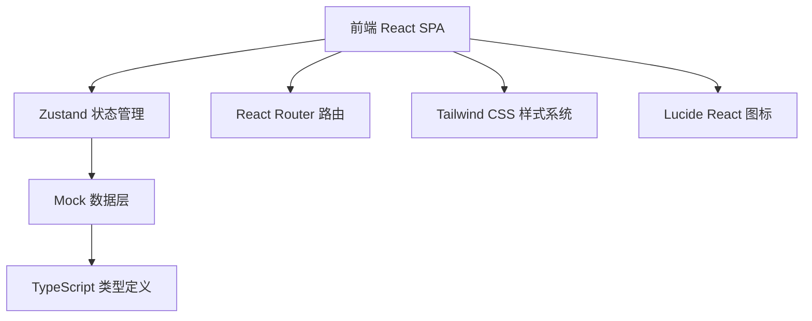
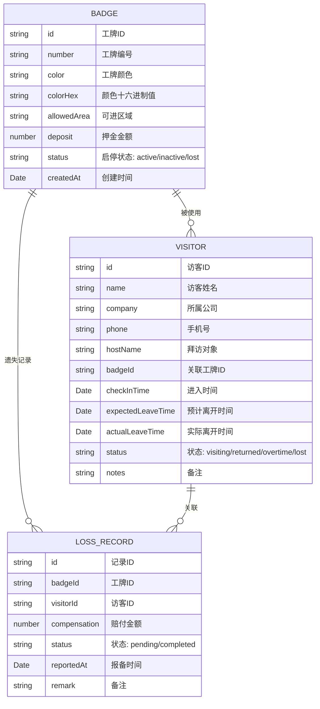

## 1. 架构设计



## 2. 技术描述

- **前端框架**：React 18 + TypeScript 5
- **构建工具**：Vite 5
- **路由管理**：React Router DOM 6
- **状态管理**：Zustand 4
- **样式方案**：Tailwind CSS 3
- **图标库**：Lucide React
- **数据层**：内置 Mock 数据（无需后端），使用 localStorage 做数据持久化

## 3. 路由定义

| 路由 | 用途 |
|------|------|
| `/` | 回收看板主页（默认路由） |
| `/badges` | 工牌管理页 |

## 4. 数据模型

### 4.1 数据模型定义



### 4.2 TypeScript 类型定义

```typescript
type BadgeStatus = 'active' | 'inactive' | 'lost';
type VisitorStatus = 'visiting' | 'returned' | 'overtime' | 'lost';
type LossRecordStatus = 'pending' | 'completed';

interface Badge {
  id: string;
  number: string;
  color: string;
  colorHex: string;
  allowedArea: string;
  deposit: number;
  status: BadgeStatus;
  createdAt: string;
}

interface Visitor {
  id: string;
  name: string;
  company: string;
  phone: string;
  hostName: string;
  badgeId: string;
  checkInTime: string;
  expectedLeaveTime: string;
  actualLeaveTime?: string;
  status: VisitorStatus;
  notes?: string;
}

interface LossRecord {
  id: string;
  badgeId: string;
  visitorId: string;
  compensation: number;
  status: LossRecordStatus;
  reportedAt: string;
  remark?: string;
}

interface DashboardStats {
  todayTotal: number;
  notReturned: number;
  overtimeCount: number;
  avgStayDuration: string;
  areaDistribution: { area: string; count: number }[];
}
```

## 5. 项目目录结构

```
src/
├── components/
│   ├── layout/
│   │   ├── Header.tsx           # 顶部导航栏
│   │   └── Sidebar.tsx          # 侧边导航
│   ├── dashboard/
│   │   ├── StatsCard.tsx        # 统计卡片
│   │   ├── UnreturnedBadges.tsx # 未归还工牌网格
│   │   ├── VisitorTable.tsx     # 今日访客表格
│   │   └── AreaDistribution.tsx # 区域分布
│   ├── badges/
│   │   ├── BadgeTable.tsx       # 工牌列表
│   │   └── BadgeForm.tsx        # 工牌表单弹窗
│   ├── visitors/
│   │   ├── VisitorForm.tsx      # 访客登记弹窗
│   │   ├── ReturnConfirm.tsx    # 归还确认弹窗
│   │   └── LossForm.tsx         # 遗失处理弹窗
│   └── ui/
│       ├── Button.tsx           # 通用按钮
│       ├── Modal.tsx            # 通用弹窗
│       ├── Input.tsx            # 通用输入框
│       ├── Select.tsx           # 通用下拉
│       └── Tag.tsx              # 标签组件
├── pages/
│   ├── Dashboard.tsx            # 看板主页
│   └── BadgeManagement.tsx      # 工牌管理页
├── store/
│   └── useBadgeStore.ts         # Zustand 全局状态
├── data/
│   └── mockData.ts              # 模拟初始数据
├── types/
│   └── index.ts                 # 全局类型定义
├── utils/
│   ├── time.ts                  # 时间格式化工具
│   └── id.ts                    # ID 生成工具
├── App.tsx
├── main.tsx
└── index.css
```

## 6. 状态管理设计 (Zustand Store)

```typescript
interface BadgeStore {
  badges: Badge[];
  visitors: Visitor[];
  lossRecords: LossRecord[];
  
  // 工牌 CRUD
  addBadge: (badge: Omit<Badge, 'id' | 'createdAt'>) => void;
  updateBadge: (id: string, data: Partial<Badge>) => void;
  deleteBadge: (id: string) => void;
  toggleBadgeStatus: (id: string) => void;
  
  // 访客管理
  checkInVisitor: (visitor: Omit<Visitor, 'id' | 'checkInTime' | 'status'>) => void;
  confirmReturn: (visitorId: string) => void;
  reportLost: (data: Omit<LossRecord, 'id' | 'reportedAt' | 'status'>) => void;
  
  // 看板数据
  getDashboardStats: () => DashboardStats;
  getUnreturnedVisitors: () => Visitor[];
  getTodayVisitors: () => Visitor[];
  
  // 初始化与持久化
  initFromStorage: () => void;
}
```
