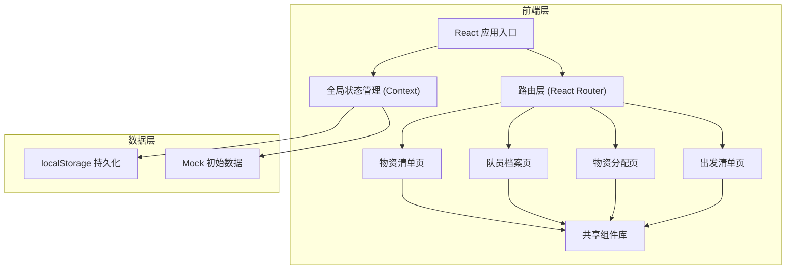
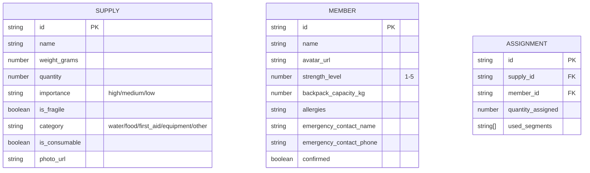

## 1. 架构设计


## 2. 技术说明
- **前端框架**：React@18 + TypeScript
- **构建工具**：Vite@5
- **样式方案**：TailwindCSS@3
- **路由管理**：React Router DOM@6
- **状态管理**：React Context + useReducer
- **图标库**：Lucide React
- **拖拽功能**：@dnd-kit/core + @dnd-kit/sortable
- **数据持久化**：localStorage
- **后端**：无（纯前端应用，数据本地存储）
- **初始数据**：内置 Mock 数据，含示例物资和队员

## 3. 路由定义
| 路由 | 页面 | 用途 |
|------|------|------|
| `/` | 物资分配页 | 默认首页，主要分配操作界面 |
| `/supplies` | 物资清单页 | 管理所有徒步物资 |
| `/members` | 队员档案页 | 管理队员信息 |
| `/checklist` | 出发清单页 | 确认状态和总览 |

## 4. 数据模型

### 4.1 数据模型定义


### 4.2 TypeScript 类型定义
```typescript
type Importance = 'high' | 'medium' | 'low';
type SupplyCategory = 'water' | 'food' | 'first_aid' | 'equipment' | 'other';

interface Supply {
  id: string;
  name: string;
  weightGrams: number;
  quantity: number;
  importance: Importance;
  isFragile: boolean;
  category: SupplyCategory;
  isConsumable: boolean;
  photoUrl?: string;
}

interface Member {
  id: string;
  name: string;
  avatarUrl?: string;
  strengthLevel: 1 | 2 | 3 | 4 | 5;
  backpackCapacityKg: number;
  allergies: string[];
  emergencyContactName: string;
  emergencyContactPhone: string;
  confirmed: boolean;
}

interface Assignment {
  id: string;
  supplyId: string;
  memberId: string;
  quantityAssigned: number;
  usedSegments: string[];
}

interface AppState {
  supplies: Supply[];
  members: Member[];
  assignments: Assignment[];
  segments: string[];
}
```

## 5. 核心算法

### 5.1 建议负重计算
```
建议负重(kg) = 体力等级 × 基础系数(2.5kg)
例：体力3星队员 = 3 × 2.5 = 7.5kg
```

### 5.2 负重占比计算
```
负重占比 = 实际负重 / (背包容量 × 0.8) × 100%
>100% 为超重（红色警告）
80%-100% 为接近上限（橙色）
<80% 为正常（绿色）
```

### 5.3 智能分配策略（可选）
- 急救用品优先分配给体力等级高的队员
- 重物均衡分散，不集中在单人
- 水等必需品每个队员至少携带一份
- 易碎品分配给细心（可配置标记）的队员
