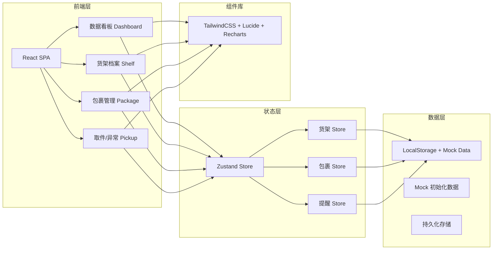
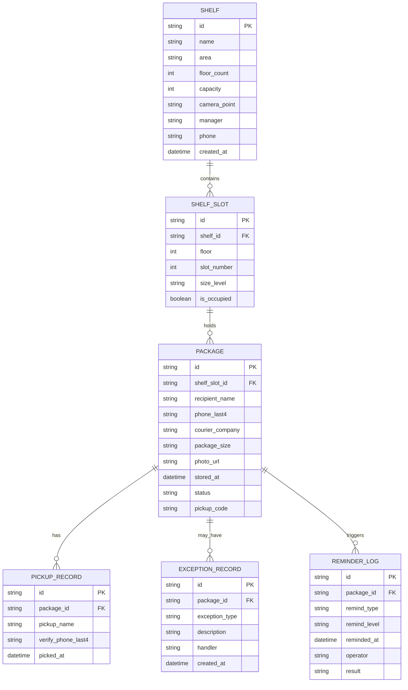

## 1. 架构设计



## 2. 技术描述

- **前端框架**：React@18 + TypeScript
- **构建工具**：Vite@5
- **样式方案**：TailwindCSS@3
- **路由管理**：React Router@6
- **状态管理**：Zustand@4（轻量、支持持久化）
- **图表库**：Recharts@2（柱状图、折线图、饼图）
- **图标库**：Lucide React
- **日期处理**：date-fns@3
- **后端**：无后端，使用 LocalStorage 持久化 + Mock 数据
- **数据库**：浏览器 LocalStorage

## 3. 路由定义

| 路由路径 | 页面组件 | 用途 |
|----------|----------|------|
| `/` | DashboardPage | 数据看板首页 |
| `/shelves` | ShelvesPage | 货架档案管理 |
| `/shelves/:id` | ShelfDetailPage | 单个货架详情 |
| `/packages` | PackagesPage | 包裹列表/搜索 |
| `/packages/register` | RegisterPage | 包裹登记 |
| `/pickup` | PickupPage | 取件操作入口 |
| `/exceptions` | ExceptionsPage | 异常记录列表 |

## 4. 数据模型

### 4.1 ER图



### 4.2 核心数据结构（TypeScript）

```typescript
// 货架
interface Shelf {
  id: string;
  name: string;
  area: string;
  floorCount: number;
  capacity: number;
  cameraPoint: string;
  manager: string;
  managerPhone: string;
  createdAt: string;
}

// 包裹
interface Package {
  id: string;
  shelfId: string;
  shelfSlotId: string;
  slotLabel: string;
  recipientName: string;
  phoneLast4: string;
  courierCompany: string;
  packageSize: 'S' | 'M' | 'L';
  photoUrl: string;
  storedAt: string;
  status: 'stored' | 'picked' | 'exception' | 'transferred';
  pickupCode: string;
  pickedAt?: string;
  pickupName?: string;
}

// 异常记录
interface ExceptionRecord {
  id: string;
  packageId: string;
  type: 'damaged' | 'wrong_pickup' | 'unclaimed';
  description: string;
  handler: string;
  createdAt: string;
}

// 提醒日志
interface ReminderLog {
  id: string;
  packageId: string;
  type: 'auto_24h' | 'auto_48h' | 'manual_72h';
  level: 'warning' | 'danger' | 'critical';
  remindedAt: string;
  operator?: string;
  result?: string;
}

// 看板统计
interface DashboardStats {
  totalSlots: number;
  occupiedSlots: number;
  occupancyRate: number;
  storedCount: number;
  delayed24hCount: number;
  delayed72hCount: number;
  todayPickedCount: number;
}
```

## 5. 状态管理设计

### 5.1 Store 划分

| Store 名称 | 职责 | 核心方法 |
|-----------|------|----------|
| useShelfStore | 货架档案CRUD | `addShelf`, `updateShelf`, `deleteShelf`, `getShelfSlots` |
| usePackageStore | 包裹生命周期管理 | `registerPackage`, `pickupPackage`, `getDelayedPackages` |
| useReminderStore | 滞留提醒逻辑 | `checkDelayedPackages`, `addReminderLog`, `triggerManualReminder` |
| useExceptionStore | 异常处理 | `addException`, `getExceptionList` |

### 5.2 滞留判定规则

```
滞留等级判定（基于 storedAt 与当前时间差 hours）:
- < 24h: 正常 (normal)
- 24h ≤ hours < 48h: 一级滞留 (warning) - 自动提醒
- 48h ≤ hours < 72h: 二级滞留 (danger) - 再次提醒
- ≥ 72h: 三级滞留 (critical) - 转人工处理
```

## 6. 项目目录结构

```
src/
├── components/          # 通用组件
│   ├── layout/         # Layout/Sidebar/Header
│   ├── ui/             # Button/Card/Modal/Table
│   └── charts/         # 图表组件封装
├── pages/              # 页面组件
│   ├── Dashboard.tsx
│   ├── Shelves.tsx
│   ├── ShelfDetail.tsx
│   ├── Packages.tsx
│   ├── Register.tsx
│   ├── Pickup.tsx
│   └── Exceptions.tsx
├── store/              # Zustand stores
├── types/              # TypeScript 类型定义
├── utils/              # 工具函数 (日期、滞留计算等)
├── mock/               # Mock 初始化数据
├── hooks/              # 自定义 hooks
├── App.tsx
├── main.tsx
└── index.css
```
