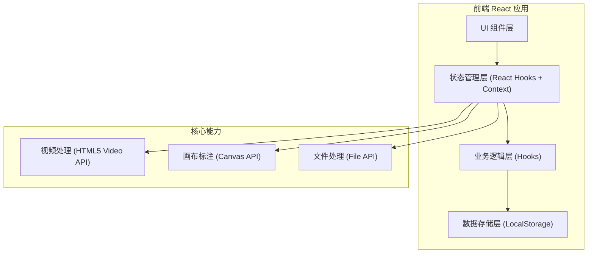
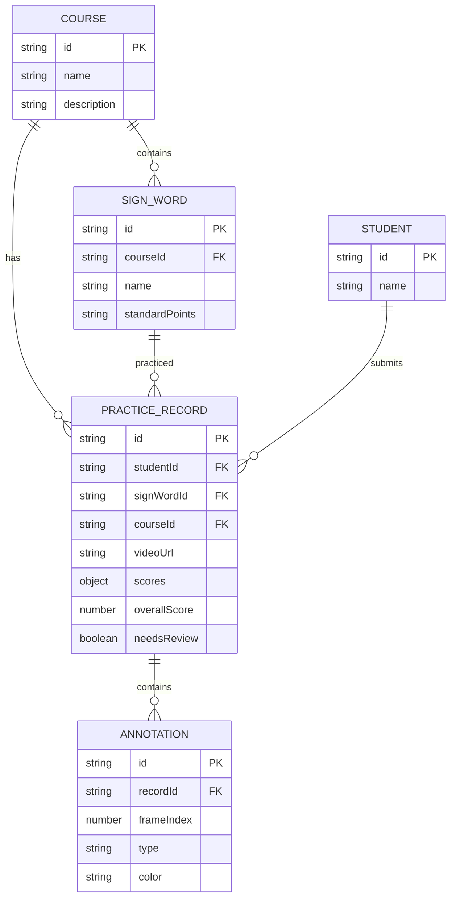

## 1. 架构设计



## 2. 技术描述

- **前端框架**：React@18 + TypeScript@5
- **构建工具**：Vite@5
- **样式方案**：TailwindCSS@3 + CSS Variables
- **状态管理**：React Context + useReducer
- **图标库**：Lucide React
- **视频处理**：原生 HTML5 Video API + Canvas 逐帧捕获
- **标注功能**：Canvas 2D API 实现绘图、矩形框选、箭头、文字
- **数据持久化**：LocalStorage 存储课程、词条、评分、批注数据
- **后端服务**：无（纯前端单页应用，数据本地存储）
- **演示数据**：内置 Mock 数据模拟课程、学生视频、历史评分记录

## 3. 路由定义

| 路由 | 用途 |
|-------|---------|
| / | 动作回放练习主页面（单页应用，所有功能在此页面完成） |

## 4. 核心数据类型定义

```typescript
// 课程主题
interface Course {
  id: string;
  name: string;
  description: string;
  createdAt: string;
}

// 手语词条
interface SignWord {
  id: string;
  courseId: string;
  name: string;
  standardPoints: {
    handShape: string;      // 手形要点
    orientation: string;    // 朝向要点
    trajectory: string;     // 移动轨迹要点
    expression: string;     // 表情配合要点
  };
  referenceVideoUrl?: string;
  createdAt: string;
}

// 学生
interface Student {
  id: string;
  name: string;
  avatar?: string;
}

// 评分维度
interface DimensionScore {
  handShape: number;        // 手形 0-100
  orientation: number;      // 朝向 0-100
  trajectory: number;       // 移动轨迹 0-100
  expression: number;       // 表情配合 0-100
  comments: {
    handShape: string;
    orientation: string;
    trajectory: string;
    expression: string;
  };
}

// 标注点（矩形/箭头/文字）
interface Annotation {
  id: string;
  frameIndex: number;       // 帧序号
  timestamp: number;        // 视频时间戳（秒）
  type: 'rect' | 'arrow' | 'text';
  color: string;
  x: number;                // 相对画布 X (0-1)
  y: number;                // 相对画布 Y (0-1)
  width?: number;           // 矩形宽度 (0-1)
  height?: number;          // 矩形高度 (0-1)
  endX?: number;            // 箭头终点 X
  endY?: number;            // 箭头终点 Y
  text?: string;            // 文字内容
  errorType?: 'handShape' | 'orientation' | 'trajectory' | 'expression' | 'other';
}

// 练习记录
interface PracticeRecord {
  id: string;
  studentId: string;
  signWordId: string;
  courseId: string;
  videoUrl: string;
  videoName: string;
  scores: DimensionScore;
  annotations: Annotation[];
  overallScore: number;
  practiceDate: string;
  needsReview: boolean;     // 是否需要复练
}
```

## 5. 数据模型关系



## 6. 项目目录结构

```
src/
├── components/           # UI 组件
│   ├── Header.tsx              # 顶部导航栏
│   ├── VideoPlayer.tsx         # 视频播放器+控制条
│   ├── AnnotationCanvas.tsx    # 标注画布层
│   ├── AnnotationToolbar.tsx   # 标注工具条
│   ├── ScoringPanel.tsx        # 多维度评分面板
│   ├── WordManager.tsx         # 词条管理面板
│   ├── AnnotationList.tsx      # 批注列表
│   └── ReviewList.tsx          # 复练名单面板
├── hooks/                # 自定义 Hooks
│   ├── useVideoControl.ts       # 视频控制逻辑
│   ├── useAnnotation.ts         # 标注绘图逻辑
│   └── usePracticeStore.ts      # 练习数据管理
├── types/                # TypeScript 类型定义
│   └── index.ts
├── data/                 # Mock 数据
│   └── mockData.ts
├── utils/                # 工具函数
│   ├── storage.ts              # LocalStorage 封装
│   └── score.ts                # 评分计算工具
├── context/              # React Context
│   └── PracticeContext.tsx
├── App.tsx               # 主应用组件
├── main.tsx              # 入口文件
└── index.css             # 全局样式
```
