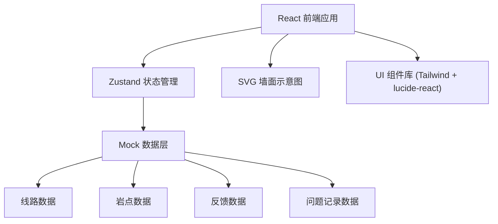
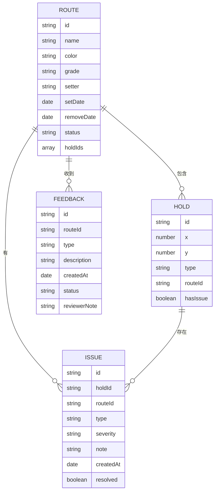

## 1. 架构设计



## 2. 技术选型

- **前端框架**：React 18 + TypeScript
- **构建工具**：Vite 5
- **样式方案**：TailwindCSS 3
- **状态管理**：Zustand
- **路由**：React Router DOM
- **图标库**：lucide-react
- **数据方案**：前端 Mock 数据 + LocalStorage 持久化

## 3. 目录结构

```
src/
├── components/          # 通用组件
│   ├── WallMap/        # 墙面示意图组件
│   ├── RouteCard/      # 线路卡片组件
│   ├── HoldMarker/     # 岩点标记组件
│   ├── IssueModal/     # 问题记录弹窗
│   ├── FeedbackForm/   # 反馈表单
│   ├── RouteEditor/    # 线路编辑器
│   └── ReviewPanel/    # 复核面板
├── pages/              # 页面
│   ├── WallOverview/   # 墙面总览页
│   ├── Patrol/         # 巡场记录页
│   ├── Feedback/       # 顾客反馈页
│   ├── RouteManage/    # 线路管理页
│   └── Review/         # 反馈复核页
├── store/              # Zustand 状态
│   ├── useRouteStore.ts
│   ├── useHoldStore.ts
│   └── useFeedbackStore.ts
├── data/               # Mock 数据
│   ├── routes.ts
│   ├── holds.ts
│   └── feedback.ts
├── types/              # TypeScript 类型
│   └── index.ts
├── utils/              # 工具函数
│   └── helpers.ts
├── App.tsx
├── main.tsx
└── index.css
```

## 4. 路由定义

| 路由 | 页面 | 功能 |
|------|------|------|
| / | 墙面总览 | 查看墙面示意图和线路列表 |
| /patrol | 巡场记录 | 点击岩点记录问题 |
| /feedback | 顾客反馈 | 提交和查看线路反馈 |
| /routes | 线路管理 | 新增/编辑线路信息 |
| /review | 反馈复核 | 开线人复核反馈并决策 |

## 5. 数据模型

### 5.1 数据模型定义



### 5.2 类型定义

```typescript
// 线路
interface Route {
  id: string;
  name: string;
  color: string;
  grade: string; // V0, V1, V2...
  setter: string;
  setDate: string;
  removeDate: string;
  status: 'active' | 'pending_review' | 'adjusting' | 'retired';
  holdIds: string[];
}

// 岩点
interface Hold {
  id: string;
  x: number; // 百分比位置 0-100
  y: number; // 百分比位置 0-100
  type: 'jug' | 'crimp' | 'sloper' | 'foothold';
  routeId: string | null;
  hasIssue: boolean;
}

// 问题记录
interface Issue {
  id: string;
  holdId: string;
  routeId: string | null;
  type: 'loose' | 'worn' | 'missing_screw' | 'slippery';
  severity: 'low' | 'medium' | 'high';
  note: string;
  createdAt: string;
  resolved: boolean;
}

// 顾客反馈
interface Feedback {
  id: string;
  routeId: string;
  type: 'too_hard' | 'bad_flow' | 'other';
  description: string;
  createdAt: string;
  status: 'pending' | 'reviewed';
  decision?: 'keep' | 'adjust' | 'retire';
  reviewerNote?: string;
}
```

## 6. 核心组件设计

### 6.1 WallMap 墙面示意图
- 基于 SVG 实现可交互墙面
- 支持网格背景
- 岩点按线路颜色渲染
- 点击岩点触发对应操作
- 悬停显示岩点信息 tooltip

### 6.2 HoldMarker 岩点标记
- 圆形或多边形岩点图标
- 支持不同尺寸和类型
- 问题状态的脉冲动画
- 选中状态的高亮效果

### 6.3 RouteCard 线路卡片
- 颜色标签
- 难度徽章
- 开线人信息
- 拆线日期倒计时
- 状态指示器

## 7. 状态管理设计

使用 Zustand 管理三个核心 store：
- useRouteStore：线路 CRUD、状态更新
- useHoldStore：岩点位置、问题记录
- useFeedbackStore：反馈提交、复核操作

所有状态通过 LocalStorage 持久化，刷新页面数据不丢失。
