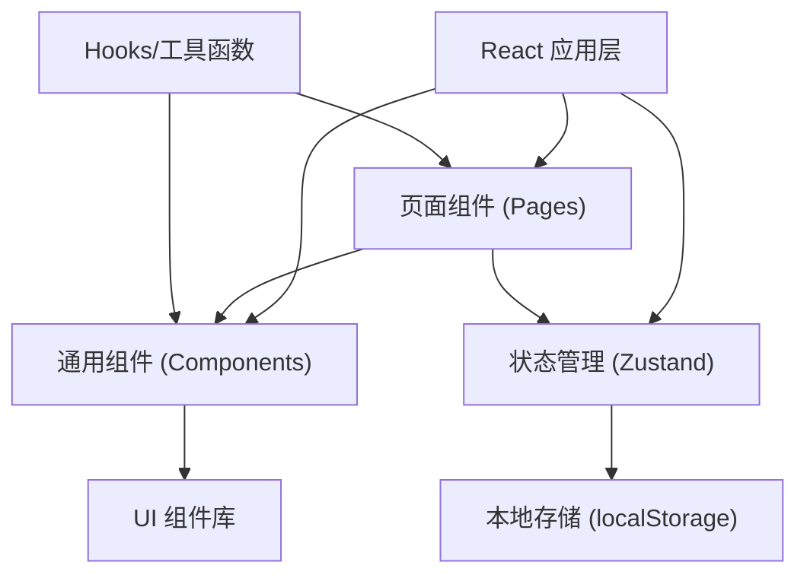
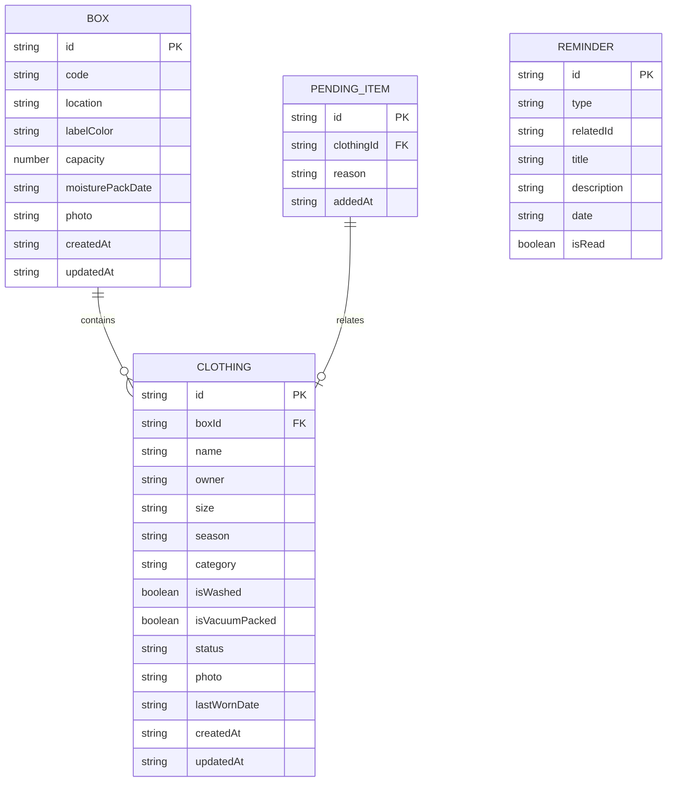

## 1. 架构设计

本项目为纯前端应用，数据存储在浏览器本地（localStorage），无需后端服务。采用 React + TypeScript + Vite 技术栈，使用 Tailwind CSS 进行样式开发，Zustand 进行状态管理。



## 2. 技术描述

- **前端框架**：React 18 + TypeScript
- **构建工具**：Vite 5
- **样式方案**：Tailwind CSS 3
- **状态管理**：Zustand
- **路由管理**：React Router DOM 6
- **图标库**：Lucide React
- **数据持久化**：localStorage
- **日期处理**：date-fns
- **初始化工具**：vite-init

## 3. 路由定义

| 路由 | 页面 | 用途 |
|------|------|------|
| / | 首页仪表盘 | 展示整体概览、箱子占用率、缺失尺码、本周待取 |
| /boxes | 箱子列表 | 所有收纳箱的网格展示和管理 |
| /boxes/:id | 箱子详情 | 单个箱子的详细信息和衣物清单 |
| /boxes/new | 新增箱子 | 添加新的收纳箱 |
| /clothes | 衣物收纳 | 衣物搜索、浏览和管理 |
| /clothes/new | 新增衣物 | 添加新衣物（入箱或待处理） |
| /clothes/:id | 衣物详情 | 单件衣物的详细信息 |
| /pending | 待处理区 | 未洗干晒透的衣物暂存 |
| /reminders | 智能提醒 | 防潮包到期和捐赠候选提醒 |

## 4. 数据模型

### 4.1 数据模型定义



### 4.2 数据字段说明

**箱子 (Box)**
- `id`: 唯一标识符，UUID
- `code`: 箱子编号，如 "B001"
- `location`: 存放位置，如 "主卧衣柜顶层"
- `labelColor`: 标签颜色，色值
- `capacity`: 容量（件数）
- `moisturePackDate`: 防潮包放置日期
- `photo`: 箱子照片 URL
- `createdAt`: 创建时间
- `updatedAt`: 更新时间

**衣物 (Clothing)**
- `id`: 唯一标识符，UUID
- `boxId`: 所属箱子 ID（可为空，表示不在箱中）
- `name`: 衣物名称
- `owner`: 归属人（爸爸、妈妈、孩子等）
- `size`: 尺码
- `season`: 适用季节（春、夏、秋、冬、四季）
- `category`: 类别（外套、上衣、裤子、裙子、内衣、配饰等）
- `isWashed`: 是否已洗干晒透
- `isVacuumPacked`: 是否真空压缩
- `status`: 状态（in_box、taken_out、pending）
- `photo`: 衣物照片 URL
- `lastWornDate`: 上次穿着日期
- `createdAt`: 创建时间
- `updatedAt`: 更新时间

**提醒 (Reminder)**
- `id`: 唯一标识符，UUID
- `type`: 提醒类型（moisture_pack、donation）
- `relatedId`: 关联的箱子或衣物 ID
- `title`: 提醒标题
- `description`: 提醒描述
- `date`: 提醒日期
- `isRead`: 是否已读

## 5. 目录结构

```
src/
├── components/          # 通用组件
│   ├── layout/         # 布局组件
│   │   ├── Layout.tsx
│   │   ├── Navbar.tsx
│   │   └── BottomNav.tsx
│   ├── ui/             # 基础 UI 组件
│   │   ├── Button.tsx
│   │   ├── Card.tsx
│   │   ├── Input.tsx
│   │   ├── ProgressBar.tsx
│   │   ├── Badge.tsx
│   │   └── Modal.tsx
│   └── shared/         # 业务组件
│       ├── BoxCard.tsx
│       ├── ClothingCard.tsx
│       └── ReminderCard.tsx
├── pages/              # 页面组件
│   ├── Dashboard.tsx
│   ├── BoxList.tsx
│   ├── BoxDetail.tsx
│   ├── BoxForm.tsx
│   ├── ClothingList.tsx
│   ├── ClothingDetail.tsx
│   ├── ClothingForm.tsx
│   ├── PendingList.tsx
│   └── Reminders.tsx
├── store/              # 状态管理
│   └── useStore.ts
├── hooks/              # 自定义 Hooks
│   ├── useBoxes.ts
│   ├── useClothes.ts
│   └── useReminders.ts
├── utils/              # 工具函数
│   ├── storage.ts
│   ├── date.ts
│   └── helpers.ts
├── types/              # 类型定义
│   └── index.ts
├── data/               # 模拟数据
│   └── mockData.ts
├── App.tsx
├── main.tsx
└── index.css
```

## 6. 关键技术方案

### 6.1 状态管理

使用 Zustand 进行全局状态管理，分为 boxes、clothes、reminders 三个主要数据切片，支持 localStorage 持久化。

### 6.2 本地存储

所有数据存储在浏览器 localStorage 中，使用统一的存储工具函数处理序列化和反序列化，确保数据类型正确。

### 6.3 搜索算法

衣物搜索支持多维度组合：
- 按人筛选（爸爸、妈妈、孩子等）
- 按场景筛选（春游、上学、运动等，通过类别和季节推断）
- 按尺码筛选
- 支持模糊名称搜索

### 6.4 提醒计算

- 防潮包提醒：放置日期 + 3 个月 = 到期日，到期前 7 天开始提醒
- 捐赠候选：lastWornDate 超过 6 个月的衣物进入捐赠候选列表

### 6.5 缺失尺码分析

按家庭成员 + 季节维度统计衣物数量，当某分类下衣物数量少于 3 件时标记为"尺码缺失"。
