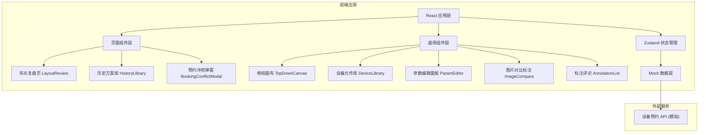

## 1. 架构设计



## 2. 技术描述

- **前端框架**: React@18 + TypeScript + Vite@5
- **状态管理**: Zustand@4（轻量、简洁，适合中大型单页应用）
- **样式方案**: TailwindCSS@3 + CSS Variables（深空灰主题定制）
- **路由管理**: React Router DOM@6
- **图标库**: Lucide React（线性图标，契合工业专业风）
- **图片标注**: 自研 Canvas 叠加层方案（无需额外依赖）
- **拖拽交互**: 原生 HTML5 Drag & Drop API + React 状态同步
- **初始化工具**: vite-init

## 3. 路由定义

| 路由 | 页面组件 | 用途 |
|------|----------|------|
| `/` | LayoutReview | 布光复盘主页（默认路由，包含画布、参数面板、对比区） |
| `/history` | HistoryLibrary | 历史方案库列表 |

## 4. 核心数据类型定义

```typescript
// 设备类型
type DeviceType = 'main_light' | 'fill_light' | 'rim_light' | 'reflector' | 'background'

// 画布上的设备实例
interface CanvasDevice {
  id: string
  type: DeviceType
  model: string          // 型号名称
  x: number              // 画布X坐标 (0-100百分比)
  y: number              // 画布Y坐标 (0-100百分比)
  rotation: number       // 朝向角度 0-360°
  distance?: number      // 到被摄体距离 (米)
  angle?: number         // 照射角度 (°)
  power?: number         // 功率 (0-100% 或 Ws)
  colorTemp?: number     // 色温 (K)
  modifier?: string      // 附件: 柔光箱/雷达罩/柔光伞/蜂巢等
}

// 相机参数
interface CameraSettings {
  cameraModel: string
  lens: string
  focalLength: number    // mm
  aperture: string       // f/
  shutterSpeed: string   // 1/
  iso: number
  whiteBalance: number   // K
}

// 标注问题类型
type AnnotationType = 
  | 'catch_light'      // 眼神光
  | 'hard_shadow'      // 阴影过硬
  | 'uneven_bg'        // 背景不均匀
  | 'overexposure'     // 过曝
  | 'underexposure'    // 欠曝
  | 'color_cast'       // 色偏
  | 'other'            // 其他

// 图片标注
interface Annotation {
  id: string
  imageType: 'final' | 'bts'  // 成片 or 花絮
  x: number               // 图片坐标百分比
  y: number
  type: AnnotationType
  severity: 'low' | 'medium' | 'high'
  comment: string
  author: string
  createdAt: number
}

// 布光方案
interface LightingSetup {
  id: string
  name: string
  client: string
  shootDate: string
  tags: string[]
  devices: CanvasDevice[]
  camera: CameraSettings
  finalImage: string     // 成片URL (使用 placeholder API)
  btsImage: string       // 花絮URL
  annotations: Annotation[]
  author: string
  createdAt: number
  updatedAt: number
}

// 设备预约记录
interface BookingRecord {
  deviceId: string       // 设备型号唯一标识
  deviceName: string
  bookedBy: string
  date: string           // YYYY-MM-DD
  startTime: string      // HH:mm
  endTime: string
  conflict?: boolean
}
```

## 5. 状态管理设计 (Zustand Store)

```typescript
interface StoreState {
  // 当前方案
  currentSetup: LightingSetup | null
  selectedDeviceId: string | null
  
  // 历史方案
  historySetups: LightingSetup[]
  
  // 预约数据
  todayBookings: BookingRecord[]
  
  // UI 状态
  showConflictModal: boolean
  conflictDevices: BookingRecord[]
  showHistoryPanel: boolean
  
  // Actions
  createNewSetup: () => void
  loadSetup: (id: string) => void
  saveSetup: () => void
  duplicateSetup: (id: string) => Promise<void>  // 触发预约检测
  selectDevice: (id: string | null) => void
  addDevice: (device: Omit<CanvasDevice, 'id'>) => void
  updateDevice: (id: string, patch: Partial<CanvasDevice>) => void
  removeDevice: (id: string) => void
  updateCamera: (patch: Partial<CameraSettings>) => void
  addAnnotation: (ann: Omit<Annotation, 'id' | 'createdAt'>) => void
  removeAnnotation: (id: string) => void
  dismissConflictModal: () => void
  toggleHistoryPanel: () => void
}
```

## 6. 项目目录结构

```
src/
├── components/
│   ├── layout/
│   │   └── TopBar.tsx                 # 顶部操作栏
│   ├── canvas/
│   │   ├── TopDownCanvas.tsx          # 俯视布光画布主组件
│   │   ├── CanvasDeviceIcon.tsx       # 单个设备图标渲染
│   │   └── GridOverlay.tsx            # 网格背景与比例尺
│   ├── devices/
│   │   └── DeviceLibrary.tsx          # 左侧设备元件库
│   ├── params/
│   │   ├── ParamEditorPanel.tsx       # 右侧参数编辑总面板
│   │   ├── DeviceParamsForm.tsx       # 灯具参数表单
│   │   ├── CameraParamsForm.tsx       # 相机参数表单
│   │   └── ColorTempSlider.tsx        # 色温可视化滑块
│   ├── compare/
│   │   ├── ImageCompareView.tsx       # 成片/花絮双栏对比
│   │   ├── AnnotationMarker.tsx       # 标注点组件
│   │   ├── AnnotationOverlay.tsx      # 标注叠加层
│   │   └── AnnotationListPanel.tsx    # 标注评论列表面板
│   ├── history/
│   │   ├── HistoryPanel.tsx           # 历史方案侧边栏
│   │   └── SetupCard.tsx              # 方案卡片
│   └── booking/
│       └── ConflictModal.tsx          # 预约冲突提醒弹窗
├── store/
│   └── useLightingStore.ts            # Zustand 全局状态
├── types/
│   └── index.ts                       # 类型定义
├── data/
│   ├── mockSetups.ts                  # Mock 历史方案数据
│   ├── mockBookings.ts                # Mock 预约数据
│   └── deviceCatalog.ts               # 设备型号目录
├── utils/
│   ├── coordinate.ts                  # 坐标转换工具
│   └── conflictChecker.ts             # 预约冲突检测逻辑
├── pages/
│   ├── LayoutReview.tsx               # 布光复盘主页
│   └── HistoryLibrary.tsx             # 历史方案库页
├── App.tsx
├── main.tsx
└── index.css
```
