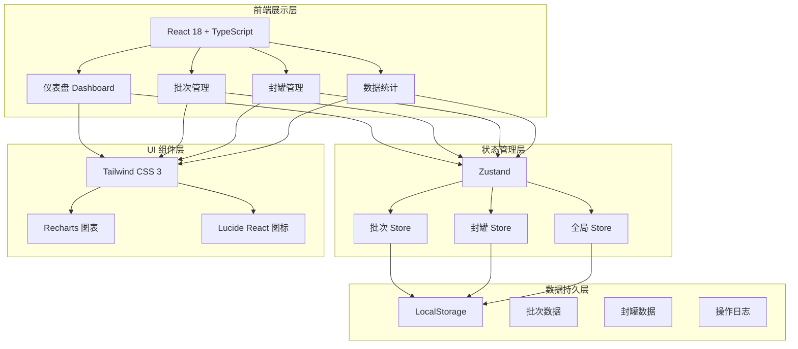
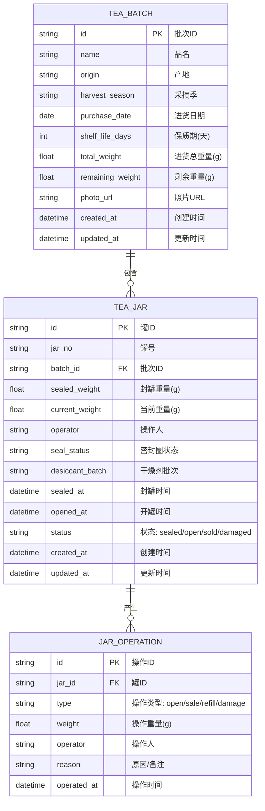

## 1. 架构设计



## 2. 技术描述

- **前端框架**：React@18 + TypeScript@5
- **构建工具**：Vite@5
- **样式方案**：Tailwind CSS@3
- **状态管理**：Zustand@4（轻量状态管理，支持数据持久化到 localStorage）
- **图表库**：Recharts@2（柱状图、饼图展示统计数据）
- **图标库**：Lucide React（线性风格图标）
- **路由**：React Router@6
- **数据持久化**：LocalStorage（无需后端，所有数据本地存储）
- **Mock 数据**：内置示例数据，首次进入自动生成

## 3. 路由定义

| 路由 | 页面 | 用途 |
|------|------|------|
| `/` | 仪表盘 | 数据概览、预警列表、快捷操作入口 |
| `/batches` | 批次管理列表 | 查看所有茶叶批次，搜索筛选 |
| `/batches/new` | 新增批次 | 录入新的茶叶批次信息 |
| `/batches/:id/edit` | 编辑批次 | 修改已有批次信息 |
| `/jars` | 封罐管理列表 | 查看所有封罐记录，按状态筛选 |
| `/jars/new` | 新增封罐 | 执行封罐操作，录入封罐信息 |
| `/jars/:id` | 罐详情 | 查看单罐完整信息、操作历史、执行开罐/补罐/报损操作 |
| `/statistics` | 数据统计 | 剩余重量、报损分析、售完预警、补货建议 |

## 4. 数据模型

### 4.1 数据模型 ER 图



### 4.2 TypeScript 类型定义

```typescript
// 采摘季类型
type HarvestSeason = '春茶' | '夏茶' | '秋茶' | '冬茶';

// 罐状态
type JarStatus = 'sealed' | 'open' | 'sold' | 'damaged';

// 密封圈状态
type SealRingStatus = 'good' | 'normal' | 'poor';

// 操作类型
type OperationType = 'seal' | 'open' | 'sale' | 'refill' | 'damage';

// 报损原因
type DamageReason = 'moisture' | 'deterioration' | 'other';

// 茶叶批次
interface TeaBatch {
  id: string;
  name: string;
  origin: string;
  harvestSeason: HarvestSeason;
  purchaseDate: string;
  shelfLifeDays: number;
  totalWeight: number;
  remainingWeight: number;
  photoUrl: string;
  createdAt: string;
  updatedAt: string;
}

// 茶叶罐
interface TeaJar {
  id: string;
  jarNo: string;
  batchId: string;
  sealedWeight: number;
  currentWeight: number;
  operator: string;
  sealStatus: SealRingStatus;
  desiccantBatch: string;
  sealedAt: string;
  openedAt: string | null;
  status: JarStatus;
  createdAt: string;
  updatedAt: string;
}

// 罐操作记录
interface JarOperation {
  id: string;
  jarId: string;
  type: OperationType;
  weight: number;
  operator: string;
  reason: string;
  operatedAt: string;
}
```

## 5. 项目目录结构

```
src/
├── assets/              # 静态资源
├── components/          # 公共组件
│   ├── Layout/          # 布局组件（侧边栏、顶栏）
│   ├── ui/              # 基础 UI 组件（卡片、按钮、表单等）
│   └── charts/          # 图表组件
├── pages/               # 页面组件
│   ├── Dashboard/       # 仪表盘
│   ├── Batches/         # 批次管理
│   ├── Jars/            # 封罐管理
│   └── Statistics/      # 数据统计
├── store/               # Zustand Store
│   ├── batchStore.ts    # 批次状态管理
│   ├── jarStore.ts      # 封罐状态管理
│   └── index.ts         # Store 入口
├── types/               # TypeScript 类型定义
│   └── index.ts
├── utils/               # 工具函数
│   ├── date.ts          # 日期处理
│   ├── storage.ts       # 本地存储
│   └── alert.ts         # 预警计算
├── data/                # Mock 数据
│   └── mockData.ts
├── router/              # 路由配置
│   └── index.tsx
├── App.tsx
├── main.tsx
└── index.css
```

## 6. 预警规则

1. **保质期临期预警**：批次保质期剩余 ≤ 30 天 → 橙色提醒；≤ 7 天 → 红色严重提醒
2. **开罐过久预警**：开罐时间超过 15 天 → 橙色提醒；超过 30 天 → 红色严重提醒
3. **库存不足预警**：批次剩余重量 < 500g → 建议补货
4. **售完预计**：按近 7 天平均售卖速度估算预计售完日期，标记最快售完的前 5 个批次

